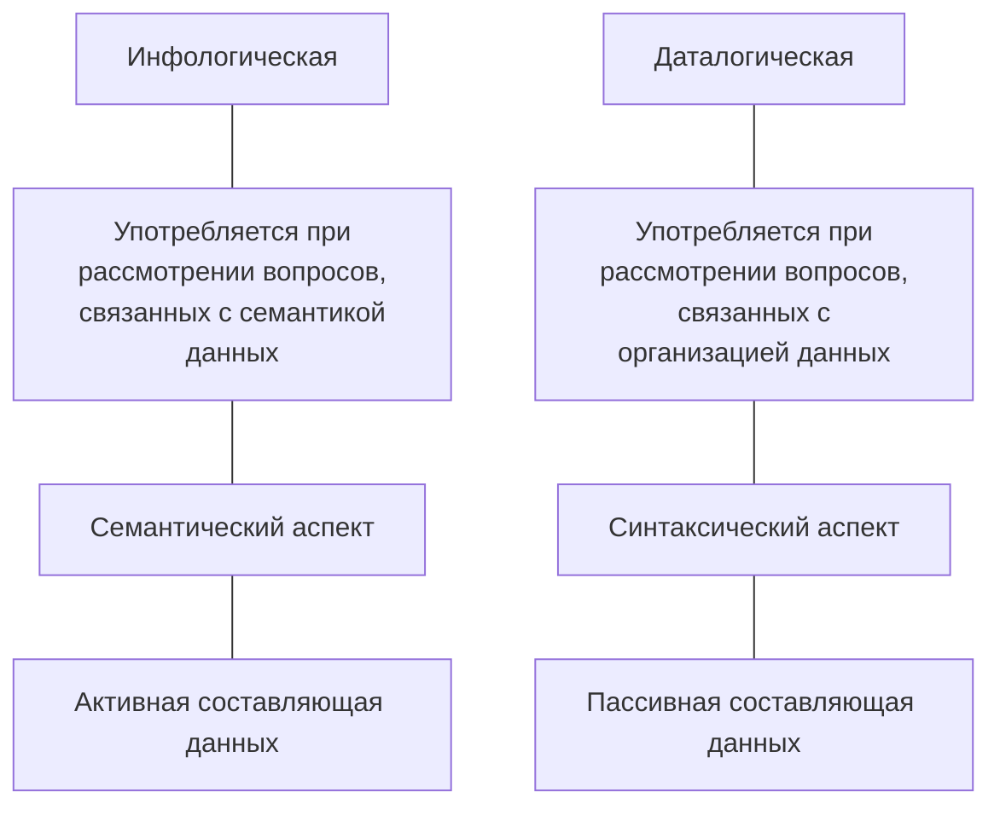
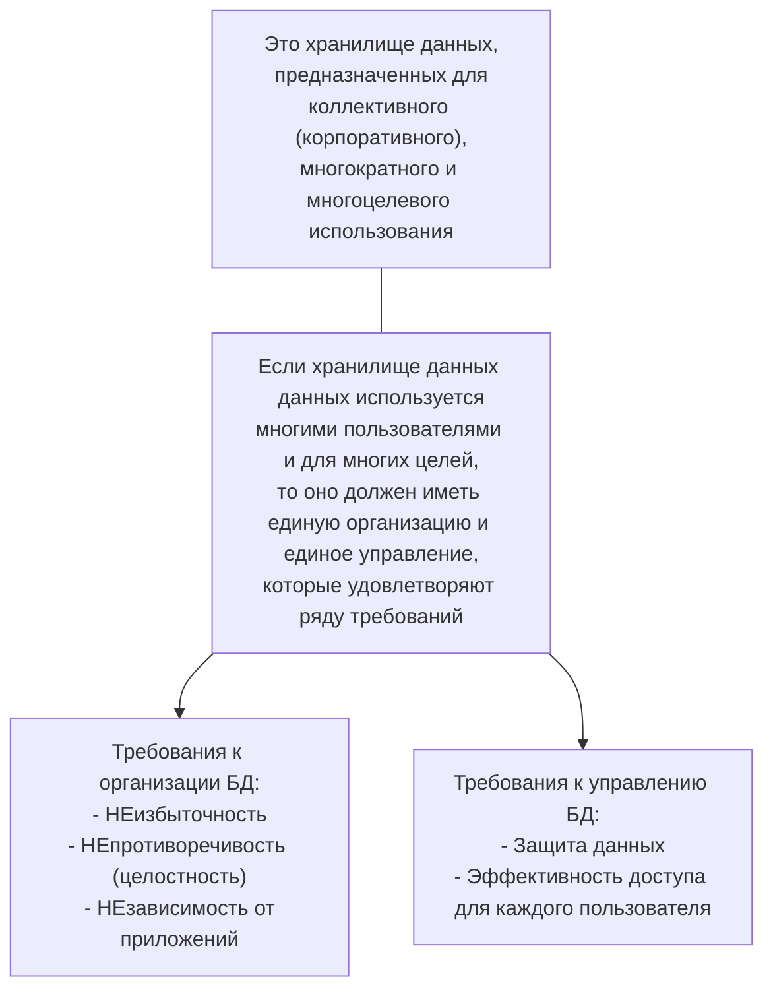
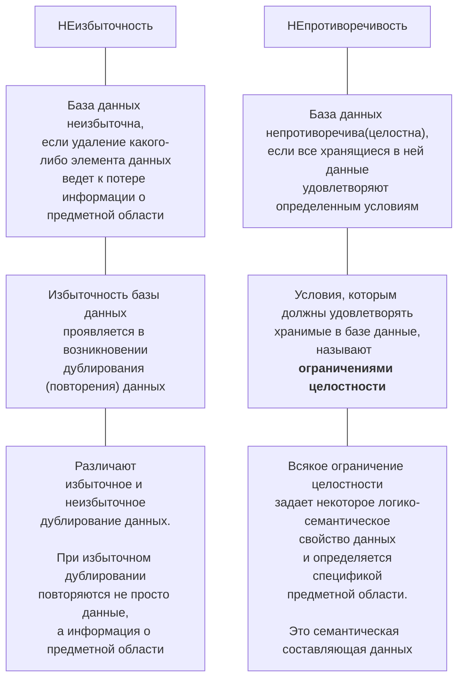

# МДК.11.01 Технология разработки и защиты БД
65f1ccf6d048d37352721344

- [Порядок прохождения курса](#порядок-прохождения-курса)
- [Аннотация РП](#аннотация-рп)
  - [1. Паспорт рабочей программы](#1-паспорт-рабочей-программы)
    - [1.1. Область применения программы](#11-область-применения-программы)
    - [1.2. Цели и задачи модуля – требования к результатам освоения модуля](#12-цели-и-задачи-модуля--требования-к-результатам-освоения-модуля)
  - [2. Результаты освоения профессионального модуля](#2-результаты-освоения-профессионального-модуля)
  - [3. Структура и содержание профессионального модуля](#3-структура-и-содержание-профессионального-модуля)
  - [4. Условия реализации программы профессионального модуля](#4-условия-реализации-программы-профессионального-модуля)
- [Список практических работ по дисциплине Основы проектирования](#список-практических-работ-по-дисциплине-основы-проектирования)
- [Перечень учебных изданий, Интернет-ресурсов, дополнительной литературы](#перечень-учебных-изданий-интернет-ресурсов-дополнительной-литературы)
  - [1	Основные источники](#1основные-источники)
  - [2	Дополнительные источники](#2дополнительные-источники)
- [Вопросы к экзамену](#вопросы-к-экзамену)
- [Банк заданий](#банк-заданий)
- [Оформление практических работ](#оформление-практических-работ)
- [Видеоуроки по MySQL](#видеоуроки-по-mysql)
- [Полное руководство по MySQL](#полное-руководство-по-mysql)
- [Тема 1.1 Основные положения теории баз данных](#тема-11-основные-положения-теории-баз-данных)

## Порядок прохождения курса
65f1ceccd048d37352721345

Программа курса рассчитана на 114 часов обучения, в том числе 8 часов отводится на лекционные занятия, 18 часов на практические занятия, 80 часов на самостоятельную работу.
В рамках курса обучающимся необходимо изучить 41тему:

1. Тема 1.1 Основные положения теории баз данных
2. Тема 1.2 Хранилища данных и баз знаний
3. Тема 1.3 Модели и структуры информационных систем
4. Тема 1.4 СУБД
5. Тема 1.5 Структуры данных СУБД
6. Тема 1.6 Основные принципы построения концептуальной, логической и физической модели данных
7. Тема 1.7   Методы организации целостности данных
8. Тема 1.8 Основные принципы структуризации и нормализации базы данных
9. Тема 2.1 Архитектуры баз данных
10. Тема 2.2 SQL сервера
11. Тема 2.3 Основные технологии доступа к данным
12. Тема 2.4 СУБД MySQL
13. Тема 2.5 Консольный клиент MySQL
14. Тема 2.6 Язык структурированных запросов SQL
15. Тема 2.7 Работа с таблицами базы данных
16. Тема 2.8 Изменение структуры таблицы
17. Тема 2.9 Индексирование таблиц
18. Тема 2.10 Ограничения целостности данных
19. Тема 2.11 Инструментальные средства для автоматизированного проектирования баз данных
20. Тема 2.12 Выборка данных из базы данных
21. Тема 2.13 Операторы сравнения в условиях выборки
22. Тема 2.14 Логические операторы в условиях выборки
23. Тема 2.15 Специальные операторы в условиях выборки
24. Тема 2.16 Группировка записей в запросах
25. Тема 2.17 Создание вычисляемых полей в запросах
26. Тема 2.18 Объединение таблиц в запросах
27. Тема 2.19 Объединение нескольких запросов
28. Тема 2.20 Вложенные запросы
29. Тема 2.21 Операторы модификации данных
30. Тема 2.22 Создание клиентской части приложения
31. Тема 2.23 Создание запросов на выборку в клиентской части приложения
32. Тема 3.1 Резервное копирование и восстановление данных
33. Тема 3.2 Управление привилегиями пользователя
34. Тема 4.1 Безопасность баз данных
35. Тема 4.2 Управление доступом к данным с помощью представлений
36. Тема 4.3 Хранимые процедуры
37. Тема 4.4 Язык хранимых процедур
38. Тема 4.5 Хранимые функции
39. Тема 4.6 Триггеры
40. Тема 4.7 Курсоры
41. Тема 4.8 Управление транзакциями и блокировки транзакций

 
Каждая тема состоит из ряда разделов:
- теоретический раздел;
- практический раздел;
- контрольное мероприятие.

Теоретическая часть темы, представлена в виде документа в формате .doc, а также содержит презентации, отражающие основное понятия, изучаемые в данной теме.

Внимательно прочтите теоретический материал.

После изучения лекционного материала, необходимо пройти тестирование для самопроверки. Оценка в баллах за выполнение теста автоматически будет выставлена в журнал. Изучив теоретический материал темы стоит перейти к выполнению практического задания (там, где оно предложено для выполнения), которое представлено в виде задания, по вариантам. Далее, направьте на проверку преподавателю, прикрепив файл к элементу Задание. Баллы за выполнение практического задания будут выставлены преподавателем в журнал.

Для закрепления знаний, воспользуйтесь материалами для самостоятельной работы (либо дополнительным материалом познавательного характера).

Изучив все темы курса, пройдите итоговое тестирование (контрольную работу).

По итогам прохождения всех контрольных мероприятий (тестов, практических заданий) будет сформирован журнал оценок.

Изучать курс рекомендуется в той последовательности, которая обозначена в его содержании.

Автором ЭУК является преподаватель Копец Ольга Николаевна.

## Аннотация РП
65f614a7d048d37352721403

В соответствии с ППССЗ по специальности 09.02.07 «Информационные системы и программирование» профессиональный модуль ПМ 11 Разработка, администрирование и защита баз данных включает междисциплинарный курс (далее – МДК): **Технология разработки и защиты баз данных**.

Рабочая программа профессионального модуля включает разделы:
1. Паспорт рабочей программы профессионального модуля;
2. Результаты освоения профессионального модуля;
3. Структура и содержание профессионального модуля;
4. Условия реализации программы профессионального модуля;
5. Контроль и оценка результатов освоения профессионального модуля (вида профессиональной деятельности).

### 1. Паспорт рабочей программы
6602be69d048d3735272154a

#### 1.1. Область применения программы
Рабочая программа профессионального модуля является частью ППССЗ в соответствии с ФГОС по специальности СПО 09.02.07 «**Информационные системы и программирование**» в части освоения основного вида деятельности (ВД): **Разработка, администрирование и защита баз данных** и соответствующих профессиональных компетенций (ПК):
- ПК 11.1. Осуществлять сбор, обработку и анализ информации для проектирования баз данных;
- ПК 1.2. Проектировать базу данных на основе анализа предметной области;
- ПК 1.3. Разрабатывать объекты базы данных в соответствии с результатами анализа предметной области;
- ПК 1.4. Реализовывать базу данных в конкретной системе управления базами данных;
- ПК 1.5 Администрировать базы данных;
- ПК 1.6 Защищать информацию в базе данных с использованием технологии защиты информации.

Рабочая программа профессионального модуля может быть использована всеми образовательными учреждениями среднего профессионального образования и в дополнительном профессиональном образовании очной, очно-заочной и заочной формы.

#### 1.2. Цели и задачи модуля – требования к результатам освоения модуля
С целью овладения указанным видом профессиональной деятельности и соответствующими профессиональными компетенциями обучающийся в ходе освоения профессионального модуля **должен**:

**иметь практический опыт**:
- выполнять сбор, обработку и анализ информации для проектирования баз данных;
- выполнять работы с документами отраслевой направленности;
- работать с объектами базы данных в конкретной системе управления базами данных;
- работать с документами отраслевой направленности;
- использовать стандартные методы защиты объектов базы данных;
- использовать средства заполнения базы данных;

**уметь**:
- работать с документами отраслевой направленности;
- собирать, обрабатывать и анализировать информацию на предпроектной стадии;
- работать с современными case-средствами проектирования баз данных;
- создавать объекты баз данных в современных СУБД;
- работать в средах современных СУБД;
- применять стандартные методы для защиты объектов базы данных;
- выполнять стандартные процедуры резервного копирования и мониторинга выполнения этой процедуры;
- выполнять установку и настройку программного обеспечения для обеспечения работы пользователя с базой данных;
- обеспечивать информационную безопасность на уровне базы данных.

**знать**:
- методы описания схем баз данных в современных СУБД;
- основные положения теории баз данных, хранилищ данных, баз знаний;
- основные команды для работы в среде современной СУБД;
- основные принципы построения концептуальной, логической и физической модели данных;
- структуры данных СУБД, общий подход к организации представлений, таблиц, индексов и кластеров;
- методы организации целостности;
- технологии передачи и обмена данными в компьютерных сетях;
- алгоритм проведения процедуры резервного копирования;
- алгоритм проведения процедуры восстановления базы данных.

### 2. Результаты освоения профессионального модуля
6602cc8dd048d3735272154e

Результатом освоения программы профессионального модуля является овладение обучающимися видом профессиональной деятельности – **Разработка, администрирование и защита баз данных**, в том числе профессиональными и общими компетенциями, которые заданы ФГОС СПО по специальности 09.02.07 «Информационные системы и программирование».

### 3. Структура и содержание профессионального модуля
6602cda2d048d37352721550

Данному профессиональному модулю соответствует междисциплинарный курс **МДК 11.01. «Технология разработки и защиты баз данных».**

Раздел | Тема
-- | --
Раздел 1 Основы хранения и обработки данных, проектирование БД | Тема 1.1 Основные положения теории баз данных Тема 1.2 Хранилища данных и баз знаний Тема 1.3 Модели и структуры информационных систем Тема 1.4 СУБД Тема 1.5 Структуры данных СУБД Тема 1.6 Основные принципы построения концептуальной, логической и физической модели данных Тема 1.7   Методы организации целостности данных Тема 1.8 Основные принципы структуризации и нормализации базы данных
Раздел 2 Разработка объектов базы данных и реализация базы данных в СУБД | Тема 2.1 Архитектуры баз данных Тема 2.2 SQL сервера Тема 2.3 Основные технологии доступа к данным Тема 2.4 СУБД MySQL Тема 2.5 Консольный клиент MySQL Тема 2.6 Язык структурированных запросов SQL Тема 2.7 Работа с таблицами базы данных Тема 2.8 Изменение структуры таблицы Тема 2.9 Индексирование таблиц Тема 2.10 Ограничения целостности данных Тема 2.11 Инструментальные средства для автоматизированного проектирования баз данных Тема 2.12 Выборка данных из базы данных Тема 2.13 Операторы сравнения в условиях выборки Тема 2.14 Логические операторы в условиях выборки Тема 2.15 Специальные операторы в условиях выборки Тема 2.16 Группировка записей в запросах Тема 2.17 Создание вычисляемых полей в запросах Тема 2.18 Объединение таблиц в запросах Тема 2.19 Объединение нескольких запросов Тема 2.20 Вложенные запросы Тема 2.21 Операторы модификации данных Тема 2.22 Создание клиентской части приложения Тема 2.23 Создание запросов на выборку в клиентской части приложения Контрольная работа 1. Подведение итогов
Раздел 3 Основы администрирования баз данных | Тема 3.1 Резервное копирование и восстановление данных Тема 3.2 Управление привилегиями пользователя
Раздел 4 Организация защиты данных в базах данных | Тема 3.1 Безопасность баз данных Тема 3.2 Управление доступом к данным с помощью представлений Тема 3.3 Хранимые процедуры Тема 3.4 Язык хранимых процедур Тема 3.5 Хранимые функции Тема 3.6 Триггеры Тема 3.7 Курсоры Тема 3.8 Управление транзакциями и блокировки транзакций Контрольная работа 2. Подведение итогов

Описание содержания обучения помимо тематического плана включает по каждому разделу:
- характеристику уровня усвоения учебного материала,
- конкретное описание учебного материала,
- содержание лабораторных работ и практических занятий,
- описание самостоятельной работы обучающихся,
- тематику курсового проекта,
- перечень видов работ, выполняемых обучающимися в ходе учебной и производственной практики.

**Календарно-тематический план с указанием обязательных практических работ**

№ п/п |	Наименование темы занятия и практической работы | Кол-во аудиторных часов
-- | -- | --
1 | Работа с таблицами базы данных | 1
2 | Ограничения целостности данных | 1
3 | Специальные операторы в условиях выборки | 1
4 | Группировка записей в запросах | 1
5 | Объединение таблиц в запросах | 1
6 | Управление привилегиями пользователя | 1
7 | Управление доступом к данным с помощью представлений | 1
8 | Язык хранимых процедур | 1
9 | Практическая работа 2.О Работа в консольном клиенте СУБД MySQL | 1
10 | Практическая работа 3.О Создание таблиц | 1
11 | Практическая работа 4.О Изменение структуры таблиц | 2
12 | Практическая работа 5.О Создание индексов | 2
13 | Практическая работа 6.О Установка ограничений и контроль ссылочной целостности | 2
14 | Практическая работа 9.О Простые запросы на выборку | 2
15 | Практическая работа 10.О Специальные операторы в условиях выборки запроса | 2
16 | Практическая работа 11.О Создание запросов на выборку с использованием группировки данных | 2
17 | Практическая работа 12.О Создание запросов на выборку с использованием вычисляемых полей | 2
18 | Практическая работа 13.О Создание запросов на объединение нескольких таблиц. | 2
19 | Практическая работа 14.О Создание запросов на объединение нескольких запросов | 2
20 | Практическая работа 15.О Создание вложенных запросов | 2
21 | Создание запросов на изменение данных | 2
22 | Практическая работа 16.О Создание запросов на изменение данных | 2
23 | Практическая работа 20.О Создание учетных записей пользователей | 1
24 | Практическая работа 21.О Реализация доступа пользователей к базе данных | 1
25 | Практическая работа 22.О Создание представлений | 2
26 | Практическая работа 23.О Создание хранимых процедур (продолжение) | 2
27 | Практическая работа 24 Создание хранимых функций | 2
28 | Практическая работа 27.О Выполнение и отмена транзакций | 2
29 | Работа над курсовым проектом | 2
30 | Работа над курсовым проектом | 2
31 | Работа над курсовым проектом | 2
32 | Работа над курсовым проектом | 2
33 | Работа над курсовым проектом | 2
| | Итого: | 52

### 4. Условия реализации программы профессионального модуля
6602d755d048d37352721553

Программа профессионального модуля включает следующие данные:
- требования к минимальному материально-техническому обеспечению образовательного процесса;
- информационное обеспечение обучения: перечень рекомендуемых учебных изданий, интернет-ресурсов, дополнительной литературы;
- общие требования к организации образовательного процесса, включая требования к условиям допуска и организации практики, итоговой аттестации по модулю, а также требования к кадровому обеспечению образовательного процесса.

## Список практических работ по дисциплине Основы проектирования
6602daa9d048d37352721556

Код работы | Название работы | Количество заданий (вариантов работы)
-- | -- | --
1.О | Проектирование базы данных с использованием алгоритма нормализации |30
2.О | Проектирование базы данных с помощью ER-диаграмм | 30
3.О |	Создание таблиц |	30
4 |	Создание схемы данных	| 30
5 |	Ввод данных в таблицы |	30
6.О |	Создание запросов с использованием операторов сравнения и логических операторов |	30
7.О |	Создание запросов с использованием специальных операторов |	30
8.О |	Создание запросов с вычисляемыми полями |	30
9 |	Создание запросов с параметром |	30
10.О |	Создание запросов с группировкой данных	| 30
11.О |	Создание многотабличных запросов |	30
12.О |	Создание запросов на изменение данных в базе данных |	30
13.О |	Создание форм	| 30
14 |	Создание главной кнопочной формы  |	30
15.О |	Создание отчетов |	30
16 |	Использование макросов |	30
17.О |	Создание простых SQL-запросов на выборку с использованием операторов сравнения, логических операторов и специальных операторов |	30
18.О |	Создание запросов с использованием специальных операторов |	30
19.О |	Создание SQL-запросов на выборку с группировкой данных |	30
20.О |	Создание SQL-запросов с вычисляемыми полями |	30
21.О |	Создание SQL-запросов на выборку из нескольких таблиц |	30
22.О |	Создание SQL-запросов на добавление, удаление и обновление данных в таблице |	30
КР1.О |	Контрольная работа 1.О

## Перечень учебных изданий, Интернет-ресурсов, дополнительной литературы
660c2d80d048d37352721641

### 1	Основные источники
- [x] 1.1 Федорова Г.Н. Разработка, администрирование и защита баз данных [Текст]: Учебник. СПО / Г. Н. Федорова. – М.: Издательский центр "Академия", 2018. - 288 с. - (Профессиональное образование). − Библиогр.: с. 282.

- [x] 1.2 Илюшечкин В.М. Основы использования и проектирования баз данных: учебник для СПО В.М. Илюшечкин. – М: Издательство ЮРАЙТ, 2018. – 213 с. – Серия: Профессиональное образование [Электронный ресурс]; режим доступа: URL:https://biblio-online.ru/viewer/290801FB-F8CF-47B3-9559-6BADEC310243/osnovy-ispolzovaniya-i-proektirovaniya-baz-dannyh#page/30

- [x] 1.3 Шуcтова Л.И., Тараканов О.В. Базы данных: Учебник. –М. ИНФРА – М, 2018. -304 с.  (Высшее образование: Бакалавриат). [Электронный ресурс]; режим доступа: URL:http://znanium.com/bookread2.php?book=491069, свободный.

### 2	Дополнительные источники
- [x] 2.1 Кара-Ушаков, В.Ю. SQL–язык реляционных баз данных: учебное пособие / В.Ю. Кара-Ушанов. – Екатеринбург: Изд-во Урал. Ун-та, 2017. – 156 с. [Электронный ресурс]; режим доступа: URL:http://www.iprbookshop.ru/68419.html
- [x] 2.2 Введение в СУБД MySQL / - М.: Национальный Открытый Университет «ИНТУИТ», 2018. – 229 с. [Электронный ресурс]; режим доступа: URL: http://www.iprbookshop.ru/73650.html
- [x] 2.3 Мартишин С.А. Проектирование и реализация баз данных в СУБД MySQL с использованием MySQL Workbench. Методы и средства проектирования информационных систем и технологий. Инструментальные средства информационных систем: учеб. пособие / С.A. Мартишин, В.Л. Симонов, М.В. Храпченко. − М.: ИД «ФОРУМ»: ИНФРА-М, 2018. − 160 с. − (Среднее профессиональное образование). [Электронный ресурс]; режим доступа: URL: http://znanium.com/bookread2.php?book=967597

## Вопросы к экзамену
660e8c8ad048d37352721674

1. Дайте определения понятиям: база данных, информационная система, банк данных, СУБД.
2. Опишите трехуровневую архитектуру баз данных. Объясните физическую и логическую независимость данных в БД.
3. Дайте понятие модели данных. Раскройте достоинства и недостатки иерархической, сетевой, реляционной, постреляционной, объектно-ориентированной и многомерной моделей данных. Приведите примеры.
4. Опишите реляционную таблицу и ее элементы. Раскройте понятия: отношение, атрибуты, домены, кортежи, схема отношений, мощность отношения, кардинальность отношения.
5. Объясните важность обеспечения непротиворечивости и целостности реляционной модели данных.
6. Перечислите требования, предъявляемые к реляционным таблицам.
7. Опишите назначение специальных реляционных операторов: объединение, пересечение, вычитание, декартово произведение. Приведите примеры.
8. Опишите назначение специальных реляционных операций: выборка, проекция, соединение, деление.  Приведите примеры.
9. Опишите функции СУБД.
10. Охарактеризуйте этапы проектирования баз данных: концептуальное, логическое, физическое.
11. Объясните назначение нормализации таблиц. Дайте определение первой нормальная форме (1НФ). Приведите примеры.
12. Объясните назначение второй нормальной формы (2НФ). Дайте объяснение функциональной зависимости. Приведите примеры.
13. Объясните назначение третьей нормальной формы (3НФ). Дайте объяснение понятия транзитивная зависимость. Приведите примеры.
14. Опишите основные понятия ER-диаграмм: сущность, атрибут, связь. Приведите примеры.
15. Опишите правила генерации реляционных таблиц из ER-диаграмм. Приведите примеры.
16. Опишите основные возможности СУБД MS Access. Перечислите объекты СУБД MS Access.
17. Перечислите и опишите типы данных, используемые при создании таблиц в СУБД MS Access. Приведите примеры
18. Опишите назначение таблиц в СУБД Access, перечислите режимы работы с таблицами и свойства полей. Приведите примеры.
19. Опишите технологию создания запросов с условиями выборки, запросов с группировкой данных, запросов с параметрами, запросов с вычисляемым полем и многотабличных запросов в СУБД Access.
20. Опишите технологию создания перекрестных запросов, запросов на создание, обновление, добавление, удаление таблиц в СУБД Access.
21. Опишите назначение форм, элементы управления формой, способы форматирования форм в СУБД Access.
22. Опишите назначение отчетов, способы форматирования отчетов, способы получения итоговых данных в MS Access.
23. Опишите назначение и способы создания макросов в СУБД Access.
24. Опишите структуру оператора SELECT.
25. Опишите создание простых SQL-запросов на выборку, упорядочивание значений полей в запросах и выборку данных без дублирования. Приведите примеры.
26. Объясните работу оператора WHERE в SQL-запросах. Перечислите операторы сравнения, логические операторы, специальные операторы в условиях выборки и их назначение. Приведите примеры.
27. Перечислите агрегатные функции и назначение операторов GROUP BY и HAVING в SQL-запросах. Приведите примеры.
28. Объясните назначение внешнего (Left Join, Right Join) и внутреннего (Inner Join) объединения таблиц в SQL-запросах. Объясните использование псевдонимов в запросах. Приведите примеры.
29. Объясните назначение операторов EXISTS, ANY и ALL при создании вложенных SQL-запросов. Приведите примеры.
30. Опишите операторы манипулирования данными: Insert, Delete, Update. Приведите примеры.

## Банк заданий
660ed2e9d048d37352721680

## Оформление практических работ
661d3f81d048d373527217c3

## Видеоуроки по MySQL
661d9affd048d373527217d0

[3. MySQL 8 - MySQL Workbench 8](https://www.youtube.com/watch?v=EMOKs8_l2WA) from [Курс MySQL 8](https://www.youtube.com/playlist?list=PLOQDek48BpZFeW02dfJM77FY4Fp5ilJ6n) channel [htmllab](https://www.youtube.com/@HtmllabRu)

## Полное руководство по MySQL
661e836fd048d373527217f5

[MySQL 8.0. Полное руководство](http://www.rldp.ru/mysql/mysql80/index.htm)

## Тема 1.1 Основные положения теории баз данных
661eedb1d048d37352721811

Современный период развития цивилизованного общества характеризует процесс информатизации.

**Информатизация общества** — это глобальный социальный процесс, особенность которого состоит в том, что доминирующим видом деятельности в сфере общественного производства является сбор, накопление, продуцирование, обработка, хранение, передача и использование информации, осуществляемые на основе современных средств микропроцессорной и вычислительной техники, а также на базе разнообразных средств информационного обмена. Информатизация общества обеспечивает:
- активное использование постоянно расширяющегося интеллектуального потенциала общества, сконцентрированного в печатном фонде, и научной, производственной и других видах деятельности его членов;
- интеграцию информационных технологий в научные и производственные виды деятельности, инициирующую развитие всех сфер общественного производства, интеллектуализацию трудовой деятельности;
- высокий уровень информационного обслуживания, доступность любого члена общества к источникам достоверной информации, визуализацию представляемой информации, существенность используемых данных.

С самого начала развития вычислительной техники (ВТ) образовались два основных направления ее использования:
- применение ВТ для сложных численных расчетов;
- применение ВТ для хранения и обработки информации.

*Первоначально* ВТ использовалась только для сложных численных расчетов. Именно потребностью обеспечить большие объемы расчетов, требовавшихся в новых отраслях науки и техники (ядерной энергетике, ракетостроении и др.), и было вызвано появление ЭВМ.

Это направление дало толчок развитию численных методов и языков программирования, ориентированных на удобную запись численных алгоритмов.

*Второе направление* возникло, когда в компьютерах появилось достаточно оперативной и внешней памяти (магнитные ленты, магнитные барабаны и, главное, магнитные диски). Оно дало развитие информационным системам (далее – ИС).

Классическими примерами ИС являются банковские системы, системы резервирования билетов, библиотечные системы и т.п.

Появление магнитных дисков, способных хранить большие объемы информации, потребовало создания систем управления данными во внешней памяти. Так появились **системы управления файлами** (**СУФ**), или **файловые системы**.

С точки зрения прикладной программы **файл** – это именованная область внешней памяти, в которую можно записывать и из которой можно считывать данные.

Почему файловых систем недостаточно для эффективной обработки информации?

В файловой системе хранятся следующие виды файлов:
- **текстовые** (документы, программы); обрабатываются текстовыми редакторами; их структура очень проста – последовательность строк или байтов (символов);
- **объектные** и **исполняемые** файлы, которые также имеют простую структуру.

Таким образом, файловые системы обеспечивают хранение слабоструктурированной информации, оставляя дальнейшую структуризацию прикладным программам.

Сами файлы часто изменяются, удаляются, создаются заново.

Одним из важнейших понятий теории базы данных является понятие информации. Здесь под **информацией** понимают любые сведения о каком-либо событии, процессе, объекте. С понятием информации тесно связано понятие данных.

**Данные** – это информация, представленная в определенном виде, позволяющем автоматизировать ее сбор, хранение и обработку.

Одни и те же данные могут быть различным образом истолкованы. Одну и ту же информацию можно представить (записать) многообразными способами.

**Две точки зрения на данные, используемые в теории баз данных**

Сами данные пассивны, активность им придают прикладные программы – ввода, вывода и обработки данных. Только программы обеспечивают интерпретацию и связность данных.

**База данных** (БД) – совокупность специальным образом организованных данных (структурированных), хранимых в памяти компьютера и отражающих состояние объектов, и их отношений в рассматриваемой предметной области.

**Предметной областью** принято называть ту часть реального мира, объекты которой описаны в базе данных. База данных состоит из множества связанных файлов.

Информацию о данных, хранимых в базе, принято называть **метаданными** (данными о данных). Совокупность всех метаданных образует **словарь данных**.

**Словарь данных** представляет собой метаданные базы данных и содержит имена и атрибуты всех объектов в базе данных.

Важнейшим элементом любой базы данных, независимо от ее представления, является **структура данных**, которая отражает возможные представления сведений для хранения, выборки и обработки.

**Структура данных** (**data structure**) — множество элементов данных, объединенных и упорядоченных определенным образом.

**Структура базы данных** (**DB structure**) — принцип или порядок организации записей в *базе данных* и связей между ними. Структуру БД принято рассматривать на разных уровнях *абстракции* (представления) и, в частности: концептуальном (с позиции администратора предприятия), реализации или внешнем (с позиций конечного пользователя и прикладного программиста) и физическом или внутреннем (с позиций системного аналитика и системного программиста). Соответственно этим уровням различают *концептуальную*, *внешнюю* и *физическую модели* и/или *схемы организации данных*.

**Управление данными** – это процесс, который подразумевает сбор, хранение, обработку и интерпретацию накопленных данных. Сегодня для многих компаний управление данными – это отличная возможность понять данные, которые уже собраны, «узнать» конкурентов, выстроить предикативную аналитику (прогнозирование), ответить на многие вопросы бизнеса.

**Основные процессы управления данными**:
-	управление базами данных;
- ETL-процессы (извлечение, преобразование и загрузка данных);
-	сбор данных;
-	защита и шифрование данных;
-	моделирование данных (структура данных);
-	собственно анализ данных (дублирование данных, устаревшие данные).

Одним из важнейших условий обеспечения эффективного функционирования любой организации является наличие развитой информационной системы.

**Информационная система** представляет собой систему, реализующую автоматизированный сбор, обработку и манипулирование данными и включающая технические средства обработки данных, программное обеспечение и обслуживающий персонал.

**Информационная система** (ИС) — это совокупность базы данных и всего комплекса аппаратно-программных средств для ее хранения, изменения и поиска информации, для взаимодействия с пользователем (СУБД + БД).

Примерами информационных систем являются системы продажи билетов на пассажирские поезда и самолеты. WWW — это тоже пример глобальной информационной системы.
Для хранения БД может использоваться как один компьютер, так и множество взаимосвязанных компьютеров.

Современной формой информационных систем являются **банки данных**, которые включают в свой состав вычислительную систему, одну или несколько баз данных (БД), систему управления базами данных (СУБД) и набор прикладных программ (ПП).

**Банк данных** (БнД) − это одна из форм информационных систем.

Основными функциями банков данных являются:
- хранение данных и их защита;
- изменение (обновление, добавление и удаление) хранимых данных;
- поиск и отбор данных по запросам пользователей;
- обработка данных и вывод результатов.

**Банком данных** называют систему специальным образом организованных баз данных, программных, технических, языковых и организационно-методических средств, предназначенных для обеспечения централизованного накопления и коллективного многоцелевого использования данных.

**Основными компонентами банка данных являются**:
-	вычислительная система (технические средства и операционная система);
-	база данных (непосредственно вся информация);
-	система управления базой данных, СУБД (программное обеспечение для организации хранения и использования информации);
-	набор прикладных программ.

К **основным функциям банка данных** относятся:
-	хранение данных и их защита;
-	изменение (обновление, добавление и удаление) хранимых данных;
-	поиск и отбор данных по запросам пользователей;
-	обработка данных и вывод результатов.

**База данных** обеспечивает хранение информации и представляет собой поименованную совокупность данных, организованных по определенным правилам, включающим общие принципы описания, хранения и манипулирования данными.

**Система управления базами данных** представляет собой пакет прикладных программ и совокупность языковых средств, предназначенных для создания, сопровождения и использования баз данных.

**Прикладные программы** (**приложения**) в составе банков данных служат для обработки данных, вычислений и формирования выходных документов по заданной форме.

> Для работы с базой данных во многих случаях можно обойтись только средствами СУБД, скажем, создавая запросы и отчеты. Приложения разрабатывают главным образом в случаях, когда требуется обеспечить удобство работы с БД неквалифицированным пользователям или интерфейс СУБД не устраивает пользователя.

Неформально, **база данных** (**БД**) – это большое по объему хранилище данных, в которое можно добавлять и из которого можно извлекать данные.

Более строгое определение БД в  «Мартин Дж. Организация баз данных в вычислительных системах. М: Мир, 1978».

**База данных** – это *совокупность взаимосвязанных хранящихся вместе данных* при наличии такой <u>минимальной избыточности</u>, которая допускает их эффективное использование для одного или нескольких приложений (задач);
- *данные* запоминаются так, чтобы они были <u>независимы от программ</u>, использующих эти данные;
- для *добавления* новых и *модификации* существующих *данных*, а также для *поиска* данных применяется *общий управляемый способ*.

Система управления данными является **СУБД**, если она

- поддерживает логически согласованный набор файлов;
- предоставляет язык манипулирования данными;
- обеспечивает восстановление информации после сбоев;
- обеспечивает параллельную работу нескольких пользователей.

Примеры СУБД: Access, Oracle, MySQL, MS SQL Server, lnformix.

**Две точки зрения на базу данных**

**БД как информационная модель**

**БД как склад данных**

База данных должна обладать определенными свойствами:
1. **Восстанавливаемость** – возможность восстановления базы данных после сбоя системы (проверка наличия файлов, дублирование базы данных).
2. **Безопасность** – предполагает защиту данных от преднамеренного и непреднамеренного доступа, защита от копирования, запрещение несанкционированного доступа.
3. **Целостность**. В каждый момент времени существования базы данных сведения, содержащиеся в ней, должны быть полными, непротиворечивыми и адекватно отражающими предметную область. В этом и заключается ее целостность. Целостность базы данных достигается вследствие введения ограничения целостности (указание диапазона допустимых значений, соотношение между значениями данных, ограничение на удаление информации и т.д.). Ограничения реализуются различными средствами системой управления базами данных (СУБД), например, при помощи декларативных (объявленных при разработке базы данных ее разработчиком) ограничений целостности.
4. **Эффективность** – минимальное время реакции на запрос пользователя.

**Неизбыточность и непротиворечивость**

Однако на практике во многих базах данных избыточность присутствует. В этом случае говорят об **управляемой** или **минимальной избыточности**. Она нужна для:
- уменьшения времени доступа к данным  или упрощения способов адресации;
- обеспечения возможности восстановления данных при их случайной потере.

**Независимость БД от приложений**

Программы, с помощью которых пользователи работают с базой данных, называются **приложениями**. В общем случае с одной базой данных могут работать множество различных приложений.

Например, если база данных моделирует некоторое предприятие, то для работы с ней может быть создано приложение, которое обслуживает подсистему учета кадров, другое приложение может быть посвящено работе подсистемы расчета заработной платы сотрудников, третье приложение работает как подсистемы складского учета, четвертое приложение посвящено планированию производственного процесса.

Под ***независимостью данных от приложений*** и наоборот, приложений от данных, подразумевается, что изменение одних не приводит к изменению других.

При рассмотрении приложений, работающих с одной базой данных, предполагается, что они могут работать параллельно и независимо друг от друга, и именно СУБД призвана обеспечить работу множества приложений с единой базой данных таким образом, чтобы каждое из них выполнялось корректно, но учитывало все изменения в базе данных, вносимые другими приложениями.

**Жизненный цикл базы данных**

