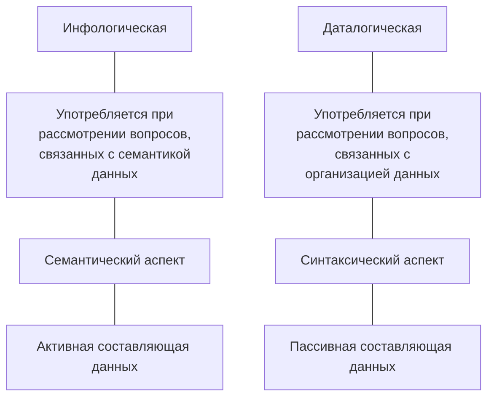
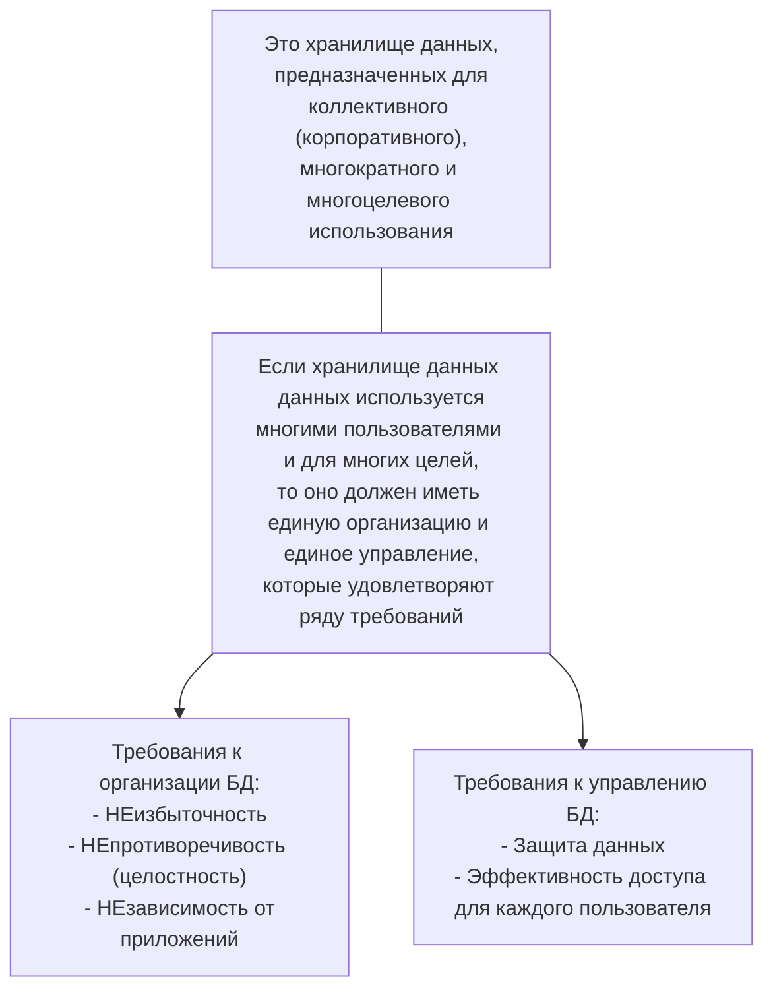
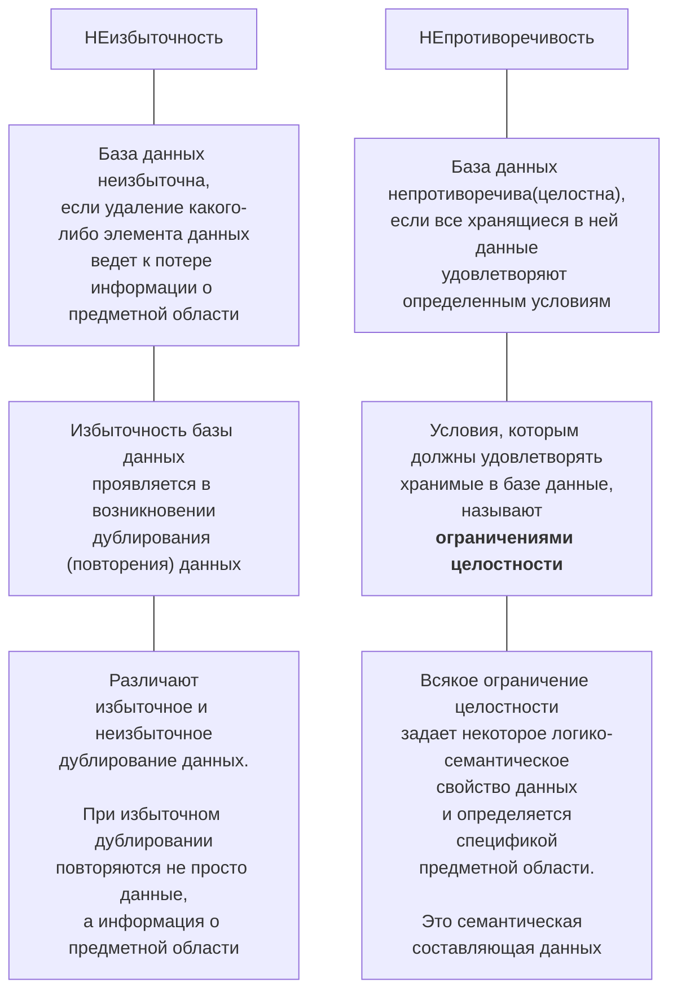

# МДК.11.01 Технология разработки и защиты БД
65f1ccf6d048d37352721344

- [Порядок прохождения курса](#порядок-прохождения-курса)
- [Аннотация РП](#аннотация-рп)
  - [1. Паспорт рабочей программы](#1-паспорт-рабочей-программы)
    - [1.1. Область применения программы](#11-область-применения-программы)
    - [1.2. Цели и задачи модуля – требования к результатам освоения модуля](#12-цели-и-задачи-модуля--требования-к-результатам-освоения-модуля)
  - [2. Результаты освоения профессионального модуля](#2-результаты-освоения-профессионального-модуля)
  - [3. Структура и содержание профессионального модуля](#3-структура-и-содержание-профессионального-модуля)
  - [4. Условия реализации программы профессионального модуля](#4-условия-реализации-программы-профессионального-модуля)
- [Список практических работ по дисциплине Основы проектирования](#список-практических-работ-по-дисциплине-основы-проектирования)
- [Перечень учебных изданий, Интернет-ресурсов, дополнительной литературы](#перечень-учебных-изданий-интернет-ресурсов-дополнительной-литературы)
  - [1	Основные источники](#1основные-источники)
  - [2	Дополнительные источники](#2дополнительные-источники)
- [Вопросы к экзамену](#вопросы-к-экзамену)
- [Банк заданий](#банк-заданий)
- [Оформление практических работ](#оформление-практических-работ)
- [Видеоуроки по MySQL](#видеоуроки-по-mysql)
- [Полное руководство по MySQL](#полное-руководство-по-mysql)
- [Тема 1.1 Основные положения теории баз данных](#тема-11-основные-положения-теории-баз-данных)
- [Тема 1.2 Хранилища данных и базы знаний](#тема-12-хранилища-данных-и-базы-знаний)
  - [Состав хранилища данных](#состав-хранилища-данных)
  - [Уровни хранилищ данных](#уровни-хранилищ-данных)
  - [Информационные потоки в ХД](#информационные-потоки-в-хд)
  - [Оптимизация ХД](#оптимизация-хд)
  - [Требования к хранилищам данных](#требования-к-хранилищам-данных)
  - [Отличия от БД](#отличия-от-бд)
  - [Базы Знаний](#базы-знаний)
- [Тема 1.3 Модели и структуры информационных систем](#тема-13-модели-и-структуры-информационных-систем)
  - [Структура информационной системы](#структура-информационной-системы)
  - [Информационное обеспечение](#информационное-обеспечение)
  - [Техническое обеспечение](#техническое-обеспечение)
  - [Математическое и программное обеспечение](#математическое-и-программное-обеспечение)
  - [Организационное обеспечение](#организационное-обеспечение)
  - [Правовое обеспечение](#правовое-обеспечение)
  - [Модели информационных систем](#модели-информационных-систем)
- [Тема 1.4 СУБД](#тема-14-субд)
  - [Средства СУБД](#средства-субд)
  - [Функции СУБД](#функции-субд)
  - [Классификации СУБД](#классификации-субд)
    - [1. По модели данных](#1-по-модели-данных)
    - [2. По степени распределённости](#2-по-степени-распределённости)
    - [3. По способу доступа к БД](#3-по-способу-доступа-к-бд)
  - [Критерии выбора СУБД](#критерии-выбора-субд)
  - [Наиболее популярные СУБД](#наиболее-популярные-субд)
  - [Преимущества СУБД](#преимущества-субд)
  - [Недостатки  СУБД](#недостатки--субд)

## Порядок прохождения курса
65f1ceccd048d37352721345

Программа курса рассчитана на 114 часов обучения, в том числе 8 часов отводится на лекционные занятия, 18 часов на практические занятия, 80 часов на самостоятельную работу.
В рамках курса обучающимся необходимо изучить 41тему:

1. Тема 1.1 Основные положения теории баз данных
2. Тема 1.2 Хранилища данных и баз знаний
3. Тема 1.3 Модели и структуры информационных систем
4. Тема 1.4 СУБД
5. Тема 1.5 Структуры данных СУБД
6. Тема 1.6 Основные принципы построения концептуальной, логической и физической модели данных
7. Тема 1.7   Методы организации целостности данных
8. Тема 1.8 Основные принципы структуризации и нормализации базы данных
9. Тема 2.1 Архитектуры баз данных
10. Тема 2.2 SQL сервера
11. Тема 2.3 Основные технологии доступа к данным
12. Тема 2.4 СУБД MySQL
13. Тема 2.5 Консольный клиент MySQL
14. Тема 2.6 Язык структурированных запросов SQL
15. Тема 2.7 Работа с таблицами базы данных
16. Тема 2.8 Изменение структуры таблицы
17. Тема 2.9 Индексирование таблиц
18. Тема 2.10 Ограничения целостности данных
19. Тема 2.11 Инструментальные средства для автоматизированного проектирования баз данных
20. Тема 2.12 Выборка данных из базы данных
21. Тема 2.13 Операторы сравнения в условиях выборки
22. Тема 2.14 Логические операторы в условиях выборки
23. Тема 2.15 Специальные операторы в условиях выборки
24. Тема 2.16 Группировка записей в запросах
25. Тема 2.17 Создание вычисляемых полей в запросах
26. Тема 2.18 Объединение таблиц в запросах
27. Тема 2.19 Объединение нескольких запросов
28. Тема 2.20 Вложенные запросы
29. Тема 2.21 Операторы модификации данных
30. Тема 2.22 Создание клиентской части приложения
31. Тема 2.23 Создание запросов на выборку в клиентской части приложения
32. Тема 3.1 Резервное копирование и восстановление данных
33. Тема 3.2 Управление привилегиями пользователя
34. Тема 4.1 Безопасность баз данных
35. Тема 4.2 Управление доступом к данным с помощью представлений
36. Тема 4.3 Хранимые процедуры
37. Тема 4.4 Язык хранимых процедур
38. Тема 4.5 Хранимые функции
39. Тема 4.6 Триггеры
40. Тема 4.7 Курсоры
41. Тема 4.8 Управление транзакциями и блокировки транзакций

 
Каждая тема состоит из ряда разделов:
- теоретический раздел;
- практический раздел;
- контрольное мероприятие.

Теоретическая часть темы, представлена в виде документа в формате .doc, а также содержит презентации, отражающие основное понятия, изучаемые в данной теме.

Внимательно прочтите теоретический материал.

После изучения лекционного материала, необходимо пройти тестирование для самопроверки. Оценка в баллах за выполнение теста автоматически будет выставлена в журнал. Изучив теоретический материал темы стоит перейти к выполнению практического задания (там, где оно предложено для выполнения), которое представлено в виде задания, по вариантам. Далее, направьте на проверку преподавателю, прикрепив файл к элементу Задание. Баллы за выполнение практического задания будут выставлены преподавателем в журнал.

Для закрепления знаний, воспользуйтесь материалами для самостоятельной работы (либо дополнительным материалом познавательного характера).

Изучив все темы курса, пройдите итоговое тестирование (контрольную работу).

По итогам прохождения всех контрольных мероприятий (тестов, практических заданий) будет сформирован журнал оценок.

Изучать курс рекомендуется в той последовательности, которая обозначена в его содержании.

Автором ЭУК является преподаватель Копец Ольга Николаевна.

## Аннотация РП
65f614a7d048d37352721403

В соответствии с ППССЗ по специальности 09.02.07 «Информационные системы и программирование» профессиональный модуль ПМ 11 Разработка, администрирование и защита баз данных включает междисциплинарный курс (далее – МДК): **Технология разработки и защиты баз данных**.

Рабочая программа профессионального модуля включает разделы:
1. Паспорт рабочей программы профессионального модуля;
2. Результаты освоения профессионального модуля;
3. Структура и содержание профессионального модуля;
4. Условия реализации программы профессионального модуля;
5. Контроль и оценка результатов освоения профессионального модуля (вида профессиональной деятельности).

### 1. Паспорт рабочей программы
6602be69d048d3735272154a

#### 1.1. Область применения программы
Рабочая программа профессионального модуля является частью ППССЗ в соответствии с ФГОС по специальности СПО 09.02.07 «**Информационные системы и программирование**» в части освоения основного вида деятельности (ВД): **Разработка, администрирование и защита баз данных** и соответствующих профессиональных компетенций (ПК):
- ПК 11.1. Осуществлять сбор, обработку и анализ информации для проектирования баз данных;
- ПК 1.2. Проектировать базу данных на основе анализа предметной области;
- ПК 1.3. Разрабатывать объекты базы данных в соответствии с результатами анализа предметной области;
- ПК 1.4. Реализовывать базу данных в конкретной системе управления базами данных;
- ПК 1.5 Администрировать базы данных;
- ПК 1.6 Защищать информацию в базе данных с использованием технологии защиты информации.

Рабочая программа профессионального модуля может быть использована всеми образовательными учреждениями среднего профессионального образования и в дополнительном профессиональном образовании очной, очно-заочной и заочной формы.

#### 1.2. Цели и задачи модуля – требования к результатам освоения модуля
С целью овладения указанным видом профессиональной деятельности и соответствующими профессиональными компетенциями обучающийся в ходе освоения профессионального модуля **должен**:

**иметь практический опыт**:
- выполнять сбор, обработку и анализ информации для проектирования баз данных;
- выполнять работы с документами отраслевой направленности;
- работать с объектами базы данных в конкретной системе управления базами данных;
- работать с документами отраслевой направленности;
- использовать стандартные методы защиты объектов базы данных;
- использовать средства заполнения базы данных;

**уметь**:
- работать с документами отраслевой направленности;
- собирать, обрабатывать и анализировать информацию на предпроектной стадии;
- работать с современными case-средствами проектирования баз данных;
- создавать объекты баз данных в современных СУБД;
- работать в средах современных СУБД;
- применять стандартные методы для защиты объектов базы данных;
- выполнять стандартные процедуры резервного копирования и мониторинга выполнения этой процедуры;
- выполнять установку и настройку программного обеспечения для обеспечения работы пользователя с базой данных;
- обеспечивать информационную безопасность на уровне базы данных.

**знать**:
- методы описания схем баз данных в современных СУБД;
- основные положения теории баз данных, хранилищ данных, баз знаний;
- основные команды для работы в среде современной СУБД;
- основные принципы построения концептуальной, логической и физической модели данных;
- структуры данных СУБД, общий подход к организации представлений, таблиц, индексов и кластеров;
- методы организации целостности;
- технологии передачи и обмена данными в компьютерных сетях;
- алгоритм проведения процедуры резервного копирования;
- алгоритм проведения процедуры восстановления базы данных.

### 2. Результаты освоения профессионального модуля
6602cc8dd048d3735272154e

Результатом освоения программы профессионального модуля является овладение обучающимися видом профессиональной деятельности – **Разработка, администрирование и защита баз данных**, в том числе профессиональными и общими компетенциями, которые заданы ФГОС СПО по специальности 09.02.07 «Информационные системы и программирование».

### 3. Структура и содержание профессионального модуля
6602cda2d048d37352721550

Данному профессиональному модулю соответствует междисциплинарный курс **МДК 11.01. «Технология разработки и защиты баз данных».**

Раздел | Тема
-- | --
Раздел 1 Основы хранения и обработки данных, проектирование БД | Тема 1.1 Основные положения теории баз данных Тема 1.2 Хранилища данных и баз знаний Тема 1.3 Модели и структуры информационных систем Тема 1.4 СУБД Тема 1.5 Структуры данных СУБД Тема 1.6 Основные принципы построения концептуальной, логической и физической модели данных Тема 1.7   Методы организации целостности данных Тема 1.8 Основные принципы структуризации и нормализации базы данных
Раздел 2 Разработка объектов базы данных и реализация базы данных в СУБД | Тема 2.1 Архитектуры баз данных Тема 2.2 SQL сервера Тема 2.3 Основные технологии доступа к данным Тема 2.4 СУБД MySQL Тема 2.5 Консольный клиент MySQL Тема 2.6 Язык структурированных запросов SQL Тема 2.7 Работа с таблицами базы данных Тема 2.8 Изменение структуры таблицы Тема 2.9 Индексирование таблиц Тема 2.10 Ограничения целостности данных Тема 2.11 Инструментальные средства для автоматизированного проектирования баз данных Тема 2.12 Выборка данных из базы данных Тема 2.13 Операторы сравнения в условиях выборки Тема 2.14 Логические операторы в условиях выборки Тема 2.15 Специальные операторы в условиях выборки Тема 2.16 Группировка записей в запросах Тема 2.17 Создание вычисляемых полей в запросах Тема 2.18 Объединение таблиц в запросах Тема 2.19 Объединение нескольких запросов Тема 2.20 Вложенные запросы Тема 2.21 Операторы модификации данных Тема 2.22 Создание клиентской части приложения Тема 2.23 Создание запросов на выборку в клиентской части приложения Контрольная работа 1. Подведение итогов
Раздел 3 Основы администрирования баз данных | Тема 3.1 Резервное копирование и восстановление данных Тема 3.2 Управление привилегиями пользователя
Раздел 4 Организация защиты данных в базах данных | Тема 3.1 Безопасность баз данных Тема 3.2 Управление доступом к данным с помощью представлений Тема 3.3 Хранимые процедуры Тема 3.4 Язык хранимых процедур Тема 3.5 Хранимые функции Тема 3.6 Триггеры Тема 3.7 Курсоры Тема 3.8 Управление транзакциями и блокировки транзакций Контрольная работа 2. Подведение итогов

Описание содержания обучения помимо тематического плана включает по каждому разделу:
- характеристику уровня усвоения учебного материала,
- конкретное описание учебного материала,
- содержание лабораторных работ и практических занятий,
- описание самостоятельной работы обучающихся,
- тематику курсового проекта,
- перечень видов работ, выполняемых обучающимися в ходе учебной и производственной практики.

**Календарно-тематический план с указанием обязательных практических работ**

№ п/п |	Наименование темы занятия и практической работы | Кол-во аудиторных часов
-- | -- | --
1 | Работа с таблицами базы данных | 1
2 | Ограничения целостности данных | 1
3 | Специальные операторы в условиях выборки | 1
4 | Группировка записей в запросах | 1
5 | Объединение таблиц в запросах | 1
6 | Управление привилегиями пользователя | 1
7 | Управление доступом к данным с помощью представлений | 1
8 | Язык хранимых процедур | 1
9 | Практическая работа 2.О Работа в консольном клиенте СУБД MySQL | 1
10 | Практическая работа 3.О Создание таблиц | 1
11 | Практическая работа 4.О Изменение структуры таблиц | 2
12 | Практическая работа 5.О Создание индексов | 2
13 | Практическая работа 6.О Установка ограничений и контроль ссылочной целостности | 2
14 | Практическая работа 9.О Простые запросы на выборку | 2
15 | Практическая работа 10.О Специальные операторы в условиях выборки запроса | 2
16 | Практическая работа 11.О Создание запросов на выборку с использованием группировки данных | 2
17 | Практическая работа 12.О Создание запросов на выборку с использованием вычисляемых полей | 2
18 | Практическая работа 13.О Создание запросов на объединение нескольких таблиц. | 2
19 | Практическая работа 14.О Создание запросов на объединение нескольких запросов | 2
20 | Практическая работа 15.О Создание вложенных запросов | 2
21 | Создание запросов на изменение данных | 2
22 | Практическая работа 16.О Создание запросов на изменение данных | 2
23 | Практическая работа 20.О Создание учетных записей пользователей | 1
24 | Практическая работа 21.О Реализация доступа пользователей к базе данных | 1
25 | Практическая работа 22.О Создание представлений | 2
26 | Практическая работа 23.О Создание хранимых процедур (продолжение) | 2
27 | Практическая работа 24 Создание хранимых функций | 2
28 | Практическая работа 27.О Выполнение и отмена транзакций | 2
29 | Работа над курсовым проектом | 2
30 | Работа над курсовым проектом | 2
31 | Работа над курсовым проектом | 2
32 | Работа над курсовым проектом | 2
33 | Работа над курсовым проектом | 2
| | Итого: | 52

### 4. Условия реализации программы профессионального модуля
6602d755d048d37352721553

Программа профессионального модуля включает следующие данные:
- требования к минимальному материально-техническому обеспечению образовательного процесса;
- информационное обеспечение обучения: перечень рекомендуемых учебных изданий, интернет-ресурсов, дополнительной литературы;
- общие требования к организации образовательного процесса, включая требования к условиям допуска и организации практики, итоговой аттестации по модулю, а также требования к кадровому обеспечению образовательного процесса.

## Список практических работ по дисциплине Основы проектирования
6602daa9d048d37352721556

Код работы | Название работы | Количество заданий (вариантов работы)
-- | -- | --
1.О | Проектирование базы данных с использованием алгоритма нормализации |30
2.О | Проектирование базы данных с помощью ER-диаграмм | 30
3.О |	Создание таблиц |	30
4 |	Создание схемы данных	| 30
5 |	Ввод данных в таблицы |	30
6.О |	Создание запросов с использованием операторов сравнения и логических операторов |	30
7.О |	Создание запросов с использованием специальных операторов |	30
8.О |	Создание запросов с вычисляемыми полями |	30
9 |	Создание запросов с параметром |	30
10.О |	Создание запросов с группировкой данных	| 30
11.О |	Создание многотабличных запросов |	30
12.О |	Создание запросов на изменение данных в базе данных |	30
13.О |	Создание форм	| 30
14 |	Создание главной кнопочной формы  |	30
15.О |	Создание отчетов |	30
16 |	Использование макросов |	30
17.О |	Создание простых SQL-запросов на выборку с использованием операторов сравнения, логических операторов и специальных операторов |	30
18.О |	Создание запросов с использованием специальных операторов |	30
19.О |	Создание SQL-запросов на выборку с группировкой данных |	30
20.О |	Создание SQL-запросов с вычисляемыми полями |	30
21.О |	Создание SQL-запросов на выборку из нескольких таблиц |	30
22.О |	Создание SQL-запросов на добавление, удаление и обновление данных в таблице |	30
КР1.О |	Контрольная работа 1.О

## Перечень учебных изданий, Интернет-ресурсов, дополнительной литературы
660c2d80d048d37352721641

### 1	Основные источники
- [x] 1.1 Федорова Г.Н. Разработка, администрирование и защита баз данных [Текст]: Учебник. СПО / Г. Н. Федорова. – М.: Издательский центр "Академия", 2018. - 288 с. - (Профессиональное образование). − Библиогр.: с. 282.

- [x] 1.2 Илюшечкин В.М. Основы использования и проектирования баз данных: учебник для СПО В.М. Илюшечкин. – М: Издательство ЮРАЙТ, 2018. – 213 с. – Серия: Профессиональное образование [Электронный ресурс]; режим доступа: URL:https://biblio-online.ru/viewer/290801FB-F8CF-47B3-9559-6BADEC310243/osnovy-ispolzovaniya-i-proektirovaniya-baz-dannyh#page/30

- [x] 1.3 Шуcтова Л.И., Тараканов О.В. Базы данных: Учебник. –М. ИНФРА – М, 2018. -304 с.  (Высшее образование: Бакалавриат). [Электронный ресурс]; режим доступа: URL:http://znanium.com/bookread2.php?book=491069, свободный.

### 2	Дополнительные источники
- [x] 2.1 Кара-Ушаков, В.Ю. SQL–язык реляционных баз данных: учебное пособие / В.Ю. Кара-Ушанов. – Екатеринбург: Изд-во Урал. Ун-та, 2017. – 156 с. [Электронный ресурс]; режим доступа: URL:http://www.iprbookshop.ru/68419.html
- [x] 2.2 Введение в СУБД MySQL / - М.: Национальный Открытый Университет «ИНТУИТ», 2018. – 229 с. [Электронный ресурс]; режим доступа: URL: http://www.iprbookshop.ru/73650.html
- [x] 2.3 Мартишин С.А. Проектирование и реализация баз данных в СУБД MySQL с использованием MySQL Workbench. Методы и средства проектирования информационных систем и технологий. Инструментальные средства информационных систем: учеб. пособие / С.A. Мартишин, В.Л. Симонов, М.В. Храпченко. − М.: ИД «ФОРУМ»: ИНФРА-М, 2018. − 160 с. − (Среднее профессиональное образование). [Электронный ресурс]; режим доступа: URL: http://znanium.com/bookread2.php?book=967597

## Вопросы к экзамену
660e8c8ad048d37352721674

1. Дайте определения понятиям: база данных, информационная система, банк данных, СУБД.
2. Опишите трехуровневую архитектуру баз данных. Объясните физическую и логическую независимость данных в БД.
3. Дайте понятие модели данных. Раскройте достоинства и недостатки иерархической, сетевой, реляционной, постреляционной, объектно-ориентированной и многомерной моделей данных. Приведите примеры.
4. Опишите реляционную таблицу и ее элементы. Раскройте понятия: отношение, атрибуты, домены, кортежи, схема отношений, мощность отношения, кардинальность отношения.
5. Объясните важность обеспечения непротиворечивости и целостности реляционной модели данных.
6. Перечислите требования, предъявляемые к реляционным таблицам.
7. Опишите назначение специальных реляционных операторов: объединение, пересечение, вычитание, декартово произведение. Приведите примеры.
8. Опишите назначение специальных реляционных операций: выборка, проекция, соединение, деление.  Приведите примеры.
9. Опишите функции СУБД.
10. Охарактеризуйте этапы проектирования баз данных: концептуальное, логическое, физическое.
11. Объясните назначение нормализации таблиц. Дайте определение первой нормальная форме (1НФ). Приведите примеры.
12. Объясните назначение второй нормальной формы (2НФ). Дайте объяснение функциональной зависимости. Приведите примеры.
13. Объясните назначение третьей нормальной формы (3НФ). Дайте объяснение понятия транзитивная зависимость. Приведите примеры.
14. Опишите основные понятия ER-диаграмм: сущность, атрибут, связь. Приведите примеры.
15. Опишите правила генерации реляционных таблиц из ER-диаграмм. Приведите примеры.
16. Опишите основные возможности СУБД MS Access. Перечислите объекты СУБД MS Access.
17. Перечислите и опишите типы данных, используемые при создании таблиц в СУБД MS Access. Приведите примеры
18. Опишите назначение таблиц в СУБД Access, перечислите режимы работы с таблицами и свойства полей. Приведите примеры.
19. Опишите технологию создания запросов с условиями выборки, запросов с группировкой данных, запросов с параметрами, запросов с вычисляемым полем и многотабличных запросов в СУБД Access.
20. Опишите технологию создания перекрестных запросов, запросов на создание, обновление, добавление, удаление таблиц в СУБД Access.
21. Опишите назначение форм, элементы управления формой, способы форматирования форм в СУБД Access.
22. Опишите назначение отчетов, способы форматирования отчетов, способы получения итоговых данных в MS Access.
23. Опишите назначение и способы создания макросов в СУБД Access.
24. Опишите структуру оператора SELECT.
25. Опишите создание простых SQL-запросов на выборку, упорядочивание значений полей в запросах и выборку данных без дублирования. Приведите примеры.
26. Объясните работу оператора WHERE в SQL-запросах. Перечислите операторы сравнения, логические операторы, специальные операторы в условиях выборки и их назначение. Приведите примеры.
27. Перечислите агрегатные функции и назначение операторов GROUP BY и HAVING в SQL-запросах. Приведите примеры.
28. Объясните назначение внешнего (Left Join, Right Join) и внутреннего (Inner Join) объединения таблиц в SQL-запросах. Объясните использование псевдонимов в запросах. Приведите примеры.
29. Объясните назначение операторов EXISTS, ANY и ALL при создании вложенных SQL-запросов. Приведите примеры.
30. Опишите операторы манипулирования данными: Insert, Delete, Update. Приведите примеры.

## Банк заданий
660ed2e9d048d37352721680

## Оформление практических работ
661d3f81d048d373527217c3

## Видеоуроки по MySQL
661d9affd048d373527217d0

[3. MySQL 8 - MySQL Workbench 8](https://www.youtube.com/watch?v=EMOKs8_l2WA) from [Курс MySQL 8](https://www.youtube.com/playlist?list=PLOQDek48BpZFeW02dfJM77FY4Fp5ilJ6n) channel [htmllab](https://www.youtube.com/@HtmllabRu)

## Полное руководство по MySQL
661e836fd048d373527217f5

[MySQL 8.0. Полное руководство](http://www.rldp.ru/mysql/mysql80/index.htm)

## Тема 1.1 Основные положения теории баз данных
661eedb1d048d37352721811

Современный период развития цивилизованного общества характеризует процесс информатизации.

**Информатизация общества** — это глобальный социальный процесс, особенность которого состоит в том, что доминирующим видом деятельности в сфере общественного производства является сбор, накопление, продуцирование, обработка, хранение, передача и использование информации, осуществляемые на основе современных средств микропроцессорной и вычислительной техники, а также на базе разнообразных средств информационного обмена. Информатизация общества обеспечивает:
- активное использование постоянно расширяющегося интеллектуального потенциала общества, сконцентрированного в печатном фонде, и научной, производственной и других видах деятельности его членов;
- интеграцию информационных технологий в научные и производственные виды деятельности, инициирующую развитие всех сфер общественного производства, интеллектуализацию трудовой деятельности;
- высокий уровень информационного обслуживания, доступность любого члена общества к источникам достоверной информации, визуализацию представляемой информации, существенность используемых данных.

С самого начала развития вычислительной техники (ВТ) образовались два основных направления ее использования:
- применение ВТ для сложных численных расчетов;
- применение ВТ для хранения и обработки информации.

*Первоначально* ВТ использовалась только для сложных численных расчетов. Именно потребностью обеспечить большие объемы расчетов, требовавшихся в новых отраслях науки и техники (ядерной энергетике, ракетостроении и др.), и было вызвано появление ЭВМ.

Это направление дало толчок развитию численных методов и языков программирования, ориентированных на удобную запись численных алгоритмов.

*Второе направление* возникло, когда в компьютерах появилось достаточно оперативной и внешней памяти (магнитные ленты, магнитные барабаны и, главное, магнитные диски). Оно дало развитие информационным системам (далее – ИС).

Классическими примерами ИС являются банковские системы, системы резервирования билетов, библиотечные системы и т.п.

Появление магнитных дисков, способных хранить большие объемы информации, потребовало создания систем управления данными во внешней памяти. Так появились **системы управления файлами** (**СУФ**), или **файловые системы**.

С точки зрения прикладной программы **файл** – это именованная область внешней памяти, в которую можно записывать и из которой можно считывать данные.

Почему файловых систем недостаточно для эффективной обработки информации?

В файловой системе хранятся следующие виды файлов:
- **текстовые** (документы, программы); обрабатываются текстовыми редакторами; их структура очень проста – последовательность строк или байтов (символов);
- **объектные** и **исполняемые** файлы, которые также имеют простую структуру.

Таким образом, файловые системы обеспечивают хранение слабоструктурированной информации, оставляя дальнейшую структуризацию прикладным программам.

Сами файлы часто изменяются, удаляются, создаются заново.

Одним из важнейших понятий теории базы данных является понятие информации. Здесь под **информацией** понимают любые сведения о каком-либо событии, процессе, объекте. С понятием информации тесно связано понятие данных.

**Данные** – это информация, представленная в определенном виде, позволяющем автоматизировать ее сбор, хранение и обработку.

Одни и те же данные могут быть различным образом истолкованы. Одну и ту же информацию можно представить (записать) многообразными способами.

**Две точки зрения на данные, используемые в теории баз данных**

Сами данные пассивны, активность им придают прикладные программы – ввода, вывода и обработки данных. Только программы обеспечивают интерпретацию и связность данных.

**База данных** (БД) – совокупность специальным образом организованных данных (структурированных), хранимых в памяти компьютера и отражающих состояние объектов, и их отношений в рассматриваемой предметной области.

**Предметной областью** принято называть ту часть реального мира, объекты которой описаны в базе данных. База данных состоит из множества связанных файлов.

Информацию о данных, хранимых в базе, принято называть **метаданными** (данными о данных). Совокупность всех метаданных образует **словарь данных**.

**Словарь данных** представляет собой метаданные базы данных и содержит имена и атрибуты всех объектов в базе данных.

Важнейшим элементом любой базы данных, независимо от ее представления, является **структура данных**, которая отражает возможные представления сведений для хранения, выборки и обработки.

**Структура данных** (**data structure**) — множество элементов данных, объединенных и упорядоченных определенным образом.

**Структура базы данных** (**DB structure**) — принцип или порядок организации записей в *базе данных* и связей между ними. Структуру БД принято рассматривать на разных уровнях *абстракции* (представления) и, в частности: концептуальном (с позиции администратора предприятия), реализации или внешнем (с позиций конечного пользователя и прикладного программиста) и физическом или внутреннем (с позиций системного аналитика и системного программиста). Соответственно этим уровням различают *концептуальную*, *внешнюю* и *физическую модели* и/или *схемы организации данных*.

**Управление данными** – это процесс, который подразумевает сбор, хранение, обработку и интерпретацию накопленных данных. Сегодня для многих компаний управление данными – это отличная возможность понять данные, которые уже собраны, «узнать» конкурентов, выстроить предикативную аналитику (прогнозирование), ответить на многие вопросы бизнеса.

**Основные процессы управления данными**:
- управление базами данных;
- ETL-процессы (извлечение, преобразование и загрузка данных);
- сбор данных;
- защита и шифрование данных;
- моделирование данных (структура данных);
- собственно анализ данных (дублирование данных, устаревшие данные).

Одним из важнейших условий обеспечения эффективного функционирования любой организации является наличие развитой информационной системы.

**Информационная система** представляет собой систему, реализующую автоматизированный сбор, обработку и манипулирование данными и включающая технические средства обработки данных, программное обеспечение и обслуживающий персонал.

**Информационная система** (ИС) — это совокупность базы данных и всего комплекса аппаратно-программных средств для ее хранения, изменения и поиска информации, для взаимодействия с пользователем (СУБД + БД).

Примерами информационных систем являются системы продажи билетов на пассажирские поезда и самолеты. WWW — это тоже пример глобальной информационной системы.
Для хранения БД может использоваться как один компьютер, так и множество взаимосвязанных компьютеров.

Современной формой информационных систем являются **банки данных**, которые включают в свой состав вычислительную систему, одну или несколько баз данных (БД), систему управления базами данных (СУБД) и набор прикладных программ (ПП).

**Банк данных** (БнД) − это одна из форм информационных систем.

Основными функциями банков данных являются:
- хранение данных и их защита;
- изменение (обновление, добавление и удаление) хранимых данных;
- поиск и отбор данных по запросам пользователей;
- обработка данных и вывод результатов.

**Банком данных** называют систему специальным образом организованных баз данных, программных, технических, языковых и организационно-методических средств, предназначенных для обеспечения централизованного накопления и коллективного многоцелевого использования данных.

**Основными компонентами банка данных являются**:
-	вычислительная система (технические средства и операционная система);
-	база данных (непосредственно вся информация);
-	система управления базой данных, СУБД (программное обеспечение для организации хранения и использования информации);
-	набор прикладных программ.

К **основным функциям банка данных** относятся:
-	хранение данных и их защита;
-	изменение (обновление, добавление и удаление) хранимых данных;
-	поиск и отбор данных по запросам пользователей;
-	обработка данных и вывод результатов.

**База данных** обеспечивает хранение информации и представляет собой поименованную совокупность данных, организованных по определенным правилам, включающим общие принципы описания, хранения и манипулирования данными.

**Система управления базами данных** представляет собой пакет прикладных программ и совокупность языковых средств, предназначенных для создания, сопровождения и использования баз данных.

**Прикладные программы** (**приложения**) в составе банков данных служат для обработки данных, вычислений и формирования выходных документов по заданной форме.

> Для работы с базой данных во многих случаях можно обойтись только средствами СУБД, скажем, создавая запросы и отчеты. Приложения разрабатывают главным образом в случаях, когда требуется обеспечить удобство работы с БД неквалифицированным пользователям или интерфейс СУБД не устраивает пользователя.

Неформально, **база данных** (**БД**) – это большое по объему хранилище данных, в которое можно добавлять и из которого можно извлекать данные.

Более строгое определение БД в  «Мартин Дж. Организация баз данных в вычислительных системах. М: Мир, 1978».

**База данных** – это *совокупность взаимосвязанных хранящихся вместе данных* при наличии такой <u>минимальной избыточности</u>, которая допускает их эффективное использование для одного или нескольких приложений (задач);
- *данные* запоминаются так, чтобы они были <u>независимы от программ</u>, использующих эти данные;
- для *добавления* новых и *модификации* существующих *данных*, а также для *поиска* данных применяется *общий управляемый способ*.

Система управления данными является **СУБД**, если она

- поддерживает логически согласованный набор файлов;
- предоставляет язык манипулирования данными;
- обеспечивает восстановление информации после сбоев;
- обеспечивает параллельную работу нескольких пользователей.

Примеры СУБД: Access, Oracle, MySQL, MS SQL Server, lnformix.

**Две точки зрения на базу данных**

**БД как информационная модель**

**БД как склад данных**

База данных должна обладать определенными свойствами:
1. **Восстанавливаемость** – возможность восстановления базы данных после сбоя системы (проверка наличия файлов, дублирование базы данных).
2. **Безопасность** – предполагает защиту данных от преднамеренного и непреднамеренного доступа, защита от копирования, запрещение несанкционированного доступа.
3. **Целостность**. В каждый момент времени существования базы данных сведения, содержащиеся в ней, должны быть полными, непротиворечивыми и адекватно отражающими предметную область. В этом и заключается ее целостность. Целостность базы данных достигается вследствие введения ограничения целостности (указание диапазона допустимых значений, соотношение между значениями данных, ограничение на удаление информации и т.д.). Ограничения реализуются различными средствами системой управления базами данных (СУБД), например, при помощи декларативных (объявленных при разработке базы данных ее разработчиком) ограничений целостности.
4. **Эффективность** – минимальное время реакции на запрос пользователя.

**Неизбыточность и непротиворечивость**

Однако на практике во многих базах данных избыточность присутствует. В этом случае говорят об **управляемой** или **минимальной избыточности**. Она нужна для:
- уменьшения времени доступа к данным  или упрощения способов адресации;
- обеспечения возможности восстановления данных при их случайной потере.

**Независимость БД от приложений**

Программы, с помощью которых пользователи работают с базой данных, называются **приложениями**. В общем случае с одной базой данных могут работать множество различных приложений.

Например, если база данных моделирует некоторое предприятие, то для работы с ней может быть создано приложение, которое обслуживает подсистему учета кадров, другое приложение может быть посвящено работе подсистемы расчета заработной платы сотрудников, третье приложение работает как подсистемы складского учета, четвертое приложение посвящено планированию производственного процесса.

Под ***независимостью данных от приложений*** и наоборот, приложений от данных, подразумевается, что изменение одних не приводит к изменению других.

При рассмотрении приложений, работающих с одной базой данных, предполагается, что они могут работать параллельно и независимо друг от друга, и именно СУБД призвана обеспечить работу множества приложений с единой базой данных таким образом, чтобы каждое из них выполнялось корректно, но учитывало все изменения в базе данных, вносимые другими приложениями.

**Жизненный цикл базы данных**

## Тема 1.2 Хранилища данных и базы знаний
661fd426d048d3735272182b

Основные проблемы, связанные с анализом информации, как правило, обусловлены разрозненностью данных в первоисточниках, их качеством и уровнем готовности (отсутствием агрегатов, вычисляемых показателей) для решения аналитических задач. Поэтому на сегодняшний день наиболее востребованной технологией, используемой при реализации аналитической информационной системы, являются хранилища данных, с помощью которых решается задача сбора, очистки и преобразования первичных данных.

В основе концепции ХД лежит идея разделения данных, используемых для оперативной обработки и для решения задач анализа.

Основными идеями, лежащими в основе концепции хранилища данных, являются:
- интеграция разъединенных детализированных данных, которые описывают некоторые конкретные факты, свойства, события и т.д., в едином хранилище;
- разделение наборов данных и приложений на используемые для оперативной обработки и применяемые для решения задач анализа.

В начале восьмидесятых годов прошлого века в период бурного развития регистрирующих ИС возникло понимание ограниченности возможности применения БД для целей анализа данных и построения на их основе систем поддержки и принятия решений. Регистрирующие системы создавались для автоматизации рутинных операций по ведению бизнеса — выписка счетов, оформление договоров, проверка состояния склада и т.д. Пользователями таких систем был в основном линейный персонал. Основные требования, которые предъявлялись к регистрирующим системам, — обеспечение транзакционности вносимых изменений и максимизация скорости их выполнения. Именно эти требования определили выбор реляционных СУБД и соответствующей модели представления данных в качестве основных используемых технических решений при построении регистрирующих систем.

Для менеджеров и аналитиков требовались системы, которые бы позволяли:
- анализировать информацию во временном аспекте;
- формировать произвольные запросы к системе;
- обрабатывать большие объемы данных;
- интегрировать данные из различных регистрирующих систем.

Очевидно, что регистрирующие системы не удовлетворяли ни одному из вышеуказанных требований. В регистрирующей системе информация актуальна только на момент обращения к базе данных, в следующий момент времени по тому же запросу можно получить совершенно другой результат. Интерфейс регистрирующих систем рассчитан на проведение жестко определенных операций и возможности получения результатов на нерегламентированный запрос сильно ограничены. Возможность обработки больших массивов данных также мала из-за настройки СУБД на выполнение коротких транзакций и неизбежного замедления работы остальных пользователей.

Ответом на возникшую потребность стало появление новой технологии организации баз данных — технологии хранилищ данных.

**Хранилище данных** (**ХД**) – это система, содержащая непротиворечивую интегрированную предметно-ориентированную совокупность исторических данных крупной корпорации или иной организации с целью поддержки принятия стратегических решений.

**Хранилище данных** – предметно ориентированный, интегрированный, неизменчивый, поддерживающий хронологию набор данных, организованный для целей поддержки принятия решений.

**Хранилище данных** – это процесс сбора, отсеивания и предварительной обработки данных с целью представления результирующей информации пользователям для статистического анализа и аналитических отчетов.

Информационные ресурсы ХД формируются путем извлечения моментальных снимков БД операционной ИС организации и различных внешних источников. ХД собирает, очищает, загружает, агрегирует, хранит данные и предоставляет к ним быстрый доступ.
При эффективном использовании ХД может быть одним из основных источников достоверной информации для руководителей и специалистов всех подразделений организации. Это обеспечит согласованность, своевременность и обоснованность принятия управленческих решений, облегчит выверку обязательной отчетности, выпуск управленческой отчетности.

О хранилище данных можно говорить, как о совокупности источника данных (структура связанных таблиц — это и есть хранилище), где собирается информация для дальнейшей обработки, и процедур извлечения, преобразования и загрузки данных (ETL — extraction, transformation, loading).

Физически хранилище данных представляет собой реляционную базу данных. Однако в отличие от БД корпоративных информационных систем (КИС) хранилище имеет принципиально иную структуру. Например, хранилище содержит агрегированные данные, вычисляемые показатели, хранит исторические накопленные данные по конкретным объектам (период хранения информации — длительный). В отличие от ХД базы данных КИС содержат детализированные данные, период их хранения относительно короткий.

*Проблемы создания физического ХД*:
- необходимость интеграции данных из неоднородных источников в распределенной среде;
- потребность в эффективном хранении и обработке очень больших объемов информации;
- необходимость наличия многоуровневых справочников метаданных;
- повышенные требования к безопасности данных.

### Состав хранилища данных

Классическая архитектура ХД состоит из следующих элементов:
- реляционная, многомерная, или гибридная БД;
- средства извлечения, очистки и загрузки данных;
- средства визуализации данных и генерации отчетов (OLAP-клиенты).

Реляционная БД строится по архитектуре «звезда», в которой с одной таблицей фактов связаны несколько таблиц измерений (справочников), или «снежинка», отличающаяся наличием иерархических справочников. Это делается для оптимизации скорости выполнения объемных запросов (в последнее время появилось много статей, критикующих этот подход за его упрощенность и невозможность решения исключительно в рамках «звезды» всего многообразия задач ХД). В многомерной БД строятся «кубы» — специфические структуры, аналогичные по смыслу реляционным «снежинкам», но хранящие вычисленные агрегаты на всех пересечениях измерений.

Концептуально модель хранилища данных можно представить в виде схемы, показанной на рис. 1.

Данные из различных источников помещаются в ХД, а описания этих данных в репозитории метаданных. Конечный пользователь, используя различные инструменты (средства визуализации, построения отчетов, статистической обработки и т.д.) и содержимое репозитория, анализирует данные в хранилище. Результатом его деятельности является информация в виде готовых отчетов, найденных скрытых закономерностей, каких-либо прогнозов. Так как средства работы конечного пользователя с хранилищем данных могут быть самыми разнообразными, то теоретически их выбор не должен влиять на его структуру и функции его поддержания в актуальном состоянии.

Детальными являются данные, переносимые непосредственно из ОИД (оперативных источников данных). Они соответствуют элементарным событиям, фиксируемым OLТР системами. (Haпример, продажи, эксперименты и др.).

Принято разделять все данные на измерения и факты.

**Измерениями** называются наборы данных, необходимые для описания событий (например, города, товары, люди и т. п.).

**Фактами** называются данные, отражающие сущность события (например, количество проданного товара, результаты экспериментов и т. п.). На основании детальных данных могут быть получены агрегированные (обобщенные) данные.

Для удобства работы с ХД необходима информация о содержащихся в нем данных. Такая информация называется **метаданными** (данные о данных).

Coгласно концепции Дж. Захмана, метаданные должны отвечать на следующие вопросы:
- что (описание объектов),
- кто (описание пользователей),
- где (описание места хранения),
- как (описание действий),
- когда (описание времени),
- почему (описание причин).

> Джон А. Захман (родился 16 декабря 1934 года) — американский бизнес-консультант и ИТ-консультант.

> **OLTP** (англ.** Online Transaction Processing**), **транзакционная система** – обработка транзакций в реальном времени. Способ организации БД, при котором система работает с небольшими по размерам транзакциями, но идущими большим потоком, и при этом клиенту требуется от системы минимальное время отклика.

**Состав хранилища данных**:
- оперативные источники данных;
- реляционного хранилища;
- средств переноса и трансформации данных;
- OLAP‑хранилища;
- метаданных – включают каталог хранилища и  правила преобразования данных при загрузке их из оперативных баз данных;
- средств доступа и анализа данных

**OLAP‑технология** — технология комплексного многомерного анализа данных. Для построения систем OLAP используются специализированные многомерные базы данных, либо надстройки над обычными реляционными базами данных.

**Витрина данных** — это набор тематически связанных БД, содержащие информацию, относящуюся к отдельным аспектам деятельности организации. Концепция ВД была предложена Forrester Research в 1991 году.

ВД максимально приближены к конечному пользователю и содержат только тематические подмножества заранее агрегированных данных, по размерам гораздо меньшие, чем общекорпоративное ХД.

Концепция ВД ориентирована исключительно на хранение, а не на обработку корпоративных данных.

В 1994 году M. Demarest предложил объединить концепции ХД и ВД в одной реализации, и использовать ХД в качестве единого интегрированного источника для многочисленных ВД.

Особенности хранилища данных связаны с особенностями задач, на решение которых оно ориентировано: аналитическую оперативную обработку информации и, как следствие, сложные для оперативных баз данных SQL-запросы.

На основе ХД создаются подмножества данных — OLAP-кубы, многомерные иерархические структуры данных, содержащие множество признаков:
- дата/время (период времени, к которому относятся данные);
- сфера деятельности (бизнес-сфера, результат), к которой относятся данные;
- субъект управления (лицо, принимающее решение — ЛПР);
- вид ресурса и др.

Эти признаки позволяют агрегировать данные путем произвольного сочетания признаков и вычисления статистических оценок. В результате анализа информации создается новое знание, полезное для целей управления.

Данные в хранилище попадают из оперативных систем (OLTP- систем), которые предназначены для автоматизации бизнес-процессов. Кроме того, хранилище может пополняться за счет внешних источников, например статистических отчетов.

На вопрос «Зачем строить хранилища данных — ведь они содержат заведомо избыточную информацию, которая и так присутствует в БД или файлах оперативных систем?», можно ответить, что анализировать данные оперативных систем напрямую невозможно или очень сложно. Это объясняется различными причинами, в том числе разрозненностью данных, хранением их в форматах различных СУБД и в разных «уголках» корпоративной сети. Но даже если на предприятии все данные хранятся на центральном сервере БД, аналитик почти наверняка не разберется в их сложных, подчас запутанных структурах.

OLAP (On-line Analytical Processing) не представляет собой необходимый атрибут хранилища данных, но он все чаще и чаще применяется для анализа накопленных в этом хранилище сведений.

Компоненты, входящие в типичное хранилище, представлены на рис. 2.

Оперативные данные собираются из различных источников, очищаются, интегрируются и складываются в реляционное хранилище. При этом они уже доступны для анализа при помощи различных средств построения отчетов. Затем данные (полностью или частично) подготавливаются для OLAP-анализа. Они могут быть загружены в специальную БД OLAP или оставлены в реляционном хранилище. Важнейшим его элементом являются метаданные, т.е. информация о структуре, размещении и трансформации данных.

Благодаря им обеспечивается эффективное взаимодействие различных компонентов хранилища.

Таким образом, задача хранилища — предоставить «сырье» для анализа в одном месте и в простой, понятной структуре.

Есть и еще одна причина, оправдывающая появление отдельного хранилища. Сложные аналитические запросы к оперативной информации тормозят текущую работу компании, надолго блокируя таблицы и захватывая ресурсы сервера.

Основными причинами, побуждающими организации внедрять хранилища данных, являются:
- необходимость выполнения аналитических запросов и генерации отчетов на не задействованных основными ИС вычислительных ресурсах;
- необходимость использования моделей данных и технологий, ускоряющих процесс выполнения запросов и подготовки отчетности, но не предназначенных для обработки транзакций;
- создание среды, в которой даже относительно небольших знаний основ СУБД достаточно для создания запросов и подготовки отчетов, что означает сокращение времени, требуемого от персонала ИТ-отдела для сопровождения системы;
- создание источника с предварительно очищенной информацией;
- упрощение процесса подготовки отчетов на основе информации из нескольких транзакционных систем и/или внешних источников данных и/или данных, используемых исключительно для генерации отчетов;
- создание выделенного источника в тех случаях, когда возможности операционной системы не соответствует требуемому бизнесом сроку хранения данных и/или необходимо иметь возможность подготовки отчетов на определенные моменты времени в прошлом;
- защита конечных пользователей от необходимости в какой бы то ни было степени вникать в структуру и логику работы БД регистрирующей системы.

### Уровни хранилищ данных
1. **Общекорпоративное централизованное ХД** на основе одной из развитых современных реляционных СУБД.
2. **Тематические ВД (витрины данных)** на уровне подразделений. Поддерживаются ВД на основе многомерной системы управления базами данных (примером такой системы является Oracle Express Server). Они содержат ссылки на ХД и добирают оттуда информацию по мере поступления запросов
3. **Рабочие места конечных пользователей**. Рабочие места конечных пользователей, снабженные аналитическим инструментарием оперативного анализа данных.

### Информационные потоки в ХД
- входной поток (Inflow) образуется данными, копируемыми из ОИД в ХД;
- поток обобщения (Upflow) образуется аrреrированием детальных дaнных и их сохранением в ХД;
- архивный поток (Downflow) образуется перемещением детальных дaнных, количество обращений к которым снизилось;
- поток метаданных (MetaFlow) образуется переносом информации о данных в репозиторий данных;
- выходной поток (Outflow) образуется данными, извлекаемыми пользователями;
- обратный поток (Feedback Flow) образуется очищенными данными, записываемыми обратно в ОИД.

### Оптимизация ХД
Для улучшения производительности ХД используют следующие приемы:
- создание таблиц предварительно агрегированных данных;
- индексирование (чтобы избежать необходимости просматривать слишком большие объемы данных);
- хранение данных в отсортированном виде;
- денормализация модели — размещение данных в одной таблице, а не в нескольких, которые необходимо соединять.

### Требования к хранилищам данных
- поддержка высокой скорости данных из хранилища;
- поддержка внутренней непротиворечивости данных;
- возможность получения и сравнения данных;
- наличие удобных утилит просмотра данных хранилища;
- полнота и достоверность хранимых данных;
- поддержка качественного процесса пополнения данных.

### Отличия от БД
- Обычная база данных предназначена для того, чтобы помочь пользователям выполнять повседневную работу, тогда как хранилища данных предназначены для принятия решений;
- Обычная база данных подвержена постоянным изменениям в процессе работы пользователей, а хранилища данных относительно стабильно; данные в нем обновляются согласно расписанию (например, ежечасно, ежедневно, ежемесячно), в идеале, процесс пополнения данными за определенный период времени без изменения прежней информации находящейся уже в хранилище.
- Обычная база данных чаще всего является источником данных попадающих в хранилище.

### Базы Знаний

Переход от данных к знаниям — логическое следствие развития и усложнения информационно-логических структур, обрабатываемых с помощью компьютера. Активно развивающейся областью использования современных компьютеров является создание баз знаний (БЗ) и их применение в различных областях науки и техники.

**Знания** — это закономерности предметной области (принципы, связи, законы), полученные в результате практической деятельности и профессионального опыта, позволяющие специалистам ставить и решать задачи в этой области.

Знания можно рассматривать как стратегическую информацию, необходимую для формирования цели и построения кинематической траектории, а информацию — как оперативные знания, используемые системой в динамическом процессе.

Под **базой знаний** (**БЗ**) понимают совокупность знаний, накопленных человеком в определенной предметной области, выраженную с помощью некоторого языка представления знаний.

**База знаний** — совокупность знаний, относящихся к некоторой предметной области и формально представленных таким образом, чтобы на их основе можно было осуществлять рассуждения.

Для создания БЗ разрабатываются соответствующие программные средства. Они позволяют обеспечивать загрузку, актуализацию, поддержание в достоверном состоянии, расширение БЗ, формирование, обработку и включение новых знаний, соответствующих текущей ситуации. Базы знаний составляют основу экспертных систем при подготовке управленческих решений.

**База знаний** — важный компонент интеллектуальной системы. Они предназначены для поиска способов решения проблем из некоторой предметной области, основываясь на записях и на пользовательском описании ситуации.

Простые базы знаний могут использоваться для создания экспертных систем хранения данных в организации: документации, руководств, статей технического обеспечения. Главная цель создания таких баз — помочь менее опытным людям найти уже существующее описание способа решения какой-либо проблемы.

**Экспертные системы** (**ЭС**) — прикладные системы искусственного интеллекта, в которых база знаний представляет собой формализованные эмпирические знания высококвалифицированных специалистов (экспертов) в какой-либо узкой предметной области, а также может содержать результатную информацию, полученную при решении экономических задач.

**Экспертная система** — это комплекс компьютерного программного обеспечения, помогающий человеку принимать обоснованные решения. Экспертные системы используют информацию, полученную заранее от экспертов — людей, которые в какой-либо области являются лучшими специалистами.

Структура экспертной системы и ее компоненты представлены на рис. 3.

- **База данных** предназначена для временного хранения фактов или гипотез, являющихся промежуточными решениями или результатом общения системы с внешней средой, в качестве которой обычно выступает человек, ведущий диалог с экспертной системой.
- **Машина логического вывода** — механизм рассуждений, оперирующий знаниями и данными с целью получения новых данных из знаний и других данных, имеющихся в рабочей памяти. Для этого обычно используется программно реализованный механизм дедуктивного логического вывода (какая-либо его разновидность) или механизм поиска решения в сети фреймов или семантической сети. Машина логического вывода может реализовывать рассуждения в виде дедуктивного вывода (прямого, обратного, смешанного), нечеткого вывода, вероятностного вывода, поиска решения с разбиением на последовательность подзадач, поиска решения с использованием стратегии разбиения пространства, поиска с учетом уровней абстрагирования решения или понятий, с ними связанных, монотонного или немонотонного рассуждения, рассуждений с использованием механизма аргументации, ассоциативного поиска с использованием нейронных сетей и др.
- **Подсистема общения** служит для ведения диалога с пользователем, в ходе которого ЭС запрашивает у пользователя необходимые факты для процесса рассуждения, а также дает возможность пользователю в какой-то степени контролировать и корректировать ход рассуждений экспертной системы.
- **Подсистема объяснений** необходима для того, чтобы дать возможность пользователю контролировать ход рассуждений и, может быть, учиться у ЭС. Если нет этой подсистемы, ЭС выглядит для пользователя как «вещь в себе», решениям которой можно либо верить, либо нет. Пользователь выбирает последнее, и такая ЭС не имеет перспектив для применения.
- **Подсистема приобретения знаний** служит для корректировки и пополнения базы знаний. В простейшем случае это — интеллектуальный редактор базы знаний, в более сложных экспертных системах — средства для извлечения знаний из баз данных, неструктурированного текста, графической информации и т.д.

Среди специализированных систем, основанных на знаниях, наиболее значимы экспертные системы реального времени, или динамические экспертные системы. На их долю приходится 70% этого рынка.

Классы задач, решаемых экспертными системами реального времени, таковы: мониторинг в реальном масштабе времени, системы управления верхнего уровня, системы обнаружения неисправностей, диагностика, составление расписаний, планирование, оптимизация, системы — советчики оператора, системы проектирования.

**Недостатки**

- Большинство экспертных систем непригодны для применения конечным пользователем. Если пользователь не имеет некоторого опыта работы с такими системами, у него могут возникнуть серьезные трудности;
- Навыки системы не всегда возрастают после сеанса экспертизы;
- Все еще остается проблемой приведение знаний, полученных от эксперта, к виду, обеспечивающему их эффективную машинную реализацию;
- Человек-эксперт при решении задач обычно обращается к своей интуиции, здравому смыслу, опыту, аналогии, если отсутствуют формальные методы решения или аналоги задач;
- Экспертные Системы редко применяются в больших предметных областях;
- Считается, что в тех предметных областях, где отсутствуют эксперты, применение экспертных систем оказывается невозможным;
- Имеет смысл привлекать экспертные системы только для решения когнитивных задач;
- Системы, основанные на знаниях, оказываются неэффективными при необходимости проведения скрупулезного анализа, когда число решений зависит от тысяч различных возможностей и многих переменных, которые изменяются во времени.

**Достоинства**

- у них нет предубеждений;
- они не делают поспешных выводов;
- они работают систематизировано, рассматривая все детали, часто выбирая наилучшую альтернативу из всех возможных;
- база знаний может быть большой и достаточно стабильной. Будучи введенными в машину один раз, знания сохраняются навсегда;
- системы, основанные на знаниях, устойчивы к «помехам».

Эксперт же пользуется побочными званиями и легко поддается влиянию внешних факторов, которые непосредственно не связаны с решаемой задачей.

**Наиболее известные экспертные системы**

- CLIPS — весьма популярная оболочка для построения ЭС (public domain)
- OpenCyc — мощная динамическая ЭС с глобальной онтологической моделью и поддержкой независимых контекстов
- WolframAlpha — база знаний и набор вычислительных алгоритмов, интеллектуальный «вычислительный движок знаний»
- MYCIN — наиболее известная диагностическая система, которая предназначена для диагностики и наблюдения за состоянием больного при менингите и бактериальных инфекциях.
- HASP/SIAP — интерпретирующая система, которая определяет местоположение и типы судов в Тихом океане по данным акустических систем слежения.
- Акинатор — интернет-игра. Игрок должен загадать любого персонажа, а Акинатор должен его отгадать, задавая вопросы. База знаний автоматически пополняется, поэтому программа может отгадать практически любого известного персонажа.
- IBM Watson — суперкомпьютер фирмы IBM, способный понимать вопросы, сформулированные на естественном языке, и находить на них ответы в базе данных.

## Тема 1.3 Модели и структуры информационных систем
6621586dd048d37352721845

Под **системой** понимают любой объект, который одновременно рассматривается и как единое целое, и как объединенная в интересах достижения поставленных целей совокупность разнородных элементов. Системы значительно отличаются между собой как по составу, так и по главным целям.

**Система** – это сложный объект, состоящий из взаимосвязанных частей (элементов) и существующий как единое целое.

**Подсистема** – это часть системы, выделенная по какому-либо признаку.

Приведем в качестве примера несколько систем, состоящих из разных элементов и направленных на реализацию разных целей.

| Система | Элементы системы | Главная цель системы |
-- | -- | --
Фирма | Люди, оборудование, материалы, здания и др. | Производство товаров
Компьютер | Электронные и электромеханические элементы, линии связи и др. | Обработка данных
Телекоммуникационная система | Компьютеры, модемы, кабели, сетевое программное обеспечение и др. | Передача информации
Информационная система | Компьютеры, компьютерные сети, люди, информационное и программное обеспечение | Передача информации

Добавление к понятию «*система*» слова «*информационная*» отражает цель ее создания и функционирования. Информационные системы обеспечивают сбор, хранение, обработку, поиск, выдачу информации, необходимой в процессе принятия решений задач из любой области. Они помогают анализировать проблемы и создавать новые продукты.

**Информационная система** – взаимосвязанная совокупность средств, методов и персонала, используемых для хранения, обработки и выдачи информации в интересах достижения поставленной цели.

*Структура ИС* обычно рассматривается как совокупность различных подсистем. Все подсистемы можно рассматривать как по отдельности, так и во взаимосвязи друг с другом.

*Классифицировать информационные системы* можно по различным признакам. В отечественной литературе по информационным системам управления ИС классифицируют обычно *по следующим признакам*:

| Признак | Тип |
-- | --
по типу объекта управления | ИС управления технологическим процессом ИС организационного управления
по степени интеграции | локальные интегрированные
по уровню автоматизации управления | информационно-справочные системы системы обработки данных информационно-советующие системы системы принятия решений экспертные системы
по уровню управления | информационные системы управления предприятием корпорацией отраслью
по характеру протекания технологических процессов на объекте управления | автоматизированная система управления дискретным производством

### Структура информационной системы

**Типы обеспечивающих подсистем**

Структуру информационной системы составляет совокупность отдельных ее частей, называемых подсистемами.

Итак, **подсистема** – это часть системы, выделенная по какому-либо признаку.

Общую структуру информационной системы можно рассматривать как совокупность подсистем независимо от сферы применения. В этом случае говорят о *структурном признаке* классификации, а подсистемы называют обеспечивающими. Таким образом, структура любой информационной системы может быть представлена совокупностью обеспечивающих подсистем (смотри рисунок).

Среди *обеспечивающих подсистем* обычно выделяют информационное, техническое, математическое, программное, организационное и правовое обеспечение.

### Информационное обеспечение

Назначение подсистемы информационного обеспечения состоит в своевременном формировании и выдаче достоверной информации для принятия управленческих решений.

**Информационное обеспечение** – совокупность единой системы классификации и кодирования информации, унифицированных систем документации, схем информационных потоков, циркулирующих в организации, а также методология построения баз данных.

**Унифицированные системы документации** создаются на государственном, республиканском, отраслевом и региональном уровнях.

**Главная цель** – это обеспечение сопоставимости показателей различных сфер общественного производства. Разработаны стандарты, где устанавливаются требования:
- к унифицированным системам документации;
- к унифицированным формам документов различных уровней управления;
- к составу и структуре реквизитов и показателей;
- к порядку внедрения, ведения и регистрации унифицированных форм документов.

Например, для учителей тоже есть требования к оформлению документов. Например, план урока оформляется с указанием темы урока, цели и задач урока, плана урока и так далее.

Однако, несмотря на существование унифицированной системы документации, при обследовании большинства организаций постоянно выявляется целый комплекс типичных недостатков:
- чрезвычайно большой объем документов для ручной обработки;
- одни и те же показатели часто дублируются в разных документах;
- работа с большим количеством документов отвлекает специалистов от решения непосредственных задач;
- имеются показатели, которые создаются, но не используются, и др.

Поэтому устранение указанных недостатков является одной из задач, стоящих при создании информационного обеспечения.

Схемы информационных потоков отражают маршруты движения информации и ее объемы, места возникновения первичной информации и использования результатной информации. За счет анализа структуры подобных схем можно выработать меры по совершенствованию всей системы управления.

Построение схем информационных потоков, позволяющих выявить объемы информации и провести ее детальный анализ, обеспечивает:
- исключение дублирующей и неиспользуемой информации;
- классификацию и рациональное представление информации.

*Методология построения баз данных* базируется на теоретических основах их проектирования. Для понимания концепции методологии приведем основные ее идеи в виде двух последовательно реализуемых на практике этапов:

1. Обследование всех функциональных подразделений фирмы с целью:
- понять специфику и структуру ее деятельности;
- построить схему информационных потоков;
- проанализировать существующую систему документооборота;
- определить информационные объекты и соответствующий состав реквизитов (параметров, характеристик), описывающих их свойства и назначение.

2. Построение концептуальной информационно-логической модели данных для обследованной на 1-м этапе сферы деятельности. В этой модели должны быть установлены и оптимизированы все связи между объектами и их реквизитами. Информационно-логическая модель является фундаментом, на котором будет создана база данных.

*Для создания информационного обеспечения необходимо*:
- понимание целей, задач, функций всей системы;
- выявление движения информации от момента возникновения и до ее использования, представленной для анализа в виде схем информационных потоков,
- наличие и использование системы классификации и кодирования;
- владение методологией создания концептуальных информационно-логических моделей, отражающих взаимосвязь информации;
- создание массивов информации на машинных носителях, что требует наличия современного технического обеспечения.

### Техническое обеспечение

**Техническое обеспечение** – комплекс технических средств, предназначенных для работы информационной системы, а также соответствующая документация на эти средства и технологические процессы.

*Комплекс технических средств составляют*:
- компьютеры любых моделей;
- устройства сбора, накопления, обработки, передачи и вывода информации;
- устройства передачи данных и линии связи;
- оргтехника и устройства автоматического съема информации;
- эксплуатационные материалы и др.

Документацией оформляются предварительный выбор технических средств, организация их эксплуатации, технологический процесс обработки данных, технологическое оснащение.

*Документацию* можно условно разделить на *три группы*:

- **общесистемную**, включающую государственные и отраслевые стандарты по техническому обеспечению;
- **специализированную**, содержащую комплекс методик по всем этапам разработки технического обеспечения;
- **нормативно-справочную**, используемую при выполнении расчетов по техническому обеспечению.

К настоящему времени сложились *две основные формы организации технического обеспечения* (формы использования технических средств): централизованная и частично или полностью децентрализованная.

**Централизованное** техническое обеспечение базируется на использовании в информационной системе больших ЭВМ и вычислительных центров.

**Децентрализация** технических средств предполагает реализацию функциональных подсистем на персональных компьютерах непосредственно на рабочих местах.

*Перспективным подходом* следует считать, по-видимому, **частично децентрализованный** подход – организацию технического обеспечения на базе распределенных сетей, состоящих из персональных компьютеров и большой ЭВМ для хранения баз данных, общих для любых функциональных подсистем.

### Математическое и программное обеспечение
**Математическое и программное обеспечение** – совокупность математических методов, моделей, алгоритмов и программ для реализации целей и задач информационной системы, а также нормального функционирования комплекса технических средств.
 
К *средствам математического обеспечения* относятся:
- средства моделирования процессов;
- типовые задачи;
- методы математического программирования, математической статистики, теории массового обслуживания и др.

В *состав программного обеспечения* входят общесистемные и специальные программные продукты, а также техническая документация.

К **общесистемному программному обеспечению** относятся комплексы программ, ориентированных на пользователей и предназначенных для решения типовых задач обработки информации. Они служат для расширения функциональных возможностей компьютеров, контроля и управления процессом обработки данных.

**Специальное программное обеспечение** представляет собой совокупность программ, разработанных при создании конкретной информационной системы. В его состав входят пакеты прикладных программ (ППП), реализующие разработанные модели разной степени адекватности, отражающие функционирование реального объекта.

**Техническая документация** на разработку программных средств должна содержать описание задач, задание на алгоритмизацию, экономико-математическую модель задачи, контрольные примеры.

### Организационное обеспечение

**Организационное обеспечение** – совокупность методов и средств, регламентирующих взаимодействие работников с техническими средствами и между собой в процессе разработки и эксплуатации информационной системы.

Организационное обеспечение *реализует следующие функции*:
- анализ существующей системы управления организацией, где будет использоваться ИС, и выявление задач, подлежащих автоматизации;
- подготовка задач к решению на компьютере, включая техническое задание на проектирование ИС и технико-экономическое обоснование ее эффективности;
- разработка управленческих решений по составу и структуре организации, методологии решения задач, направленных на повышение эффективности системы управления.

Организационное обеспечение создается по результатам предпроектного обследования на 1-м этапе построения баз данных.

### Правовое обеспечение

**Правовое обеспечение** – совокупность правовых норм, определяющих создание, юридический статус и функционирование информационных систем, регламентирующих порядок получения, преобразования и использования информации.

**Главной целью** правового обеспечения является укрепление законности.

В *состав правового обеспечения* входят законы, указы, постановления государственных органов власти, приказы, инструкции и другие нормативные документы министерств, ведомств, организаций, местных органов власти.

В *правовом обеспечении можно выделить*:
- общую часть, регулирующую функционирование любой информационной системы,
- локальную часть, регулирующую функционирование конкретной системы.

*Правовое обеспечение этапов разработки информационной системы включает* нормативные акты, связанные с договорными отношениями разработчика и заказчика и правовым регулированием отклонений от договора.

*Правовое обеспечение этапов функционирования информационной системы включает*:
- статус информационной системы;
- права, обязанности и ответственность персонала;
- правовые положения отдельных видов процесса управления;
- порядок создания и использования информации и др.

### Модели информационных систем
При концептуальном проектировании ИС используют ряд описаний спецификаций (требований, условий, ограничений и т.д.), среди которых центральное место занимают модели преобразования, хранения и передачи информации. Модели, полученные при изучении предметной области, в процессе разработки ИС изменяются и становятся моделями проектируемой ИС.

Под **моделью информационной системы** в общем случае понимается формализованное описание системы на определенном уровне абстракции. Каждая модель определяет конкретный аспект системы, использует набор диаграмм и документов заданного формата, а также отражает точку зрения и является объектом деятельности различных людей с конкретными интересами, ролями или задачами.

Различают функциональные, информационные, поведенческие и структурные модели.

**Функциональная модель системы** описывает совокупность выполняемых системой функций.

**Информационные модели** отражают структуры данных — их состав и взаимосвязи.

**Поведенческие модели** описывают информационные процессы (динамику функционирования), в них фигурируют такие категории, как состояние системы, событие, переход из одного состояния в другое, условия перехода, последовательность событий.

**Структурные модели** характеризуют морфологию системы (ее построение) — состав подсистем, их взаимосвязи.

## Тема 1.4 СУБД
66227436d048d37352721864

**СУБД** – Система управления базами данных (СУБД) – это комплекс языковых и программных средств, обеспечивающих создание, хранение и совместное использование баз данных.  Иными словами, СУБД является интерфейсом между базой данных и прикладными задачами.

Обычно современная *СУБД содержит следующие компоненты* (**архитектура СУБД**):
- **ядро**, которое отвечает за управление данными во внешней и оперативной памяти и журнализацию;
- **процессор языка базы данных**, обеспечивающий оптимизацию запросов на извлечение и изменение данных и создание, как правило, машинно-независимого исполняемого внутреннего кода;
- **подсистему поддержки времени исполнения**, которая интерпретирует программы манипуляции данными, создающие пользовательский интерфейс с СУБД;
- **сервисные программы** (внешние утилиты), обеспечивающие ряд дополнительных возможностей по обслуживанию информационной системы.

**Архитектурно СУБД** состоит из двух основных компонентов: *языка описания данных* (ЯОД), позволяющего создать схему описания данных в базе, и *языка манипулирования данными* (ЯМД), выполняющего операции с базой данных (наполнение, обновление, удаление, выборку информации). Помимо ЯОД и ЯМД к СУБД следует отнести средства (или языки) подготовки отчетов, позволяющие подготовить сводки (отчеты) на основе информации, найденной в базе данных, по заданным формам.

### Средства СУБД

1. Средства задания структуры БД.
2. Средства конструирования экранных форм (ввод данных, осмотр).
3. Средства создания запросов для выборки данных, а также для их обработки.
4. Средства создания отчета, для вывода на печать документа.
5. Языковые средства (макросы, язык запросов, встроенный алгоритмический язык).
6. Средства создания приложений пользователя, позволяющие объединить различные операции работы с БД в единый технологический процесс.

### Функции СУБД

- Управление данными — можно указать, кому разрешено знакомиться с данными, корректировать их или добавлять новую информацию. Можно также определять правила коллективного доступа, в том числе: управление данными во внешней памяти (на дисках); управление данными в оперативной памяти с использованием дискового кэша.
- Резервное копирование и восстановление БД после сбоев.
- Поддержка языков БД (язык определения данных, язык манипулирования данными).
- Определение данных — определить, какая именно информация будет храниться в базе данных, задать свойства данных, их тип (например, число цифр или символов), а также указать, как эти данные связаны между собой. В некоторых случаях есть возможность задавать форматы и критерии проверки данных.

### Классификации СУБД

#### 1. По модели данных

- **Иерархические**

  Используется представление базы данных в виде древовидной (иерархической) структуры, состоящей из объектов (данных) различных уровней.

  Между объектами существуют связи, каждый объект может включать в себя несколько объектов более низкого уровня. Такие объекты находятся в отношении предка (объект более близкий к корню) к потомку (объект более низкого уровня), при этом возможна ситуация, когда объект-предок не имеет потомков или имеет их несколько, тогда как у объекта-потомка обязательно только один предок. Объекты, имеющие общего предка, называются близнецами (в программировании применительно к структуре данных дерево устоялось название братья).

  Иерархической базой данных является файловая система, состоящая из корневого каталога, в котором имеется иерархия подкаталогов и файлов.

  Примеры: Caché, Google App Engine Datastore API.

- **Сетевые**

  Сетевые базы данных подобны иерархическим, за исключением того, что в них имеются указатели в обоих направлениях, которые соединяют родственную информацию.

  Примеры: Caché.

- **Реляционные**

  Практически все разработчики современных приложений, предусматривающих связь с системами баз данных, ориентируются на реляционные СУБД. По оценке Gartner в 2013 году рынок реляционных СУБД составлял 26 млрд долларов с годовым приростом около 9%, а к 2018 году рынок реляционных СУБД достигнет 40 млрд долларов. В настоящее время абсолютными лидерами рынка СУБД являются компании Oracle, IBM и Microsoft, с общей совокупной долей рынка около 90%, поставляя такие системы как Oracle Database, IBM DB2 и Microsoft SQL Server.

- **Объектно-ориентированные**

  Управляют базами данных, в которых данные моделируются в виде объектов, их атрибутов, методов и классов.

  Этот вид СУБД позволяет работать с объектами баз данных так же, как с объектами в программировании в объектно-ориентированных языках программирования. ООСУБД расширяет языки программирования, прозрачно вводя долговременные данные, управление параллелизмом, восстановление данных, ассоциированные запросы и другие возможности.

  Примеры: GemStone.

- **Объектно-реляционные**

  Этот тип СУБД позволяет через расширенные структуры баз данных и язык запросов использовать возможности объектно-ориентированного подхода: объекты, классы и наследование.

  Зачастую все те СУБД, которые называются реляционными, являются, по факту, объектно-реляционными.

  Примеры: PostgreSQL, DB2, Oracle, Microsoft SQL Server.

#### 2. По степени распределённости
- **Локальные СУБД** (все части локальной СУБД размещаются на одном компьютере)
- **Распределённые СУБД** (части СУБД могут размещаться на двух и более компьютерах).

#### 3. По способу доступа к БД
- **Файл-серверные**

    В файл-серверных СУБД файлы данных располагаются централизованно на файл-сервере. СУБД располагается на каждом клиентском компьютере (рабочей станции). Доступ СУБД к данным осуществляется через локальную сеть. Синхронизация чтений и обновлений осуществляется посредством файловых блокировок. Преимуществом этой архитектуры является низкая нагрузка на процессор файлового сервера. Недостатки: потенциально высокая загрузка локальной сети; затруднённость или невозможность централизованного управления; затруднённость или невозможность обеспечения таких важных характеристик как высокая надёжность, высокая доступность и высокая безопасность. Применяются чаще всего в локальных приложениях, которые используют функции управления БД; в системах с низкой интенсивностью обработки данных и низкими пиковыми нагрузками на БД.

    На данный момент файл-серверная технология считается устаревшей, а её использование в крупных информационных системах — недостатком.

    Примеры: Microsoft Access, Paradox, dBase, FoxPro, Visual FoxPro.

- **Клиент-серверные**

  Клиент-серверная СУБД располагается на сервере вместе с БД и осуществляет доступ к БД непосредственно, в монопольном режиме. Все клиентские запросы на обработку данных обрабатываются клиент-серверной СУБД централизованно. Недостаток клиент-серверных СУБД состоит в повышенных требованиях к серверу. Достоинства: потенциально более низкая загрузка локальной сети; удобство централизованного управления; удобство обеспечения таких важных характеристик как высокая надёжность, высокая доступность и высокая безопасность.

  Примеры: Oracle, Firebird, Interbase, IBM DB2, Informix, MS SQL Server, Sybase Adaptive Server Enterprise, PostgreSQL, MySQL, Caché, ЛИНТЕР.

- **Встраиваемые**

  Встраиваемая СУБД — СУБД, которая может поставляться как составная часть некоторого программного продукта, не требуя процедуры самостоятельной установки. Встраиваемая СУБД предназначена для локального хранения данных своего приложения и не рассчитана на коллективное использование в сети. Физически встраиваемая СУБД чаще всего реализована в виде подключаемой библиотеки. Доступ к данным со стороны приложения может происходить через SQL либо через специальные программные интерфейсы (API).

  Примеры: OpenEdge, SQLite, BerkeleyDB, Firebird Embedded, Microsoft SQL Server Compact, ЛИНТЕР.

### Критерии выбора СУБД
1. Среда функционирования (платформа).
2. Поддерживаемая модель данных.
3. Возможность встроенного языка, его переносимость и др. приложения.
4. Наличие диалоговых средств конструирования (таблиц, форм запросов,  отчетов и т.д.) и средств работы с БД.
5. Возможность работы с нетрадиционными данными (e-mail, video, audio, пример странички).
6. Используемые концепции для работы с нетрадиционными данными: бъектно-реляционные, объектные.
7. Уровень использования: локальные системы, архитектуры “клиент-сервер” с параллельной архитектурой данных.
8. Возможность интеграции данных из разных СУБД.
9. Степень поддержки языка SQL и возможность работы с сервером БД.
10. Наличие средств отчуждаемых приложений, позволяющих не проводить полную инсталляцию СУБД при тиражировании приложений пользователей.

### Наиболее популярные СУБД

- **MySQL**

  Считается одной из самых распространенных СУБД. MySQL — реляционная СУБД с открытым исходным кодом, главными плюсами которой являются ее скорость и гибкость, которая обеспечена поддержкой большого количества различных типов таблиц.

  Кроме того, это надежная бесплатная система с простым интерфейсом и возможностью синхронизации с другими базами данных. В совокупности эти факторы позволяют использовать MySQL как крупным корпорациям, так и небольшим компаниям.

- **Microsoft SQL Server**

  Как следует из названия, фирменная СУБД, разработанная Microsoft. Оптимальная для использования в операционных системах семейства Windows, однако может работать и с Linux.

  Система позволяет синхронизироваться с другими программными продуктами компании Microsoft, а также обеспечивает надежную защиту данных и простой интерфейс, однако отличается высокой стоимостью лицензии и повышенным потреблением ресурсов.

  В целом, однако, сохраняет свою популярность, в немалой степени из-за того, что продукты корпорации Microsoft используются многими компаниями.

- **PostgreSQL**

  СУБД PostgreSQL — еще одна популярная и бесплатная система. Наибольшее применение нашла для управления БД веб-сайтов и различных сервисов. Она универсальна, то есть подойдет для работы с большинством популярных платформ.

  При этом PostgreSQL — объектно-реляционная СУБД, что дает ей некоторые преимущества над другими бесплатными СУБД, в большинстве являющимися реляционными.

- **Oracle**

Первая версия этой объектно-реляционной СУБД появилась в конце 70-х, и с тех пор зарекомендовала себя как надежная, функциональная и практичная. СУБД Oracle постоянно развивается и дорабатывается, упрощая установку и первоначальную настройку и расширяя функционал.

Однако существенным минусом данной СУБД является высокая стоимость лицензии, поэтому она используется в основном крупными компаниями и корпорациями, работающими с огромными объемами данных.

### Преимущества СУБД
1. Благодаря интеграции отдельных файлов, степень избыточности значительно уменьшается. За счет этого можно уменьшить или исключить несогласованность данных характерную для систем, использующих много копий одних и тех же данных.
2. Увеличивается мобильность и гибкость информационной системы.
3. Возможность коллективного использования данных.
4. Централизованное управление обеспечивает жесткую стандартизацию, что очень  важно при обмене информации локальных вычислительных систем.
5. Наличие интегрированной БД сокращает затраты на создание, хранение и поддержание данных в актуальном состоянии.
 
### Недостатки  СУБД
1. Может увеличиться опасность несанкционированного доступа к данным.
2. Увеличивается сложность создаваемых систем.
3. Повышаются требования к аппаратным средствам.
4. Увеличивается доля служебной информации в общем объеме хранящихся данных.
