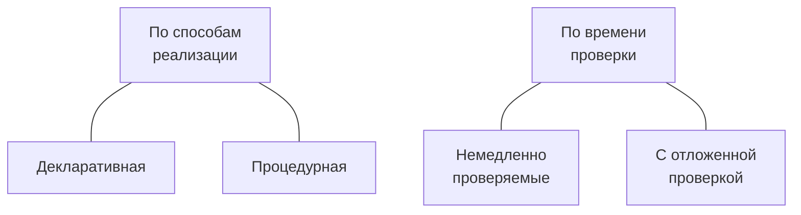
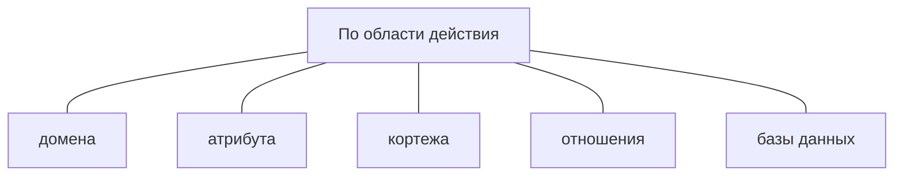
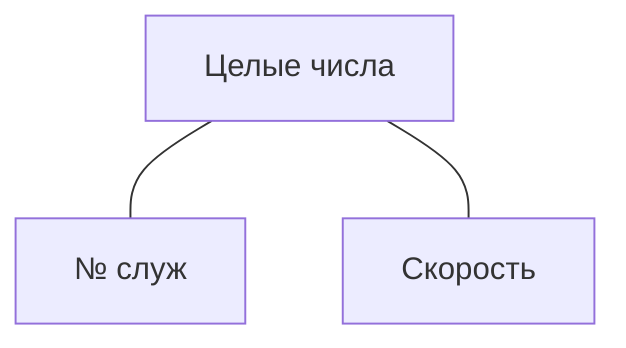
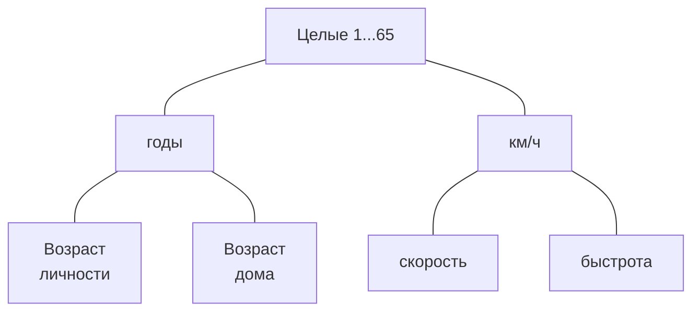

<link href="styles.css" rel="stylesheet" />

# МДК.11.01 Технология разработки и защиты БД
65f1ccf6d048d37352721344

- [Общее](#общее)
  - [Порядок прохождения курса](#порядок-прохождения-курса)
  - [Аннотация РП](#аннотация-рп)
    - [1. Паспорт рабочей программы](#1-паспорт-рабочей-программы)
      - [1.1. Область применения программы](#11-область-применения-программы)
      - [1.2. Цели и задачи модуля – требования к результатам освоения модуля](#12-цели-и-задачи-модуля--требования-к-результатам-освоения-модуля)
    - [2. Результаты освоения профессионального модуля](#2-результаты-освоения-профессионального-модуля)
    - [3. Структура и содержание профессионального модуля](#3-структура-и-содержание-профессионального-модуля)
    - [4. Условия реализации программы профессионального модуля](#4-условия-реализации-программы-профессионального-модуля)
  - [Список практических работ по дисциплине Основы проектирования](#список-практических-работ-по-дисциплине-основы-проектирования)
  - [Перечень учебных изданий, Интернет-ресурсов, дополнительной литературы](#перечень-учебных-изданий-интернет-ресурсов-дополнительной-литературы)
    - [1	Основные источники](#1основные-источники)
    - [2	Дополнительные источники](#2дополнительные-источники)
  - [Вопросы к экзамену](#вопросы-к-экзамену)
  - [Банк заданий](#банк-заданий)
  - [Оформление практических работ](#оформление-практических-работ)
  - [Видеоуроки по MySQL](#видеоуроки-по-mysql)
  - [Полное руководство по MySQL](#полное-руководство-по-mysql)
- [Тема 1.1 Основные положения теории баз данных](#тема-11-основные-положения-теории-баз-данных)
- [Тема 1.2 Хранилища данных и базы знаний](#тема-12-хранилища-данных-и-базы-знаний)
  - [Состав хранилища данных](#состав-хранилища-данных)
  - [Уровни хранилищ данных](#уровни-хранилищ-данных)
  - [Информационные потоки в ХД](#информационные-потоки-в-хд)
  - [Оптимизация ХД](#оптимизация-хд)
  - [Требования к хранилищам данных](#требования-к-хранилищам-данных)
  - [Отличия от БД](#отличия-от-бд)
  - [Базы Знаний](#базы-знаний)
- [Тема 1.3 Модели и структуры информационных систем](#тема-13-модели-и-структуры-информационных-систем)
  - [Структура информационной системы](#структура-информационной-системы)
  - [Информационное обеспечение](#информационное-обеспечение)
  - [Техническое обеспечение](#техническое-обеспечение)
  - [Математическое и программное обеспечение](#математическое-и-программное-обеспечение)
  - [Организационное обеспечение](#организационное-обеспечение)
  - [Правовое обеспечение](#правовое-обеспечение)
  - [Модели информационных систем](#модели-информационных-систем)
- [Тема 1.4 СУБД](#тема-14-субд)
  - [Архитектура СУБД](#архитектура-субд)
    - [Типовая организация СУБД](#типовая-организация-субд)
    - [Основные компоненты СУБД](#основные-компоненты-субд)
  - [Средства СУБД](#средства-субд)
  - [Компоненты среды СУБД](#компоненты-среды-субд)
    - [Аппаратное обеспечение](#аппаратное-обеспечение)
    - [Программное обеспечение](#программное-обеспечение)
    - [Данные](#данные)
    - [Процедуры](#процедуры)
    - [Пользователи](#пользователи)
  - [Функции СУБД](#функции-субд)
  - [Классификации СУБД](#классификации-субд)
    - [Аспекты классификация СУБД](#аспекты-классификация-субд)
    - [1. По модели данных](#1-по-модели-данных)
    - [2. По степени распределённости](#2-по-степени-распределённости)
    - [3. По способу доступа к БД](#3-по-способу-доступа-к-бд)
    - [4. По степени универсальности](#4-по-степени-универсальности)
  - [Возможности СУБД](#возможности-субд)
  - [Критерии выбора СУБД](#критерии-выбора-субд)
  - [Наиболее популярные СУБД](#наиболее-популярные-субд)
  - [Преимущества СУБД](#преимущества-субд)
  - [Недостатки  СУБД](#недостатки--субд)
- [Тема 1.5 Структуры данных СУБД](#тема-15-структуры-данных-субд)
  - [Модели данных](#модели-данных)
  - [Структуры данных](#структуры-данных)
  - [Иерархическая модель](#иерархическая-модель)
  - [Сетевая модель](#сетевая-модель)
  - [Реляционная модель](#реляционная-модель)
  - [NoSQL базы данных](#nosql-базы-данных)
    - [1. Базы данных «ключ-значение»](#1-базы-данных-ключ-значение)
    - [2. Документная база данных](#2-документная-база-данных)
    - [3. Графовая база данных](#3-графовая-база-данных)
    - [4. Колоночные базы данных](#4-колоночные-базы-данных)
    - [5. Базы данных временных рядов](#5-базы-данных-временных-рядов)
  - [Комбинированные типы](#комбинированные-типы)
    - [1. NewSQL базы данных](#1-newsql-базы-данных)
    - [2. Многомодельные базы данных](#2-многомодельные-базы-данных)
- [Тема 1.6 Основные принципы построения концептуальной, логической и физической модели данных](#тема-16-основные-принципы-построения-концептуальной-логической-и-физической-модели-данных)
  - [Жизненный цикл БД](#жизненный-цикл-бд)
  - [Проектирование БД](#проектирование-бд)
  - [Концептуальное проектирование (моделирование)](#концептуальное-проектирование-моделирование)
    - [Базовые понятия ER-методики: сущность, связь,  атрибут](#базовые-понятия-er-методики-сущность-связь--атрибут)
    - [Типы связей в ER-модели.](#типы-связей-в-er-модели)
    - [Класс принадлежности в ER-модели](#класс-принадлежности-в-er-модели)
    - [Преобразование ER- модели в реляционную](#преобразование-er--модели-в-реляционную)
      - [Правило 1](#правило-1)
      - [Правило 2](#правило-2)
      - [Правило 3](#правило-3)
      - [Правило 4](#правило-4)
      - [Правило 5](#правило-5)
      - [Правило 6](#правило-6)
  - [Логическое проектирование](#логическое-проектирование)
  - [Физическое проектирование](#физическое-проектирование)
- [Тема 1.7 Методы организации целостности](#тема-17-методы-организации-целостности)
  - [Понятие ограничения целостности и классификация ограничений целостности](#понятие-ограничения-целостности-и-классификация-ограничений-целостности)
    - [Основные понятия](#основные-понятия)
    - [Классификация ограничений целостности](#классификация-ограничений-целостности)
  - [Декларативные ограничения целостности](#декларативные-ограничения-целостности)
  - [Целостность столбцов: уровень поля](#целостность-столбцов-уровень-поля)
  - [Целостность связей между столбцами: уровень кортежей (записей, строк)](#целостность-связей-между-столбцами-уровень-кортежей-записей-строк)
  - [Целостность](#целостность)
  - [Целостность таблиц: уровень таблицы](#целостность-таблиц-уровень-таблицы)
  - [Целостность связей между таблицами: уровень совокупности взаимосвязанных таблиц](#целостность-связей-между-таблицами-уровень-совокупности-взаимосвязанных-таблиц)
  - [Семантические (прикладные) ограничения целостности](#семантические-прикладные-ограничения-целостности)
  - [Алгоритмические зависимости](#алгоритмические-зависимости)
  - [Запрет на обновление](#запрет-на-обновление)
  - [Отмена ограничений](#отмена-ограничений)
  - [Одномоментные и отложенные ограничения](#одномоментные-и-отложенные-ограничения)
  - [Режимы проверки корректности БД](#режимы-проверки-корректности-бд)
  - [Явные и неявные ограничения](#явные-и-неявные-ограничения)
  - [Целостность служебной информации](#целостность-служебной-информации)
  - [Информационная целостность банка данных](#информационная-целостность-банка-данных)
  - [Логическая и физическая целостность](#логическая-и-физическая-целостность)
  - [Целостность и истинность данных в БД](#целостность-и-истинность-данных-в-бд)
    - [Ограничения для доменов и атрибутов](#ограничения-для-доменов-и-атрибутов)
    - [Ограничения на сущности и связи](#ограничения-на-сущности-и-связи)
- [Тема 1.8 Основные принципы структуризации и нормализации базы данных](#тема-18-основные-принципы-структуризации-и-нормализации-базы-данных)
  - [Нормализация схем отношений](#нормализация-схем-отношений)
  - [Первая нормальная форма](#первая-нормальная-форма)
  - [Вторая нормальная форма](#вторая-нормальная-форма)
  - [Третья нормальная форма](#третья-нормальная-форма)
  - [Нормальная форма Бойса—Кодда](#нормальная-форма-бойсакодда)
  - [Практическая работа 1.О Сбор и анализ информации для проектирования базы данных](#практическая-работа-1о-сбор-и-анализ-информации-для-проектирования-базы-данных)
    - [Содержание работы](#содержание-работы)
    - [1.Т Типовое задание](#1т-типовое-задание)

## Общее

### Порядок прохождения курса
65f1ceccd048d37352721345

Программа курса рассчитана на 114 часов обучения, в том числе 8 часов отводится на лекционные занятия, 18 часов на практические занятия, 80 часов на самостоятельную работу.
В рамках курса обучающимся необходимо изучить 41тему:

1. Тема 1.1 Основные положения теории баз данных
2. Тема 1.2 Хранилища данных и баз знаний
3. Тема 1.3 Модели и структуры информационных систем
4. Тема 1.4 СУБД
5. Тема 1.5 Структуры данных СУБД
6. Тема 1.6 Основные принципы построения концептуальной, логической и физической модели данных
7. Тема 1.7   Методы организации целостности данных
8. Тема 1.8 Основные принципы структуризации и нормализации базы данных
9. Тема 2.1 Архитектуры баз данных
10. Тема 2.2 SQL сервера
11. Тема 2.3 Основные технологии доступа к данным
12. Тема 2.4 СУБД MySQL
13. Тема 2.5 Консольный клиент MySQL
14. Тема 2.6 Язык структурированных запросов SQL
15. Тема 2.7 Работа с таблицами базы данных
16. Тема 2.8 Изменение структуры таблицы
17. Тема 2.9 Индексирование таблиц
18. Тема 2.10 Ограничения целостности данных
19. Тема 2.11 Инструментальные средства для автоматизированного проектирования баз данных
20. Тема 2.12 Выборка данных из базы данных
21. Тема 2.13 Операторы сравнения в условиях выборки
22. Тема 2.14 Логические операторы в условиях выборки
23. Тема 2.15 Специальные операторы в условиях выборки
24. Тема 2.16 Группировка записей в запросах
25. Тема 2.17 Создание вычисляемых полей в запросах
26. Тема 2.18 Объединение таблиц в запросах
27. Тема 2.19 Объединение нескольких запросов
28. Тема 2.20 Вложенные запросы
29. Тема 2.21 Операторы модификации данных
30. Тема 2.22 Создание клиентской части приложения
31. Тема 2.23 Создание запросов на выборку в клиентской части приложения
32. Тема 3.1 Резервное копирование и восстановление данных
33. Тема 3.2 Управление привилегиями пользователя
34. Тема 4.1 Безопасность баз данных
35. Тема 4.2 Управление доступом к данным с помощью представлений
36. Тема 4.3 Хранимые процедуры
37. Тема 4.4 Язык хранимых процедур
38. Тема 4.5 Хранимые функции
39. Тема 4.6 Триггеры
40. Тема 4.7 Курсоры
41. Тема 4.8 Управление транзакциями и блокировки транзакций

 
Каждая тема состоит из ряда разделов:
- теоретический раздел;
- практический раздел;
- контрольное мероприятие.

Теоретическая часть темы, представлена в виде документа в формате .doc, а также содержит презентации, отражающие основное понятия, изучаемые в данной теме.

Внимательно прочтите теоретический материал.

После изучения лекционного материала, необходимо пройти тестирование для самопроверки. Оценка в баллах за выполнение теста автоматически будет выставлена в журнал. Изучив теоретический материал темы стоит перейти к выполнению практического задания (там, где оно предложено для выполнения), которое представлено в виде задания, по вариантам. Далее, направьте на проверку преподавателю, прикрепив файл к элементу Задание. Баллы за выполнение практического задания будут выставлены преподавателем в журнал.

Для закрепления знаний, воспользуйтесь материалами для самостоятельной работы (либо дополнительным материалом познавательного характера).

Изучив все темы курса, пройдите итоговое тестирование (контрольную работу).

По итогам прохождения всех контрольных мероприятий (тестов, практических заданий) будет сформирован журнал оценок.

Изучать курс рекомендуется в той последовательности, которая обозначена в его содержании.

Автором ЭУК является преподаватель Копец Ольга Николаевна.

### Аннотация РП
65f614a7d048d37352721403

В соответствии с ППССЗ по специальности 09.02.07 «Информационные системы и программирование» профессиональный модуль ПМ 11 Разработка, администрирование и защита баз данных включает междисциплинарный курс (далее – МДК): **Технология разработки и защиты баз данных**.

Рабочая программа профессионального модуля включает разделы:
1. Паспорт рабочей программы профессионального модуля;
2. Результаты освоения профессионального модуля;
3. Структура и содержание профессионального модуля;
4. Условия реализации программы профессионального модуля;
5. Контроль и оценка результатов освоения профессионального модуля (вида профессиональной деятельности).

#### 1. Паспорт рабочей программы
6602be69d048d3735272154a

##### 1.1. Область применения программы
Рабочая программа профессионального модуля является частью ППССЗ в соответствии с ФГОС по специальности СПО 09.02.07 «**Информационные системы и программирование**» в части освоения основного вида деятельности (ВД): **Разработка, администрирование и защита баз данных** и соответствующих профессиональных компетенций (ПК):
- ПК 11.1. Осуществлять сбор, обработку и анализ информации для проектирования баз данных;
- ПК 1.2. Проектировать базу данных на основе анализа предметной области;
- ПК 1.3. Разрабатывать объекты базы данных в соответствии с результатами анализа предметной области;
- ПК 1.4. Реализовывать базу данных в конкретной системе управления базами данных;
- ПК 1.5 Администрировать базы данных;
- ПК 1.6 Защищать информацию в базе данных с использованием технологии защиты информации.

Рабочая программа профессионального модуля может быть использована всеми образовательными учреждениями среднего профессионального образования и в дополнительном профессиональном образовании очной, очно-заочной и заочной формы.

##### 1.2. Цели и задачи модуля – требования к результатам освоения модуля
С целью овладения указанным видом профессиональной деятельности и соответствующими профессиональными компетенциями обучающийся в ходе освоения профессионального модуля **должен**:

**иметь практический опыт**:
- выполнять сбор, обработку и анализ информации для проектирования баз данных;
- выполнять работы с документами отраслевой направленности;
- работать с объектами базы данных в конкретной системе управления базами данных;
- работать с документами отраслевой направленности;
- использовать стандартные методы защиты объектов базы данных;
- использовать средства заполнения базы данных;

**уметь**:
- работать с документами отраслевой направленности;
- собирать, обрабатывать и анализировать информацию на предпроектной стадии;
- работать с современными case-средствами проектирования баз данных;
- создавать объекты баз данных в современных СУБД;
- работать в средах современных СУБД;
- применять стандартные методы для защиты объектов базы данных;
- выполнять стандартные процедуры резервного копирования и мониторинга выполнения этой процедуры;
- выполнять установку и настройку программного обеспечения для обеспечения работы пользователя с базой данных;
- обеспечивать информационную безопасность на уровне базы данных.

**знать**:
- методы описания схем баз данных в современных СУБД;
- основные положения теории баз данных, хранилищ данных, баз знаний;
- основные команды для работы в среде современной СУБД;
- основные принципы построения концептуальной, логической и физической модели данных;
- структуры данных СУБД, общий подход к организации представлений, таблиц, индексов и кластеров;
- методы организации целостности;
- технологии передачи и обмена данными в компьютерных сетях;
- алгоритм проведения процедуры резервного копирования;
- алгоритм проведения процедуры восстановления базы данных.

#### 2. Результаты освоения профессионального модуля
6602cc8dd048d3735272154e

Результатом освоения программы профессионального модуля является овладение обучающимися видом профессиональной деятельности – **Разработка, администрирование и защита баз данных**, в том числе профессиональными и общими компетенциями, которые заданы ФГОС СПО по специальности 09.02.07 «Информационные системы и программирование».

#### 3. Структура и содержание профессионального модуля
6602cda2d048d37352721550

Данному профессиональному модулю соответствует междисциплинарный курс **МДК 11.01. «Технология разработки и защиты баз данных».**

Раздел | Тема
-- | --
Раздел 1 Основы хранения и обработки данных, проектирование БД | Тема 1.1 Основные положения теории баз данных Тема 1.2 Хранилища данных и баз знаний Тема 1.3 Модели и структуры информационных систем Тема 1.4 СУБД Тема 1.5 Структуры данных СУБД Тема 1.6 Основные принципы построения концептуальной, логической и физической модели данных Тема 1.7   Методы организации целостности данных Тема 1.8 Основные принципы структуризации и нормализации базы данных
Раздел 2 Разработка объектов базы данных и реализация базы данных в СУБД | Тема 2.1 Архитектуры баз данных Тема 2.2 SQL сервера Тема 2.3 Основные технологии доступа к данным Тема 2.4 СУБД MySQL Тема 2.5 Консольный клиент MySQL Тема 2.6 Язык структурированных запросов SQL Тема 2.7 Работа с таблицами базы данных Тема 2.8 Изменение структуры таблицы Тема 2.9 Индексирование таблиц Тема 2.10 Ограничения целостности данных Тема 2.11 Инструментальные средства для автоматизированного проектирования баз данных Тема 2.12 Выборка данных из базы данных Тема 2.13 Операторы сравнения в условиях выборки Тема 2.14 Логические операторы в условиях выборки Тема 2.15 Специальные операторы в условиях выборки Тема 2.16 Группировка записей в запросах Тема 2.17 Создание вычисляемых полей в запросах Тема 2.18 Объединение таблиц в запросах Тема 2.19 Объединение нескольких запросов Тема 2.20 Вложенные запросы Тема 2.21 Операторы модификации данных Тема 2.22 Создание клиентской части приложения Тема 2.23 Создание запросов на выборку в клиентской части приложения Контрольная работа 1. Подведение итогов
Раздел 3 Основы администрирования баз данных | Тема 3.1 Резервное копирование и восстановление данных Тема 3.2 Управление привилегиями пользователя
Раздел 4 Организация защиты данных в базах данных | Тема 3.1 Безопасность баз данных Тема 3.2 Управление доступом к данным с помощью представлений Тема 3.3 Хранимые процедуры Тема 3.4 Язык хранимых процедур Тема 3.5 Хранимые функции Тема 3.6 Триггеры Тема 3.7 Курсоры Тема 3.8 Управление транзакциями и блокировки транзакций Контрольная работа 2. Подведение итогов

Описание содержания обучения помимо тематического плана включает по каждому разделу:
- характеристику уровня усвоения учебного материала,
- конкретное описание учебного материала,
- содержание лабораторных работ и практических занятий,
- описание самостоятельной работы обучающихся,
- тематику курсового проекта,
- перечень видов работ, выполняемых обучающимися в ходе учебной и производственной практики.

**Календарно-тематический план с указанием обязательных практических работ**

№ п/п |	Наименование темы занятия и практической работы | Кол-во аудиторных часов
-- | -- | --
1 | Работа с таблицами базы данных | 1
2 | Ограничения целостности данных | 1
3 | Специальные операторы в условиях выборки | 1
4 | Группировка записей в запросах | 1
5 | Объединение таблиц в запросах | 1
6 | Управление привилегиями пользователя | 1
7 | Управление доступом к данным с помощью представлений | 1
8 | Язык хранимых процедур | 1
9 | Практическая работа 2.О Работа в консольном клиенте СУБД MySQL | 1
10 | Практическая работа 3.О Создание таблиц | 1
11 | Практическая работа 4.О Изменение структуры таблиц | 2
12 | Практическая работа 5.О Создание индексов | 2
13 | Практическая работа 6.О Установка ограничений и контроль ссылочной целостности | 2
14 | Практическая работа 9.О Простые запросы на выборку | 2
15 | Практическая работа 10.О Специальные операторы в условиях выборки запроса | 2
16 | Практическая работа 11.О Создание запросов на выборку с использованием группировки данных | 2
17 | Практическая работа 12.О Создание запросов на выборку с использованием вычисляемых полей | 2
18 | Практическая работа 13.О Создание запросов на объединение нескольких таблиц. | 2
19 | Практическая работа 14.О Создание запросов на объединение нескольких запросов | 2
20 | Практическая работа 15.О Создание вложенных запросов | 2
21 | Создание запросов на изменение данных | 2
22 | Практическая работа 16.О Создание запросов на изменение данных | 2
23 | Практическая работа 20.О Создание учетных записей пользователей | 1
24 | Практическая работа 21.О Реализация доступа пользователей к базе данных | 1
25 | Практическая работа 22.О Создание представлений | 2
26 | Практическая работа 23.О Создание хранимых процедур (продолжение) | 2
27 | Практическая работа 24 Создание хранимых функций | 2
28 | Практическая работа 27.О Выполнение и отмена транзакций | 2
29 | Работа над курсовым проектом | 2
30 | Работа над курсовым проектом | 2
31 | Работа над курсовым проектом | 2
32 | Работа над курсовым проектом | 2
33 | Работа над курсовым проектом | 2
| | Итого: | 52

#### 4. Условия реализации программы профессионального модуля
6602d755d048d37352721553

Программа профессионального модуля включает следующие данные:
- требования к минимальному материально-техническому обеспечению образовательного процесса;
- информационное обеспечение обучения: перечень рекомендуемых учебных изданий, интернет-ресурсов, дополнительной литературы;
- общие требования к организации образовательного процесса, включая требования к условиям допуска и организации практики, итоговой аттестации по модулю, а также требования к кадровому обеспечению образовательного процесса.

### Список практических работ по дисциплине Основы проектирования
6602daa9d048d37352721556

Код работы | Название работы | Количество заданий (вариантов работы)
-- | -- | --
1.О | Проектирование базы данных с использованием алгоритма нормализации |30
2.О | Проектирование базы данных с помощью ER-диаграмм | 30
3.О |	Создание таблиц |	30
4 |	Создание схемы данных	| 30
5 |	Ввод данных в таблицы |	30
6.О |	Создание запросов с использованием операторов сравнения и логических операторов |	30
7.О |	Создание запросов с использованием специальных операторов |	30
8.О |	Создание запросов с вычисляемыми полями |	30
9 |	Создание запросов с параметром |	30
10.О |	Создание запросов с группировкой данных	| 30
11.О |	Создание многотабличных запросов |	30
12.О |	Создание запросов на изменение данных в базе данных |	30
13.О |	Создание форм	| 30
14 |	Создание главной кнопочной формы  |	30
15.О |	Создание отчетов |	30
16 |	Использование макросов |	30
17.О |	Создание простых SQL-запросов на выборку с использованием операторов сравнения, логических операторов и специальных операторов |	30
18.О |	Создание запросов с использованием специальных операторов |	30
19.О |	Создание SQL-запросов на выборку с группировкой данных |	30
20.О |	Создание SQL-запросов с вычисляемыми полями |	30
21.О |	Создание SQL-запросов на выборку из нескольких таблиц |	30
22.О |	Создание SQL-запросов на добавление, удаление и обновление данных в таблице |	30
КР1.О |	Контрольная работа 1.О

### Перечень учебных изданий, Интернет-ресурсов, дополнительной литературы
660c2d80d048d37352721641

#### 1	Основные источники
- [x] 1.1 Федорова Г.Н. Разработка, администрирование и защита баз данных [Текст]: Учебник. СПО / Г. Н. Федорова. – М.: Издательский центр "Академия", 2018. - 288 с. - (Профессиональное образование). − Библиогр.: с. 282.

- [x] 1.2 Илюшечкин В.М. Основы использования и проектирования баз данных: учебник для СПО В.М. Илюшечкин. – М: Издательство ЮРАЙТ, 2018. – 213 с. – Серия: Профессиональное образование [Электронный ресурс]; режим доступа: URL:https://biblio-online.ru/viewer/290801FB-F8CF-47B3-9559-6BADEC310243/osnovy-ispolzovaniya-i-proektirovaniya-baz-dannyh#page/30

- [x] 1.3 Шуcтова Л.И., Тараканов О.В. Базы данных: Учебник. –М. ИНФРА – М, 2018. -304 с.  (Высшее образование: Бакалавриат). [Электронный ресурс]; режим доступа: URL:http://znanium.com/bookread2.php?book=491069, свободный.

#### 2	Дополнительные источники
- [x] 2.1 Кара-Ушаков, В.Ю. SQL–язык реляционных баз данных: учебное пособие / В.Ю. Кара-Ушанов. – Екатеринбург: Изд-во Урал. Ун-та, 2017. – 156 с. [Электронный ресурс]; режим доступа: URL:http://www.iprbookshop.ru/68419.html
- [x] 2.2 Введение в СУБД MySQL / - М.: Национальный Открытый Университет «ИНТУИТ», 2018. – 229 с. [Электронный ресурс]; режим доступа: URL: http://www.iprbookshop.ru/73650.html
- [x] 2.3 Мартишин С.А. Проектирование и реализация баз данных в СУБД MySQL с использованием MySQL Workbench. Методы и средства проектирования информационных систем и технологий. Инструментальные средства информационных систем: учеб. пособие / С.A. Мартишин, В.Л. Симонов, М.В. Храпченко. − М.: ИД «ФОРУМ»: ИНФРА-М, 2018. − 160 с. − (Среднее профессиональное образование). [Электронный ресурс]; режим доступа: URL: http://znanium.com/bookread2.php?book=967597

### Вопросы к экзамену
660e8c8ad048d37352721674

1. Дайте определения понятиям: база данных, информационная система, банк данных, СУБД.
2. Опишите трехуровневую архитектуру баз данных. Объясните физическую и логическую независимость данных в БД.
3. Дайте понятие модели данных. Раскройте достоинства и недостатки иерархической, сетевой, реляционной, постреляционной, объектно-ориентированной и многомерной моделей данных. Приведите примеры.
4. Опишите реляционную таблицу и ее элементы. Раскройте понятия: отношение, атрибуты, домены, кортежи, схема отношений, мощность отношения, кардинальность отношения.
5. Объясните важность обеспечения непротиворечивости и целостности реляционной модели данных.
6. Перечислите требования, предъявляемые к реляционным таблицам.
7. Опишите назначение специальных реляционных операторов: объединение, пересечение, вычитание, декартово произведение. Приведите примеры.
8. Опишите назначение специальных реляционных операций: выборка, проекция, соединение, деление.  Приведите примеры.
9. Опишите функции СУБД.
10. Охарактеризуйте этапы проектирования баз данных: концептуальное, логическое, физическое.
11. Объясните назначение нормализации таблиц. Дайте определение первой нормальная форме (1НФ). Приведите примеры.
12. Объясните назначение второй нормальной формы (2НФ). Дайте объяснение функциональной зависимости. Приведите примеры.
13. Объясните назначение третьей нормальной формы (3НФ). Дайте объяснение понятия транзитивная зависимость. Приведите примеры.
14. Опишите основные понятия ER-диаграмм: сущность, атрибут, связь. Приведите примеры.
15. Опишите правила генерации реляционных таблиц из ER-диаграмм. Приведите примеры.
16. Опишите основные возможности СУБД MS Access. Перечислите объекты СУБД MS Access.
17. Перечислите и опишите типы данных, используемые при создании таблиц в СУБД MS Access. Приведите примеры
18. Опишите назначение таблиц в СУБД Access, перечислите режимы работы с таблицами и свойства полей. Приведите примеры.
19. Опишите технологию создания запросов с условиями выборки, запросов с группировкой данных, запросов с параметрами, запросов с вычисляемым полем и многотабличных запросов в СУБД Access.
20. Опишите технологию создания перекрестных запросов, запросов на создание, обновление, добавление, удаление таблиц в СУБД Access.
21. Опишите назначение форм, элементы управления формой, способы форматирования форм в СУБД Access.
22. Опишите назначение отчетов, способы форматирования отчетов, способы получения итоговых данных в MS Access.
23. Опишите назначение и способы создания макросов в СУБД Access.
24. Опишите структуру оператора SELECT.
25. Опишите создание простых SQL-запросов на выборку, упорядочивание значений полей в запросах и выборку данных без дублирования. Приведите примеры.
26. Объясните работу оператора WHERE в SQL-запросах. Перечислите операторы сравнения, логические операторы, специальные операторы в условиях выборки и их назначение. Приведите примеры.
27. Перечислите агрегатные функции и назначение операторов GROUP BY и HAVING в SQL-запросах. Приведите примеры.
28. Объясните назначение внешнего (Left Join, Right Join) и внутреннего (Inner Join) объединения таблиц в SQL-запросах. Объясните использование псевдонимов в запросах. Приведите примеры.
29. Объясните назначение операторов EXISTS, ANY и ALL при создании вложенных SQL-запросов. Приведите примеры.
30. Опишите операторы манипулирования данными: Insert, Delete, Update. Приведите примеры.

### Банк заданий
660ed2e9d048d37352721680

### Оформление практических работ
661d3f81d048d373527217c3

### Видеоуроки по MySQL
661d9affd048d373527217d0

[3. MySQL 8 - MySQL Workbench 8](https://www.youtube.com/watch?v=EMOKs8_l2WA) from [Курс MySQL 8](https://www.youtube.com/playlist?list=PLOQDek48BpZFeW02dfJM77FY4Fp5ilJ6n) channel [htmllab](https://www.youtube.com/@HtmllabRu)

### Полное руководство по MySQL
661e836fd048d373527217f5

[MySQL 8.0. Полное руководство](http://www.rldp.ru/mysql/mysql80/index.htm)

## Тема 1.1 Основные положения теории баз данных
661eedb1d048d37352721811

Современный период развития цивилизованного общества характеризует процесс информатизации.

<dfn title="информатизация общества">Информатизация общества</dfn> — это глобальный социальный процесс, особенность которого состоит в том, что доминирующим видом деятельности в сфере общественного производства является сбор, накопление, продуцирование, обработка, хранение, передача и использование информации, осуществляемые на основе современных средств микропроцессорной и вычислительной техники, а также на базе разнообразных средств информационного обмена. Информатизация общества обеспечивает:
- активное использование постоянно расширяющегося интеллектуального потенциала общества, сконцентрированного в печатном фонде, и научной, производственной и других видах деятельности его членов;
- интеграцию информационных технологий в научные и производственные виды деятельности, инициирующую развитие всех сфер общественного производства, интеллектуализацию трудовой деятельности;
- высокий уровень информационного обслуживания, доступность любого члена общества к источникам достоверной информации, визуализацию представляемой информации, существенность используемых данных.

*[ВТ]: Вычислительная техника
С самого начала развития вычислительной техники (ВТ) образовались два основных направления ее использования:
- применение ВТ для сложных численных расчетов;
- применение ВТ для хранения и обработки информации.

*Первоначально* ВТ использовалась только для сложных численных расчетов. Именно потребностью обеспечить большие объемы расчетов, требовавшихся в новых отраслях науки и техники (ядерной энергетике, ракетостроении и др.), и было вызвано появление ЭВМ.

Это направление дало толчок развитию численных методов и языков программирования, ориентированных на удобную запись численных алгоритмов.

*Второе направление* возникло, когда в компьютерах появилось достаточно оперативной и внешней памяти (магнитные ленты, магнитные барабаны и, главное, магнитные диски). Оно дало развитие информационным системам (далее – ИС).

Классическими примерами ИС являются банковские системы, системы резервирования билетов, библиотечные системы и т.п.

*[СУФ]: Система Управления Файлами
Появление магнитных дисков, способных хранить большие объемы информации, потребовало создания систем управления данными во внешней памяти. Так появились **системы управления файлами** (**СУФ**), или **файловые системы**.

С точки зрения прикладной программы <dfn title="файл">файл</dfn> – это именованная область внешней памяти, в которую можно записывать и из которой можно считывать данные.

Почему файловых систем недостаточно для эффективной обработки информации?

В файловой системе хранятся следующие виды файлов:
- **текстовые** (документы, программы); обрабатываются текстовыми редакторами; их структура очень проста – последовательность строк или байтов (символов);
- **объектные** и **исполняемые** файлы, которые также имеют простую структуру.

Таким образом, файловые системы обеспечивают хранение слабоструктурированной информации, оставляя дальнейшую структуризацию прикладным программам.

Сами файлы часто изменяются, удаляются, создаются заново.

Одним из важнейших понятий теории базы данных является понятие информации. Здесь под <dfn title="информация">информацией</dfn> понимают любые сведения о каком-либо событии, процессе, объекте. С понятием информации тесно связано понятие данных.

<dfn title="данные">Данные</dfn> – это информация, представленная в определенном виде, позволяющем автоматизировать ее сбор, хранение и обработку.

Одни и те же данные могут быть различным образом истолкованы. Одну и ту же информацию можно представить (записать) многообразными способами.

**Две точки зрения на данные, используемые в теории баз данных**

Сами данные пассивны, активность им придают прикладные программы – ввода, вывода и обработки данных. Только программы обеспечивают интерпретацию и связность данных.

*[БД]: База Данных
<dfn title="база данных">База данных</dfn> (БД) – совокупность специальным образом организованных данных (структурированных), хранимых в памяти компьютера и отражающих состояние объектов, и их отношений в рассматриваемой предметной области.

<dfn title="предметная область">Предметной областью</dfn> принято называть ту часть реального мира, объекты которой описаны в базе данных. База данных состоит из множества связанных файлов.

Информацию о данных, хранимых в базе, принято называть <dfn title="метаданные">метаданными</dfn> (данными о данных). Совокупность всех метаданных образует <dfn title="словарь данных">словарь данных</dfn>.

<dfn title="словарь данных">Словарь данных</dfn> представляет собой метаданные базы данных и содержит имена и атрибуты всех объектов в базе данных.

Важнейшим элементом любой базы данных, независимо от ее представления, является <dfn title="структура данных">структура данных</dfn>, которая отражает возможные представления сведений для хранения, выборки и обработки.

<dfn title="структура данных">Структура данных</dfn> (**data structure**) — множество элементов данных, объединенных и упорядоченных определенным образом.

<dfn title="структура базы данных">Структура базы данных</dfn> (**DB structure**) — принцип или порядок организации записей в *базе данных* и связей между ними. Структуру БД принято рассматривать на разных уровнях *абстракции* (представления) и, в частности: концептуальном (с позиции администратора предприятия), реализации или внешнем (с позиций конечного пользователя и прикладного программиста) и физическом или внутреннем (с позиций системного аналитика и системного программиста). Соответственно этим уровням различают *концептуальную*, *внешнюю* и *физическую модели* и/или *схемы организации данных*.

<dfn title="управление данными">Управление данными</dfn> – это процесс, который подразумевает сбор, хранение, обработку и интерпретацию накопленных данных. Сегодня для многих компаний управление данными – это отличная возможность понять данные, которые уже собраны, «узнать» конкурентов, выстроить предикативную аналитику (прогнозирование), ответить на многие вопросы бизнеса.

**Основные процессы управления данными**:
- управление базами данных;
- ETL-процессы (извлечение, преобразование и загрузка данных);
- сбор данных;
- защита и шифрование данных;
- моделирование данных (структура данных);
- собственно анализ данных (дублирование данных, устаревшие данные).

Одним из важнейших условий обеспечения эффективного функционирования любой организации является наличие развитой информационной системы.

<dfn title="информационная система">Информационная система</dfn> представляет собой систему, реализующую автоматизированный сбор, обработку и манипулирование данными и включающая технические средства обработки данных, программное обеспечение и обслуживающий персонал.

*[ИС]: Информационная Система
<dfn title="информационная система">Информационная система</dfn> (ИС) — это совокупность базы данных и всего комплекса аппаратно-программных средств для ее хранения, изменения и поиска информации, для взаимодействия с пользователем (СУБД + БД).

Примерами информационных систем являются системы продажи билетов на пассажирские поезда и самолеты. WWW — это тоже пример глобальной информационной системы.

Для хранения БД может использоваться как один компьютер, так и множество взаимосвязанных компьютеров.

*[ПП]: Прикладная Программа
*[СУБД]: Система Управления Базами Данных
Современной формой информационных систем являются <dfn title="банк данных">банки данных</dfn>, которые включают в свой состав вычислительную систему, одну или несколько баз данных (БД), систему управления базами данных (СУБД) и набор прикладных программ (ПП).

*[БнД]: Банк Данных
<dfn title="банк данных">Банк данных</dfn> (БнД) − это одна из форм информационных систем.

Основными функциями банков данных являются:
- хранение данных и их защита;
- изменение (обновление, добавление и удаление) хранимых данных;
- поиск и отбор данных по запросам пользователей;
- обработка данных и вывод результатов.

<dfn title="банк данных">Банком данных</dfn> называют систему специальным образом организованных баз данных, программных, технических, языковых и организационно-методических средств, предназначенных для обеспечения централизованного накопления и коллективного многоцелевого использования данных.

**Основными компонентами банка данных являются**:
-	вычислительная система (технические средства и операционная система);
-	база данных (непосредственно вся информация);
-	система управления базой данных, СУБД (программное обеспечение для организации хранения и использования информации);
-	набор прикладных программ.

К **основным функциям банка данных** относятся:
-	хранение данных и их защита;
-	изменение (обновление, добавление и удаление) хранимых данных;
-	поиск и отбор данных по запросам пользователей;
-	обработка данных и вывод результатов.

<dfn title="база данных">База данных</dfn> обеспечивает хранение информации и представляет собой поименованную совокупность данных, организованных по определенным правилам, включающим общие принципы описания, хранения и манипулирования данными.

<dfn title="система управления базами данных">Система управления базами данных</dfn> представляет собой пакет прикладных программ и совокупность языковых средств, предназначенных для создания, сопровождения и использования баз данных.

<dfn title="прикладная программа">Прикладные программы</dfn> (<dfn title="приложение">приложения</dfn>) в составе банков данных служат для обработки данных, вычислений и формирования выходных документов по заданной форме.

> Для работы с базой данных во многих случаях можно обойтись только средствами СУБД, скажем, создавая запросы и отчеты. Приложения разрабатывают главным образом в случаях, когда требуется обеспечить удобство работы с БД неквалифицированным пользователям или интерфейс СУБД не устраивает пользователя.

Неформально, <dfn title="база данных">база данных</dfn> (БД) – это большое по объему хранилище данных, в которое можно добавлять и из которого можно извлекать данные.

Более строгое определение БД в  «Мартин Дж. Организация баз данных в вычислительных системах. М: Мир, 1978».

<dfn title="база данных">База данных</dfn> – это *совокупность взаимосвязанных хранящихся вместе данных* при наличии такой <u>минимальной избыточности</u>, которая допускает их эффективное использование для одного или нескольких приложений (задач);
- *данные* запоминаются так, чтобы они были <u>независимы от программ</u>, использующих эти данные;
- для *добавления* новых и *модификации* существующих *данных*, а также для *поиска* данных применяется *общий управляемый способ*.

Система управления данными является **СУБД**, если она
- поддерживает логически согласованный набор файлов;
- предоставляет язык манипулирования данными;
- обеспечивает восстановление информации после сбоев;
- обеспечивает параллельную работу нескольких пользователей.

Примеры СУБД: Access, Oracle, MySQL, MS SQL Server, lnformix.

**Две точки зрения на базу данных**

**БД как информационная модель**

**БД как склад данных**

База данных должна обладать определенными свойствами:
1. <dfn title="восстанавливаемость">Восстанавливаемость</dfn> – возможность восстановления базы данных после сбоя системы (проверка наличия файлов, дублирование базы данных).
2. <dfn title="безопасность">Безопасность</dfn> – предполагает защиту данных от преднамеренного и непреднамеренного доступа, защита от копирования, запрещение несанкционированного доступа.
3. <dfn title="целостность">Целостность</dfn>. В каждый момент времени существования базы данных сведения, содержащиеся в ней, должны быть полными, непротиворечивыми и адекватно отражающими предметную область. В этом и заключается ее целостность. Целостность базы данных достигается вследствие введения ограничения целостности (указание диапазона допустимых значений, соотношение между значениями данных, ограничение на удаление информации и т.д.). Ограничения реализуются различными средствами системой управления базами данных (СУБД), например, при помощи декларативных (объявленных при разработке базы данных ее разработчиком) ограничений целостности.
4. <dfn title="эффективность">Эффективность</dfn> – минимальное время реакции на запрос пользователя.

**Неизбыточность и непротиворечивость**

Однако на практике во многих базах данных избыточность присутствует. В этом случае говорят об <dfn title="управляемая избыточность">управляемой</dfn> или <dfn title="минимальная избыточность">минимальной избыточности</dfn>. Она нужна для:
- уменьшения времени доступа к данным  или упрощения способов адресации;
- обеспечения возможности восстановления данных при их случайной потере.

**Независимость БД от приложений**

Программы, с помощью которых пользователи работают с базой данных, называются <dfn title="приложение">приложениями</dfn>. В общем случае с одной базой данных могут работать множество различных приложений.

Например, если база данных моделирует некоторое предприятие, то для работы с ней может быть создано приложение, которое обслуживает подсистему учета кадров, другое приложение может быть посвящено работе подсистемы расчета заработной платы сотрудников, третье приложение работает как подсистемы складского учета, четвертое приложение посвящено планированию производственного процесса.

Под <dfn title="независимость данных от приложений">независимостью данных от приложений</dfn> и наоборот, приложений от данных, подразумевается, что изменение одних не приводит к изменению других.

При рассмотрении приложений, работающих с одной базой данных, предполагается, что они могут работать параллельно и независимо друг от друга, и именно СУБД призвана обеспечить работу множества приложений с единой базой данных таким образом, чтобы каждое из них выполнялось корректно, но учитывало все изменения в базе данных, вносимые другими приложениями.

**Жизненный цикл базы данных**

## Тема 1.2 Хранилища данных и базы знаний
661fd426d048d3735272182b

Основные проблемы, связанные с анализом информации, как правило, обусловлены разрозненностью данных в первоисточниках, их качеством и уровнем готовности (отсутствием агрегатов, вычисляемых показателей) для решения аналитических задач. Поэтому на сегодняшний день наиболее востребованной технологией, используемой при реализации аналитической информационной системы, являются хранилища данных, с помощью которых решается задача сбора, очистки и преобразования первичных данных.

В основе концепции ХД лежит идея разделения данных, используемых для оперативной обработки и для решения задач анализа.

Основными идеями, лежащими в основе концепции хранилища данных, являются:
- интеграция разъединенных детализированных данных, которые описывают некоторые конкретные факты, свойства, события и т.д., в едином хранилище;
- разделение наборов данных и приложений на используемые для оперативной обработки и применяемые для решения задач анализа.

В начале восьмидесятых годов прошлого века в период бурного развития регистрирующих ИС возникло понимание ограниченности возможности применения БД для целей анализа данных и построения на их основе систем поддержки и принятия решений. Регистрирующие системы создавались для автоматизации рутинных операций по ведению бизнеса — выписка счетов, оформление договоров, проверка состояния склада и т.д. Пользователями таких систем был в основном линейный персонал. Основные требования, которые предъявлялись к регистрирующим системам, — обеспечение транзакционности вносимых изменений и максимизация скорости их выполнения. Именно эти требования определили выбор реляционных СУБД и соответствующей модели представления данных в качестве основных используемых технических решений при построении регистрирующих систем.

Для менеджеров и аналитиков требовались системы, которые бы позволяли:
- анализировать информацию во временном аспекте;
- формировать произвольные запросы к системе;
- обрабатывать большие объемы данных;
- интегрировать данные из различных регистрирующих систем.

Очевидно, что регистрирующие системы не удовлетворяли ни одному из вышеуказанных требований. В регистрирующей системе информация актуальна только на момент обращения к базе данных, в следующий момент времени по тому же запросу можно получить совершенно другой результат. Интерфейс регистрирующих систем рассчитан на проведение жестко определенных операций и возможности получения результатов на нерегламентированный запрос сильно ограничены. Возможность обработки больших массивов данных также мала из-за настройки СУБД на выполнение коротких транзакций и неизбежного замедления работы остальных пользователей.

Ответом на возникшую потребность стало появление новой технологии организации баз данных — технологии хранилищ данных.

*[ХД]: Хранилище данных
<dfn title="хранилище данных">Хранилище данных</dfn> (**ХД**) – это система, содержащая непротиворечивую интегрированную предметно-ориентированную совокупность исторических данных крупной корпорации или иной организации с целью поддержки принятия стратегических решений.

<dfn title="хранилище данных">Хранилище данных</dfn> – предметно ориентированный, интегрированный, неизменчивый, поддерживающий хронологию набор данных, организованный для целей поддержки принятия решений.

<dfn title="создание хранилища данных">Создание хранилища данных</dfn> – это процесс сбора, отсеивания и предварительной обработки данных с целью представления результирующей информации пользователям для статистического анализа и аналитических отчетов.

Информационные ресурсы ХД формируются путем извлечения моментальных снимков БД операционной ИС организации и различных внешних источников. ХД собирает, очищает, загружает, агрегирует, хранит данные и предоставляет к ним быстрый доступ.

При эффективном использовании ХД может быть одним из основных источников достоверной информации для руководителей и специалистов всех подразделений организации. Это обеспечит согласованность, своевременность и обоснованность принятия управленческих решений, облегчит выверку обязательной отчетности, выпуск управленческой отчетности.

О хранилище данных можно говорить, как о совокупности источника данных (структура связанных таблиц — это и есть хранилище), где собирается информация для дальнейшей обработки, и процедур извлечения, преобразования и загрузки данных (ETL — extraction, transformation, loading).

*[КИС]: Корпоративная информационная система
Физически хранилище данных представляет собой реляционную базу данных. Однако в отличие от БД корпоративных информационных систем (КИС) хранилище имеет принципиально иную структуру. Например, хранилище содержит агрегированные данные, вычисляемые показатели, хранит исторические накопленные данные по конкретным объектам (период хранения информации — длительный). В отличие от ХД базы данных КИС содержат детализированные данные, период их хранения относительно короткий.

*Проблемы создания физического ХД*:
- необходимость интеграции данных из неоднородных источников в распределенной среде;
- потребность в эффективном хранении и обработке очень больших объемов информации;
- необходимость наличия многоуровневых справочников метаданных;
- повышенные требования к безопасности данных.

### Состав хранилища данных
Классическая архитектура ХД состоит из следующих элементов:
- реляционная, многомерная, или гибридная БД;
- средства извлечения, очистки и загрузки данных;
- средства визуализации данных и генерации отчетов (OLAP-клиенты).

Реляционная БД строится по архитектуре «звезда», в которой с одной таблицей фактов связаны несколько таблиц измерений (справочников), или «снежинка», отличающаяся наличием иерархических справочников. Это делается для оптимизации скорости выполнения объемных запросов (в последнее время появилось много статей, критикующих этот подход за его упрощенность и невозможность решения исключительно в рамках «звезды» всего многообразия задач ХД). В многомерной БД строятся «кубы» — специфические структуры, аналогичные по смыслу реляционным «снежинкам», но хранящие вычисленные агрегаты на всех пересечениях измерений.

Концептуально модель хранилища данных можно представить в виде схемы, показанной на рис. 1.

*Рис. 1 Концептуальная модель хранилища данных*

Данные из различных источников помещаются в ХД, а описания этих данных в репозитории метаданных. Конечный пользователь, используя различные инструменты (средства визуализации, построения отчетов, статистической обработки и т.д.) и содержимое репозитория, анализирует данные в хранилище. Результатом его деятельности является информация в виде готовых отчетов, найденных скрытых закономерностей, каких-либо прогнозов. Так как средства работы конечного пользователя с хранилищем данных могут быть самыми разнообразными, то теоретически их выбор не должен влиять на его структуру и функции его поддержания в актуальном состоянии.

*[ОИД]: Оперативный источник данных
Детальными являются данные, переносимые непосредственно из ОИД (оперативных источников данных). Они соответствуют элементарным событиям, фиксируемым OLTP системами. (Haпример, продажи, эксперименты и др.).

*[OLTP]: On-Line Transaction Processing
> <dfn title="OLTP">OLTP</dfn> (англ. *Online Transaction Processing*), <dfn title="транзакционная система">транзакционная система</dfn> – обработка транзакций в реальном времени. Способ организации БД, при котором система работает с небольшими по размерам транзакциями, но идущими большим потоком, и при этом клиенту требуется от системы минимальное время отклика.

Принято разделять все данные на измерения и факты.

<dfn title="измерение">Измерениями</dfn> называются наборы данных, необходимые для описания событий (например, города, товары, люди и т. п.).

<dfn title="факт">Фактами</dfn> называются данные, отражающие сущность события (например, количество проданного товара, результаты экспериментов и т. п.). На основании детальных данных могут быть получены агрегированные (обобщенные) данные.

Для удобства работы с ХД необходима информация о содержащихся в нем данных. Такая информация называется <dfn title="метаданные">метаданными</dfn> (данные о данных).

Coгласно концепции Дж. Захмана, метаданные должны отвечать на следующие вопросы:
- что (описание объектов),
- кто (описание пользователей),
- где (описание места хранения),
- как (описание действий),
- когда (описание времени),
- почему (описание причин).

> Джон А. Захман (родился 16 декабря 1934 года) — американский бизнес-консультант и ИТ-консультант.

**Состав хранилища данных**:
- оперативные источники данных;
- реляционного хранилища;
- средств переноса и трансформации данных;
- OLAP‑хранилища;
- метаданных – включают каталог хранилища и  правила преобразования данных при загрузке их из оперативных баз данных;
- средств доступа и анализа данных

*[OLAP]: On-Line Analytical Processing
<dfn title="OLAP">OLAP‑технология</dfn> — технология комплексного многомерного анализа данных. Для построения систем OLAP используются специализированные многомерные базы данных, либо надстройки над обычными реляционными базами данных.

<dfn title="витрина данных">Витрина данных</dfn> — это набор тематически связанных БД, содержащие информацию, относящуюся к отдельным аспектам деятельности организации. Концепция ВД была предложена Forrester Research в 1991 году.

ВД максимально приближены к конечному пользователю и содержат только тематические подмножества заранее агрегированных данных, по размерам гораздо меньшие, чем общекорпоративное ХД.

Концепция ВД ориентирована исключительно на хранение, а не на обработку корпоративных данных.

В 1994 году M. Demarest предложил объединить концепции ХД и ВД в одной реализации, и использовать ХД в качестве единого интегрированного источника для многочисленных ВД.

Особенности хранилища данных связаны с особенностями задач, на решение которых оно ориентировано: аналитическую оперативную обработку информации и, как следствие, сложные для оперативных баз данных SQL-запросы.

На основе ХД создаются подмножества данных — OLAP-кубы, многомерные иерархические структуры данных, содержащие множество признаков:
- дата/время (период времени, к которому относятся данные);
- сфера деятельности (бизнес-сфера, результат), к которой относятся данные;
- субъект управления (лицо, принимающее решение — ЛПР);
- вид ресурса и др.

Эти признаки позволяют агрегировать данные путем произвольного сочетания признаков и вычисления статистических оценок. В результате анализа информации создается новое знание, полезное для целей управления.

Данные в хранилище попадают из оперативных систем (OLTP-систем), которые предназначены для автоматизации бизнес-процессов. Кроме того, хранилище может пополняться за счет внешних источников, например статистических отчетов.

На вопрос «Зачем строить хранилища данных — ведь они содержат заведомо избыточную информацию, которая и так присутствует в БД или файлах оперативных систем?», можно ответить, что анализировать данные оперативных систем напрямую невозможно или очень сложно. Это объясняется различными причинами, в том числе разрозненностью данных, хранением их в форматах различных СУБД и в разных «уголках» корпоративной сети. Но даже если на предприятии все данные хранятся на центральном сервере БД, аналитик почти наверняка не разберется в их сложных, подчас запутанных структурах.

OLAP (On-line Analytical Processing) не представляет собой необходимый атрибут хранилища данных, но он все чаще и чаще применяется для анализа накопленных в этом хранилище сведений.

Компоненты, входящие в типичное хранилище, представлены на рис. 2.

*Рис. 2. Структура хранилища данных*

Оперативные данные собираются из различных источников, очищаются, интегрируются и складываются в реляционное хранилище. При этом они уже доступны для анализа при помощи различных средств построения отчетов. Затем данные (полностью или частично) подготавливаются для OLAP-анализа. Они могут быть загружены в специальную БД OLAP или оставлены в реляционном хранилище. Важнейшим его элементом являются метаданные, т.е. информация о структуре, размещении и трансформации данных.

Благодаря им обеспечивается эффективное взаимодействие различных компонентов хранилища.

Таким образом, задача хранилища — предоставить «сырье» для анализа в одном месте и в простой, понятной структуре.

Есть и еще одна причина, оправдывающая появление отдельного хранилища. Сложные аналитические запросы к оперативной информации тормозят текущую работу компании, надолго блокируя таблицы и захватывая ресурсы сервера.

Основными причинами, побуждающими организации внедрять хранилища данных, являются:
- необходимость выполнения аналитических запросов и генерации отчетов на не задействованных основными ИС вычислительных ресурсах;
- необходимость использования моделей данных и технологий, ускоряющих процесс выполнения запросов и подготовки отчетности, но не предназначенных для обработки транзакций;
- создание среды, в которой даже относительно небольших знаний основ СУБД достаточно для создания запросов и подготовки отчетов, что означает сокращение времени, требуемого от персонала ИТ-отдела для сопровождения системы;
- создание источника с предварительно очищенной информацией;
- упрощение процесса подготовки отчетов на основе информации из нескольких транзакционных систем и/или внешних источников данных и/или данных, используемых исключительно для генерации отчетов;
- создание выделенного источника в тех случаях, когда возможности операционной системы не соответствует требуемому бизнесом сроку хранения данных и/или необходимо иметь возможность подготовки отчетов на определенные моменты времени в прошлом;
- защита конечных пользователей от необходимости в какой бы то ни было степени вникать в структуру и логику работы БД регистрирующей системы.

### Уровни хранилищ данных
1. **Общекорпоративное централизованное ХД** на основе одной из развитых современных реляционных СУБД.
2. **Тематические ВД (витрины данных)** на уровне подразделений. Поддерживаются ВД на основе многомерной системы управления базами данных (примером такой системы является Oracle Express Server). Они содержат ссылки на ХД и добирают оттуда информацию по мере поступления запросов
3. **Рабочие места конечных пользователей**. Рабочие места конечных пользователей, снабженные аналитическим инструментарием оперативного анализа данных.

### Информационные потоки в ХД
- входной поток (Inflow) образуется данными, копируемыми из ОИД в ХД;
- поток обобщения (Upflow) образуется аrреrированием детальных дaнных и их сохранением в ХД;
- архивный поток (Downflow) образуется перемещением детальных дaнных, количество обращений к которым снизилось;
- поток метаданных (MetaFlow) образуется переносом информации о данных в репозиторий данных;
- выходной поток (Outflow) образуется данными, извлекаемыми пользователями;
- обратный поток (Feedback Flow) образуется очищенными данными, записываемыми обратно в ОИД.

### Оптимизация ХД
Для улучшения производительности ХД используют следующие приемы:
- создание таблиц предварительно агрегированных данных;
- индексирование (чтобы избежать необходимости просматривать слишком большие объемы данных);
- хранение данных в отсортированном виде;
- <dfn title="денормализация модели">денормализация модели</dfn> — размещение данных в одной таблице, а не в нескольких, которые необходимо соединять.

### Требования к хранилищам данных
- поддержка высокой скорости данных из хранилища;
- поддержка внутренней непротиворечивости данных;
- возможность получения и сравнения данных;
- наличие удобных утилит просмотра данных хранилища;
- полнота и достоверность хранимых данных;
- поддержка качественного процесса пополнения данных.

### Отличия от БД
- Обычная база данных предназначена для того, чтобы помочь пользователям выполнять повседневную работу, тогда как хранилища данных предназначены для принятия решений;
- Обычная база данных подвержена постоянным изменениям в процессе работы пользователей, а хранилища данных относительно стабильно; данные в нем обновляются согласно расписанию (например, ежечасно, ежедневно, ежемесячно), в идеале, процесс пополнения данными за определенный период времени без изменения прежней информации находящейся уже в хранилище.
- Обычная база данных чаще всего является источником данных попадающих в хранилище.

### Базы Знаний
Переход от данных к знаниям — логическое следствие развития и усложнения информационно-логических структур, обрабатываемых с помощью компьютера. Активно развивающейся областью использования современных компьютеров является создание баз знаний (БЗ) и их применение в различных областях науки и техники.

<dfn title="знания">Знания</dfn> — это закономерности предметной области (принципы, связи, законы), полученные в результате практической деятельности и профессионального опыта, позволяющие специалистам ставить и решать задачи в этой области.

Знания можно рассматривать как стратегическую информацию, необходимую для формирования цели и построения кинематической траектории, а информацию — как оперативные знания, используемые системой в динамическом процессе.

*[БЗ]: База знаний
Под <dfn title="база знаний">базой знаний</dfn> (**БЗ**) понимают совокупность знаний, накопленных человеком в определенной предметной области, выраженную с помощью некоторого языка представления знаний.

<dfn title="база знаний">База знаний</dfn> — совокупность знаний, относящихся к некоторой предметной области и формально представленных таким образом, чтобы на их основе можно было осуществлять рассуждения.

Для создания БЗ разрабатываются соответствующие программные средства. Они позволяют обеспечивать загрузку, актуализацию, поддержание в достоверном состоянии, расширение БЗ, формирование, обработку и включение новых знаний, соответствующих текущей ситуации. Базы знаний составляют основу экспертных систем при подготовке управленческих решений.

<dfn title="база знаний">База знаний</dfn> — важный компонент интеллектуальной системы. Они предназначены для поиска способов решения проблем из некоторой предметной области, основываясь на записях и на пользовательском описании ситуации.

Простые базы знаний могут использоваться для создания экспертных систем хранения данных в организации: документации, руководств, статей технического обеспечения. Главная цель создания таких баз — помочь менее опытным людям найти уже существующее описание способа решения какой-либо проблемы.

*[ЭС]: Экспертная система
<dfn title="экспертная система">Экспертные системы</dfn> (**ЭС**) — прикладные системы искусственного интеллекта, в которых база знаний представляет собой формализованные эмпирические знания высококвалифицированных специалистов (экспертов) в какой-либо узкой предметной области, а также может содержать результатную информацию, полученную при решении экономических задач.

<dfn title="экспертная система">Экспертная система</dfn> — это комплекс компьютерного программного обеспечения, помогающий человеку принимать обоснованные решения. Экспертные системы используют информацию, полученную заранее от экспертов — людей, которые в какой-либо области являются лучшими специалистами.

Структура экспертной системы и ее компоненты представлены на рис. 3.

*Рис. 3 Структура экспертной системы*

- **База данных** предназначена для временного хранения фактов или гипотез, являющихся промежуточными решениями или результатом общения системы с внешней средой, в качестве которой обычно выступает человек, ведущий диалог с экспертной системой.
- <dfn title="машина логического вывода">Машина логического вывода</dfn> — механизм рассуждений, оперирующий знаниями и данными с целью получения новых данных из знаний и других данных, имеющихся в рабочей памяти. Для этого обычно используется программно реализованный механизм дедуктивного логического вывода (какая-либо его разновидность) или механизм поиска решения в сети фреймов или семантической сети. Машина логического вывода может реализовывать рассуждения в виде дедуктивного вывода (прямого, обратного, смешанного), нечеткого вывода, вероятностного вывода, поиска решения с разбиением на последовательность подзадач, поиска решения с использованием стратегии разбиения пространства, поиска с учетом уровней абстрагирования решения или понятий, с ними связанных, монотонного или немонотонного рассуждения, рассуждений с использованием механизма аргументации, ассоциативного поиска с использованием нейронных сетей и др.
- **Подсистема общения** служит для ведения диалога с пользователем, в ходе которого ЭС запрашивает у пользователя необходимые факты для процесса рассуждения, а также дает возможность пользователю в какой-то степени контролировать и корректировать ход рассуждений экспертной системы.
- **Подсистема объяснений** необходима для того, чтобы дать возможность пользователю контролировать ход рассуждений и, может быть, учиться у ЭС. Если нет этой подсистемы, ЭС выглядит для пользователя как «вещь в себе», решениям которой можно либо верить, либо нет. Пользователь выбирает последнее, и такая ЭС не имеет перспектив для применения.
- **Подсистема приобретения знаний** служит для корректировки и пополнения базы знаний. В простейшем случае это — интеллектуальный редактор базы знаний, в более сложных экспертных системах — средства для извлечения знаний из баз данных, неструктурированного текста, графической информации и т.д.

Среди специализированных систем, основанных на знаниях, наиболее значимы экспертные системы реального времени, или динамические экспертные системы. На их долю приходится 70% этого рынка.

Классы задач, решаемых экспертными системами реального времени, таковы: мониторинг в реальном масштабе времени, системы управления верхнего уровня, системы обнаружения неисправностей, диагностика, составление расписаний, планирование, оптимизация, системы — советчики оператора, системы проектирования.

**Недостатки**

- Большинство экспертных систем непригодны для применения конечным пользователем. Если пользователь не имеет некоторого опыта работы с такими системами, у него могут возникнуть серьезные трудности.
- Навыки системы не всегда возрастают после сеанса экспертизы.
- Все еще остается проблемой приведение знаний, полученных от эксперта, к виду, обеспечивающему их эффективную машинную реализацию.
- Человек-эксперт при решении задач обычно обращается к своей интуиции, здравому смыслу, опыту, аналогии, если отсутствуют формальные методы решения или аналоги задач.
- Экспертные системы редко применяются в больших предметных областях.
- Считается, что в тех предметных областях, где отсутствуют эксперты, применение экспертных систем оказывается невозможным.
- Имеет смысл привлекать экспертные системы только для решения когнитивных задач.
- Системы, основанные на знаниях, оказываются неэффективными при необходимости проведения скрупулезного анализа, когда число решений зависит от тысяч различных возможностей и многих переменных, которые изменяются во времени.

**Достоинства**

- у них нет предубеждений;
- они не делают поспешных выводов;
- они работают систематизировано, рассматривая все детали, часто выбирая наилучшую альтернативу из всех возможных;
- база знаний может быть большой и достаточно стабильной. Будучи введенными в машину один раз, знания сохраняются навсегда;
- системы, основанные на знаниях, устойчивы к «помехам».

Эксперт же пользуется побочными званиями и легко поддается влиянию внешних факторов, которые непосредственно не связаны с решаемой задачей.

**Наиболее известные экспертные системы**

- CLIPS — весьма популярная оболочка для построения ЭС (public domain);
- OpenCyc — мощная динамическая ЭС с глобальной онтологической моделью и поддержкой независимых контекстов;
- WolframAlpha — база знаний и набор вычислительных алгоритмов, интеллектуальный «вычислительный движок знаний»;
- MYCIN — наиболее известная диагностическая система, которая предназначена для диагностики и наблюдения за состоянием больного при менингите и бактериальных инфекциях;
- HASP/SIAP — интерпретирующая система, которая определяет местоположение и типы судов в Тихом океане по данным акустических систем слежения;
- Акинатор — интернет-игра. Игрок должен загадать любого персонажа, а Акинатор должен его отгадать, задавая вопросы. База знаний автоматически пополняется, поэтому программа может отгадать практически любого известного персонажа;
- IBM Watson — суперкомпьютер фирмы IBM, способный понимать вопросы, сформулированные на естественном языке, и находить на них ответы в базе данных.

## Тема 1.3 Модели и структуры информационных систем
6621586dd048d37352721845

Под <dfn title="система">системой</dfn> понимают любой объект, который одновременно рассматривается и как единое целое, и как объединенная в интересах достижения поставленных целей совокупность разнородных элементов. Системы значительно отличаются между собой как по составу, так и по главным целям.

<dfn title="система">Система</dfn> – это сложный объект, состоящий из взаимосвязанных частей (элементов) и существующий как единое целое.

<dfn title="подсистема">Подсистема</dfn> – это часть системы, выделенная по какому-либо признаку.

Приведем в качестве примера несколько систем, состоящих из разных элементов и направленных на реализацию разных целей.

| Система | Элементы системы | Главная цель системы |
-- | -- | --
Фирма | Люди, оборудование, материалы, здания и др. | Производство товаров
Компьютер | Электронные и электромеханические элементы, линии связи и др. | Обработка данных
Телекоммуникационная система | Компьютеры, модемы, кабели, сетевое программное обеспечение и др. | Передача информации
Информационная система | Компьютеры, компьютерные сети, люди, информационное и программное обеспечение | Передача информации

Добавление к понятию «*система*» слова «*информационная*» отражает цель ее создания и функционирования. Информационные системы обеспечивают сбор, хранение, обработку, поиск, выдачу информации, необходимой в процессе принятия решений задач из любой области. Они помогают анализировать проблемы и создавать новые продукты.

<dfn title="информационная система">Информационная система</dfn> – взаимосвязанная совокупность средств, методов и персонала, используемых для хранения, обработки и выдачи информации в интересах достижения поставленной цели.

*Структура ИС* обычно рассматривается как совокупность различных подсистем. Все подсистемы можно рассматривать как по отдельности, так и во взаимосвязи друг с другом.

*Классифицировать информационные системы* можно по различным признакам. В отечественной литературе по информационным системам управления ИС классифицируют обычно *по следующим признакам*:

| Признак | Тип |
-- | --
по типу объекта управления | ИС управления технологическим процессом ИС организационного управления
по степени интеграции | локальные интегрированные
по уровню автоматизации управления | информационно-справочные системы системы обработки данных информационно-советующие системы системы принятия решений экспертные системы
по уровню управления | информационные системы управления предприятием корпорацией отраслью
по характеру протекания технологических процессов на объекте управления | автоматизированная система управления дискретным производством

### Структура информационной системы

**Типы обеспечивающих подсистем**

<dfn title="структура информационной системы">Структуру информационной системы</dfn> составляет совокупность отдельных ее частей, называемых подсистемами.

Итак, <dfn title="подсистема">подсистема</dfn> – это часть системы, выделенная по какому-либо признаку.

Общую структуру информационной системы можно рассматривать как совокупность подсистем независимо от сферы применения. В этом случае говорят о *структурном признаке* классификации, а подсистемы называют обеспечивающими. Таким образом, структура любой информационной системы может быть представлена совокупностью обеспечивающих подсистем (смотри рисунок).

Среди *обеспечивающих подсистем* обычно выделяют информационное, техническое, математическое, программное, организационное и правовое обеспечение.

### Информационное обеспечение
Назначение подсистемы информационного обеспечения состоит в своевременном формировании и выдаче достоверной информации для принятия управленческих решений.

<dfn title="информационное обеспечение">Информационное обеспечение</dfn> – совокупность единой системы классификации и кодирования информации, унифицированных систем документации, схем информационных потоков, циркулирующих в организации, а также методология построения баз данных.

**Унифицированные системы документации** создаются на государственном, республиканском, отраслевом и региональном уровнях.

**Главная цель** – это обеспечение сопоставимости показателей различных сфер общественного производства. Разработаны стандарты, где устанавливаются требования:
- к унифицированным системам документации;
- к унифицированным формам документов различных уровней управления;
- к составу и структуре реквизитов и показателей;
- к порядку внедрения, ведения и регистрации унифицированных форм документов.

Например, для учителей тоже есть требования к оформлению документов. Например, план урока оформляется с указанием темы урока, цели и задач урока, плана урока и так далее.

Однако, несмотря на существование унифицированной системы документации, при обследовании большинства организаций постоянно выявляется целый комплекс типичных недостатков:
- чрезвычайно большой объем документов для ручной обработки;
- одни и те же показатели часто дублируются в разных документах;
- работа с большим количеством документов отвлекает специалистов от решения непосредственных задач;
- имеются показатели, которые создаются, но не используются, и др.

Поэтому устранение указанных недостатков является одной из задач, стоящих при создании информационного обеспечения.

Схемы информационных потоков отражают маршруты движения информации и ее объемы, места возникновения первичной информации и использования результатной информации. За счет анализа структуры подобных схем можно выработать меры по совершенствованию всей системы управления.

Построение схем информационных потоков, позволяющих выявить объемы информации и провести ее детальный анализ, обеспечивает:
- исключение дублирующей и неиспользуемой информации;
- классификацию и рациональное представление информации.

*Методология построения баз данных* базируется на теоретических основах их проектирования. Для понимания концепции методологии приведем основные ее идеи в виде двух последовательно реализуемых на практике этапов:

1. Обследование всех функциональных подразделений фирмы с целью:
- понять специфику и структуру ее деятельности;
- построить схему информационных потоков;
- проанализировать существующую систему документооборота;
- определить информационные объекты и соответствующий состав реквизитов (параметров, характеристик), описывающих их свойства и назначение.

2. Построение концептуальной информационно-логической модели данных для обследованной на 1-м этапе сферы деятельности. В этой модели должны быть установлены и оптимизированы все связи между объектами и их реквизитами. Информационно-логическая модель является фундаментом, на котором будет создана база данных.

*Для создания информационного обеспечения необходимо*:
- понимание целей, задач, функций всей системы;
- выявление движения информации от момента возникновения и до ее использования, представленной для анализа в виде схем информационных потоков;
- наличие и использование системы классификации и кодирования;
- владение методологией создания концептуальных информационно-логических моделей, отражающих взаимосвязь информации;
- создание массивов информации на машинных носителях, что требует наличия современного технического обеспечения.

### Техническое обеспечение
<dfn title="техническое обеспечение">Техническое обеспечение</dfn> – комплекс технических средств, предназначенных для работы информационной системы, а также соответствующая документация на эти средства и технологические процессы.

*Комплекс технических средств составляют*:
- компьютеры любых моделей;
- устройства сбора, накопления, обработки, передачи и вывода информации;
- устройства передачи данных и линии связи;
- оргтехника и устройства автоматического съема информации;
- эксплуатационные материалы и др.

Документацией оформляются предварительный выбор технических средств, организация их эксплуатации, технологический процесс обработки данных, технологическое оснащение.

*Документацию* можно условно разделить на *три группы*:
- **общесистемную**, включающую государственные и отраслевые стандарты по техническому обеспечению;
- **специализированную**, содержащую комплекс методик по всем этапам разработки технического обеспечения;
- **нормативно-справочную**, используемую при выполнении расчетов по техническому обеспечению.

К настоящему времени сложились *две основные формы организации технического обеспечения* (формы использования технических средств): централизованная и частично или полностью децентрализованная.

<dfn title="централизованное техническое обеспечение">Централизованное техническое обеспечение</dfn> базируется на использовании в информационной системе больших ЭВМ и вычислительных центров.

<dfn title="децентрализация технических средств">Децентрализация технических средств</dfn> предполагает реализацию функциональных подсистем на персональных компьютерах непосредственно на рабочих местах.

*Перспективным подходом* следует считать, по-видимому, <dfn title="частично децентрализованное техническое обеспечение">частично децентрализованный</dfn> подход – организацию технического обеспечения на базе распределенных сетей, состоящих из персональных компьютеров и большой ЭВМ для хранения баз данных, общих для любых функциональных подсистем.

### Математическое и программное обеспечение
<dfn title="математическое и программное обеспечение">Математическое и программное обеспечение</dfn> – совокупность математических методов, моделей, алгоритмов и программ для реализации целей и задач информационной системы, а также нормального функционирования комплекса технических средств.
 
К *средствам математического обеспечения* относятся:
- средства моделирования процессов;
- типовые задачи;
- методы математического программирования, математической статистики, теории массового обслуживания и др.

В *состав программного обеспечения* входят общесистемные и специальные программные продукты, а также техническая документация.

К <dfn title="общесистемное программное обеспечение">общесистемному программному обеспечению</dfn> относятся комплексы программ, ориентированных на пользователей и предназначенных для решения типовых задач обработки информации. Они служат для расширения функциональных возможностей компьютеров, контроля и управления процессом обработки данных.

<dfn title="специальное программное обеспечение">Специальное программное обеспечение</dfn> представляет собой совокупность программ, разработанных при создании конкретной информационной системы. В его состав входят пакеты прикладных программ (ППП), реализующие разработанные модели разной степени адекватности, отражающие функционирование реального объекта.

<dfn title="техническая документация">Техническая документация</dfn> на разработку программных средств должна содержать описание задач, задание на алгоритмизацию, экономико-математическую модель задачи, контрольные примеры.

### Организационное обеспечение
<dfn title="организационное обеспечение">Организационное обеспечение</dfn> – совокупность методов и средств, регламентирующих взаимодействие работников с техническими средствами и между собой в процессе разработки и эксплуатации информационной системы.

Организационное обеспечение *реализует следующие функции*:
- анализ существующей системы управления организацией, где будет использоваться ИС, и выявление задач, подлежащих автоматизации;
- подготовка задач к решению на компьютере, включая техническое задание на проектирование ИС и технико-экономическое обоснование ее эффективности;
- разработка управленческих решений по составу и структуре организации, методологии решения задач, направленных на повышение эффективности системы управления.

Организационное обеспечение создается по результатам предпроектного обследования на 1-м этапе построения баз данных.

### Правовое обеспечение
<dfn title="правовое обеспечение">Правовое обеспечение</dfn> – совокупность правовых норм, определяющих создание, юридический статус и функционирование информационных систем, регламентирующих порядок получения, преобразования и использования информации.

**Главной целью** правового обеспечения является укрепление законности.

В *состав правового обеспечения* входят законы, указы, постановления государственных органов власти, приказы, инструкции и другие нормативные документы министерств, ведомств, организаций, местных органов власти.

В *правовом обеспечении можно выделить*:
- общую часть, регулирующую функционирование любой информационной системы,
- локальную часть, регулирующую функционирование конкретной системы.

*Правовое обеспечение этапов разработки информационной системы включает* нормативные акты, связанные с договорными отношениями разработчика и заказчика и правовым регулированием отклонений от договора.

*Правовое обеспечение этапов функционирования информационной системы включает*:
- статус информационной системы;
- права, обязанности и ответственность персонала;
- правовые положения отдельных видов процесса управления;
- порядок создания и использования информации и др.

### Модели информационных систем
При концептуальном проектировании ИС используют ряд описаний спецификаций (требований, условий, ограничений и т.д.), среди которых центральное место занимают модели преобразования, хранения и передачи информации. Модели, полученные при изучении предметной области, в процессе разработки ИС изменяются и становятся моделями проектируемой ИС.

Под <dfn title="модель информационной системы">моделью информационной системы</dfn> в общем случае понимается формализованное описание системы на определенном уровне абстракции. Каждая модель определяет конкретный аспект системы, использует набор диаграмм и документов заданного формата, а также отражает точку зрения и является объектом деятельности различных людей с конкретными интересами, ролями или задачами.

Различают функциональные, информационные, поведенческие и структурные модели.

<dfn title="функциональная модель системы">Функциональная модель системы</dfn> описывает совокупность выполняемых системой функций.

<dfn title="информационная модель системы">Информационные модели</dfn> отражают структуры данных — их состав и взаимосвязи.

<dfn title="поведенческая модель системы">Поведенческие модели</dfn> описывают информационные процессы (динамику функционирования), в них фигурируют такие категории, как состояние системы, событие, переход из одного состояния в другое, условия перехода, последовательность событий.

<dfn title="структурная модель системы">Структурные модели</dfn> характеризуют морфологию системы (ее построение) — состав подсистем, их взаимосвязи.

## Тема 1.4 СУБД
66227436d048d37352721864

<dfn title="СУБД">СУБД</dfn> – <dfn title="система управления базами данных">Система управления базами данных</dfn> (СУБД) – это комплекс языковых и программных средств, обеспечивающих создание, хранение и совместное использование баз данных. Иными словами, СУБД является интерфейсом между базой данных и прикладными задачами.

<dfn title="СУБД">СУБД</dfn> – это программное обеспечение, с помощью которого пользователи могут определять, создавать и поддерживать базу данных, а также осуществлять к ней контролируемый доступ.

<dfn title="СУБД">СУБД</dfn> — это программное обеспечение, которое взаимодействует с прикладными программами пользователя и базой данных и обладает перечисленными ниже возможностями:
- позволяет создать базу данных и объекты базы данных;
- позволяет вставлять, обновлять, удалять и извлекать информацию из базы данных;
- поддержка языка манипулирования данными;
- способность к интеграции с коммуникационным программным обеспечением;
- предоставляет контролируемый доступ к базе данных с помощью перечисленных ниже средств:
  - системы обеспечения защиты, предотвращающей несанкционированный доступ к базе данных со стороны пользователей;
  - системы поддержки целостности данных, обеспечивающей непротиворечивое состояние хранимых данных;
  - системы управления параллельной работой приложений, контролирующей процессы их совместного доступа к базе данных;
  - системы восстановления, позволяющей восстановить базу данных до предыдущего непротиворечивого состояния, нарушенного в результате сбоя аппаратного или программного обеспечения;
  - доступного пользователям каталога, содержащего описание хранимой в базе данных информации;
  - интеграция с коммуникационным программным обеспечением.

Большинство пользователей осуществляют доступ к базе данных с помощью терминалов. Иногда эти терминалы подсоединены непосредственно к компьютеру с СУБД. В других случаях терминалы могут находиться на значительном удалении и обмениваться данными с компьютером, на котором располагается СУБД, через сеть. В любом случае СУБД получает запросы в виде сообщений обмена данными (communications messages) и аналогичным образом отвечает на них. Такая передача данных управляется менеджером обмена данными. Хотя этот менеджер не является частью собственно СУБД, тем не менее, чтобы быть коммерчески жизнеспособной, любая СУБД должна обладать способностью интеграции с разнообразными существующими менеджерами обмена данными. Даже СУБД для персональных компьютеров должны поддерживать работу в локальной сети, чтобы вместо нескольких баз данных для каждого пользователя можно было установить одну централизованную базу данных и использовать ее как общий ресурс для всех пользователей. При этом предполагается, что не база данных должна быть распределена в сети, а удаленные пользователи должны иметь возможность доступа к централизованной базе данных. Такая топология называется <dfn title="распределенная обработка">распределенной обработкой</dfn>.

Обычно современная *СУБД содержит следующие компоненты* (**архитектура СУБД**):
- **ядро**, которое отвечает за управление данными во внешней и оперативной памяти и журнализацию;
- **процессор языка базы данных**, обеспечивающий оптимизацию запросов на извлечение и изменение данных и создание, как правило, машинно-независимого исполняемого внутреннего кода;
- **подсистему поддержки времени исполнения**, которая интерпретирует программы манипуляции данными, создающие пользовательский интерфейс с СУБД;
- **сервисные программы** (внешние утилиты), обеспечивающие ряд дополнительных возможностей по обслуживанию информационной системы.

### Архитектура СУБД
*[SQL]: Structured Query Language
**Архитектурно СУБД** состоит из двух основных компонентов: *языка описания данных* (ЯОД), позволяющего создать схему описания данных в базе, и *языка манипулирования данными* (ЯМД), выполняющего операции с базой данных (наполнение, обновление, удаление, выборку информации). Помимо ЯОД и ЯМД к СУБД следует отнести средства (или языки) подготовки отчетов, позволяющие подготовить сводки (отчеты) на основе информации, найденной в базе данных, по заданным формам.

#### Типовая организация СУБД

Логически в современной СУБД можно выделить наиболее внутреннюю часть – ядро СУБД, компилятор языка БД (обычно язык SQL), подсистему поддержки времени выполнения, набор утилит. В некоторых системах эти части выделяются явно, в других – нет, но логически такое разделение можно провести во всех СУБД.

#### Основные компоненты СУБД

Ядро СУБД отвечает за управление данными во внешней памяти, управление буферами оперативной памяти, управление транзакциями и журнализацию. Соответственно, можно выделить такие компоненты ядра (по крайней мере, логически, как менеджер данных, менеджер буферов, менеджер транзакций и менеджер журнала. Функции этих компонентов взаимосвязаны и для обеспечения корректной работы СУБД все эти компоненты должны взаимодействовать по протоколам. Ядро СУБД обладает собственным интерфейсом, не доступным пользователям напрямую и используемым в программах, производимых компилятором SQL (или в подсистеме поддержки выполнения таких программ) и утилитах БД. Ядро СУБД является основной резидентной частью СУБД. При использовании архитектуры «клиент-сервер» ядро является основной составляющей серверной части системы.

Основной функцией компилятора языка БД является компиляция операторов языка БД в некоторую выполняемую программу и оптимизацию запросов на извлечение и изменение данных. Явной проблемой реляционных СУБД является то, что язык SQL являются непроцедурным (декларативным), т.е. в операторе такого языка специфицируется некоторое действие над БД, но эта спецификация лишь описывает в некоторой форме условия совершения желаемого действия. Поэтому компилятор должен решить, каким образом выполнять оператор языка прежде, чем произвести программу. Результатом компиляции является выполняемая программа, представляемая в выполняемом внутреннем машинно-независимом коде. В этом случае реальное выполнение оператора производится с привлечением подсистемы поддержки времени выполнения, представляющей собой, по сути дела, интерпретатор этого внутреннего языка.

СУБД должна предоставлять некоторый набор различных вспомогательных служб. Вспомогательные утилиты обычно предназначены для оказания помощи администраторам БД в эффективном администрировании базы данных. В утилиты БД обычно выделяют такие процедуры, которые слишком накладно выполнять с использованием языка БД, например, загрузка и выгрузка БД, сбор статистики, глобальная проверка целостности БД и т.д. Утилиты программируются с использованием интерфейса ядра СУБД.

Приведем примеры таких утилит:
- утилиты импортирования, предназначенные для загрузки данных из плоских файлов или других СУБД, а также утилиты экспортирования, которые служат для выгрузки базы данных в плоские файлы или другие СУБД;
- средства мониторинга, предназначенные для отслеживания характеристик функционирования и использования базы данных;
- программы статистического анализа, позволяющие оценить производительность или степень использования базы данных;
- инструменты реорганизации индексов, предназначенные для перестройки индексов и обработки случаев их переполнения;
- инструменты сборки мусора и перераспределения памяти для физического устранения удаленных записей с запоминающих устройств, объединения освобожденного пространства и перераспределения памяти в случае необходимости.

### Средства СУБД

1. Средства задания структуры БД.
2. Средства конструирования экранных форм (ввод данных, осмотр).
3. Средства создания запросов для выборки данных, а также для их обработки.
4. Средства создания отчета, для вывода на печать документа.
5. Языковые средства (макросы, язык запросов, встроенный алгоритмический язык).
6. Средства создания приложений пользователя, позволяющие объединить различные операции работы с БД в единый технологический процесс.

### Компоненты среды СУБД
В среде СУБД можно выделить пять основных компонентов: аппаратное и программное обеспечение, данные, процедуры и пользователей.

#### Аппаратное обеспечение
Для работы СУБД и приложений необходимо аппаратное обеспечение. Оно может варьировать в очень широких пределах — от единственного персонального компьютера или мэйнфрейма до сети компьютеров. Используемое аппаратное обеспечение зависит от требований предприятия и типа СУБД. При этом одни СУБД предназначены для работы только с конкретными типами операционных систем или оборудования, другие могут работать с широким кругом аппаратного обеспечения и различными операционными системами.

#### Программное обеспечение
Этот компонент охватывает программное обеспечение самой СУБД, операционной системы, включая и сетевое программное обеспечение, если СУБД используется в сети, прикладных программ и сред разработки прикладного ПО.

Существуют следующие виды программ СУБД:
*[QBE]: Query By Example
- **Полнофункциональные СУБД** (ПФСУБД).  К ПФСУБД относятся, например, такие пакеты как: Clarion Database Developer, DataBase, Dataplex, dBase IV, Microsoft Access, Microsoft FoxPro и Paradox R:BASE и др. ПФСУБД имеют развитый интерфейс, позволяющий с помощью команд меню выполнять основные действия с БД: создавать и модифицировать структуры БД, вводить данные, формировать запросы, разрабатывать отчеты, выводить их на печать и т. п. Для создания запросов и отчетов не обязательно знания языков программирования или языка запросов, иногда удобно пользоваться языком QBE (Query By Example — формулировки запросов по образцу).

- **Серверы БД**. Предназначены для организации центров обработки данных в сетях ЭВМ. Серверы БД реализуют функции управления базами данных, запрашиваемые другими (клиентскими) программами обычно с помощью операторов SQL. Примерами серверов БД являются следующие программы: NetWare SQL (Novell), MS SQL Server (Microsoft), InterBase (Borland), SQLBase Server (Gupta), Intelligent Database (Ingress).

- **Клиенты БД**. В роли клиентских программ для серверов БД в общем случае могут использоваться различные программы: ПФСУБД, электронные таблицы, текстовые процессоры, программы электронной почты и т. д. При этом элементы пары «клиент — сервер» могут принадлежать одному или разным производителям программного обеспечения. В случае, когда клиентская и серверная части выполнены одной фирмой, естественно ожидать, что распределение функций между ними выполнено рационально. В остальных случаях обычно преследуется цель обеспечения доступа к данным «любой ценой». Примером такого соединения является случай, когда одна из полнофункциональных СУБД играет роль сервера, а вторая СУБД (другого производителя) — роль клиента. Так, для сервера БД SQL Server (Microsoft) в роли клиентских (фронтальных) программ могут выступать многие СУБД, такие как: dBASE IV, Blyth Software, Paradox, DataBase, Focus, 1-2-3, MDBS III, Revelation и др.

- **Средства разработки программ работы с БД**. Обычно приложения создаются на языках программирования высокого уровня, таких как С, С++, Java, Visual Basic, COBOL, Fortran, Ada или Delphi. Впрочем, СУБД может иметь свои собственные инструменты, предназначенные для быстрой разработки приложении с использованием встроенных непроцедурных языков запросов, генераторов отчетов, форм, графических изображений и даже полномасштабных приложений.

#### Данные
Cамым важным компонентом среды СУБД (с точки зрения конечных пользователей) являются данные.

База данных содержит как рабочие данные, так и метаданные, т.е. "данные о данных" в виде системного каталога. В системном каталоге содержатся следующие сведения:
- имена, типы и размеры элементов данных;
- имена связей;
- ограничения целостности данных;
- имена зарегистрированных пользователей, которым предоставлены некоторые права доступа к данным;
- используемые индексы и структуры хранения — например, инвертированные файлы.

#### Процедуры
К процедурам относятся инструкции и правила, которые должны учитываться при проектировании и использовании базы данных. Пользователям и обслуживающему персоналу базы данных необходимо предоставить документацию, содержащую подробное описание процедур использования и сопровождения данной системы, включая инструкции о правилах выполнения приведенных ниже действий:
- регистрация в СУБД;
- запуск и останов СУБД;
- создание резервных копий СУБД;
- обработка сбоев аппаратного и программного обеспечения;
- изменение структуры таблицы, реорганизация базы данных, размещенной на нескольких дисках, способы улучшения производительности и методы архивирования данных на вторичных устройствах хранения.

#### Пользователи
Среди них можно выделить следующие группы: администраторы данных и баз данных, прикладные программисты и конечные пользователи.

- **Администратор данных** отвечает за управление данными, включая планирование базы данных, разработку и сопровождение стандартов, прикладных алгоритмов и деловых процедур, а также за концептуальное и логическое проектирование базы данных.

  Основные задачи, связанные администрированием данных, перечислены ниже:
  - выбор подходящих инструментов разработки;
  - помощь в разработке корпоративных стратегий создания информационной системы, развития информационных технологий и бизнес-стратегий;
  - разработка корпоративной модели данных;
  - определение требований организации к используемым данным;
  - определение стандартов сбора данных и выбор формата их представления;
  - оценка объемов данных и вероятности их роста;
  - определение способов и интенсивности использования данных;
  - определение правил доступа к данным и мер безопасности, соответствующих правовым нормам и внутренним требованиям организации;
  - концептуальное и логическое проектирование базы данных;
  - взаимодействие с администратором БД и разработчиками приложений с целью обеспечения соответствия созданных приложений всем существующим требованиям;
  - обучение пользователей — изучение существующих стандартов обработки данных и юридической ответственности за их некорректное применение;
  - постоянная модернизация используемых информационных систем и технологий по мере развития бизнес-процессов;
  - обеспечение полноты всей требуемой документации, включая корпоративную модель, стандарты, ограничения, процедуры, использование словаря данных, а также управление работой конечных пользователей;
  - поддержка словаря данных организации;
  - взаимодействие с конечными пользователями для определения новых требований и разрешения проблем, связанных с доступом к данным и недостаточной производительностью их обработки;
  - разработка правил защиты.

- **Администратор базы данных** отвечает за физическую реализацию базы данных, включая физическое проектирование и воплощение проекта, за обеспечение безопасности и целостности данных, за сопровождение операционной системы, а также за обеспечение максимальной производительности приложений и пользователей.

  Основные задачи администрирования базы данных перечислены ниже:
  - оценка и выбор целевой СУБД;
  - физическое проектирование базы данных;
  - реализация физического проекта базы данных в среде целевой СУБД;
  - определение требований защиты и поддержки целостности данных;
  - взаимодействие с разработчиками приложений баз данных;
  - разработка стратегии тестирования;
  - обучение пользователей;
  - ответственность за сдачу в эксплуатацию готового приложения базы данных;
  - контроль текущей производительности системы и соответствующая настройка базы данных;
  - регулярное резервное копирование;
  - разработка требуемых механизмов и процедур восстановления;
  - обеспечение полноты используемой документации, включая материалы, разработанные внутри организации;
  - поддержка актуальности используемого программного и аппаратного обеспечения, включая заказ и установку пакетов обновлений в случае необходимости.

  По сравнению с АД, обязанности АБД носят более технический характер и для него необходимо знание конкретной СУБД и системного окружения.

- **Прикладные программисты**. Сразу после создания базы данных следует приступить к разработке приложений, предоставляющих пользователям необходимые им функциональные возможности. Именно эту работу и выполняют прикладные программисты. Обычно прикладные программисты работают на основе спецификаций, созданных системными аналитиками.

- **Пользователи**. Пользователи являются клиентами базы данных — она проектируется, создается и поддерживается для того, чтобы обслуживать их информационные потребности. Пользователей можно классифицировать по способу использования ими системы:
  - конечные пользователи — обычно обращаются к БД с помощью специальных приложений, позволяющих в максимальной степени упростить выполняемые ими операции;
  - опытные пользователи для выполнения требуемых операций могут использовать такой язык запросов высокого уровня, как SQL. А некоторые опытные пользователи могут даже создавать собственные прикладные программы.

### Функции СУБД

1. **Непосредственное управление данными во внешней памяти**. Эта функция включает поддержку структур во внешней памяти ПК необходимых как для хранения данных, непосредственно составляющих БД, так и для хранения служебной информации, например, для хранения информации о структуре БД, индексах.

    Данная функция предоставляет пользователям возможности выполнения самых основных операций, которые осуществляются с данными, – это сохранение, извлечение и обновление информации. Она включает в себя обеспечение необходимых структур внешней памяти как для хранения данных, непосредственно входящих в БД, так и для служебных целей, например для ускорения доступа к данным.

    Некоторые реализации СУБД опираются на возможности существующих файловых систем, в других работа производится самой СУБД, вплоть до уровня устройств внешней памяти. Но при этом в развитых СУБД пользователи не обязаны знать, как организованы файлы. В частности, СУБД поддерживает собственную систему именования объектов БД.

    Могут решаться вопросы, кому разрешено знакомиться с данными, корректировать их или добавлять новую информацию. При этом можно также определять правила коллективного доступа, в том числе: управление данными во внешней памяти (на дисках); управление данными в оперативной памяти с использованием дискового кэша.

2. **Управление транзакциями**. <dfn title="транзакция">Транзакция</dfn> — это последовательность операций над БД, рассматриваемых СУБД как единое целое. Транзакция представляет собой набор действий, выполняемых с целью доступа или изменения содержимого базы данных. Примерами простых транзакций может служить добавление, обновление или удаление в базе данных сведений о некоем объекте. Сложная же транзакция образуется в том случае, когда в базу данных требуется внести сразу несколько изменений. Инициализация транзакции может быть вызвана отдельным пользователем или прикладной программой.

    <dfn title="транзакция">Транзакция</dfn> — это, неделимая с точки зрения воздействия на БД, последовательность элементарных операций манипулирования над данными, рассматриваемая СУБД как единое целое, такая, что либо результаты всех операторов, входящих в транзакцию отображаются в БД, либо воздействие всех этих операторов полностью отсутствует.

    Поддержание механизма транзакций является обязательным условием даже однопользовательских СУБД. Но понятие транзакции гораздо более важно в многопользовательских СУБД. То свойство, что каждая транзакция начинается при целостном состоянии БД и оставляет это состояние целостным после своего завершения, делает удобным использование понятия транзакции как единицы активности пользователя по отношению к БД.

    Система, поддерживающая процесс транзакции, гарантирует, что если во время выполнения неких обновлений произошла ошибка любой природы, то все эти обновления будут аннулированы. Транзакция или выполняется полностью, или полностью отменяется.

    Существует два способа завершения транзакций: фиксация и откат. <dfn title="фиксация транзакции">Фиксация транзакции</dfn> — действие, обеспечивающее запись на диск изменений в БД, которые были сделаны в процессе выполнения транзакции. До тех пор пока транзакция не зафиксирована, еще возможно аннулирование изменений и восстановление БД в состояние, предшествующее началу выполнения транзакции. В результате фиксации транзакции все изменения в БД становятся постоянными. Если в процессе выполнения транзакции возникает исключительная ситуация, которая делает невозможным нормальное завершение данной транзакции, база данных должна быть возвращена в исходное состояние. <dfn title="откат транзакции">Откат транзакции</dfn>  — это действие, аннулирующее все изменения данных, которые были выполнены операторами SQL в теле текущей незавершенной транзакции.

    С управлением транзакциями в многопользовательской СУБД связаны такие понятия как сериализация транзакций и сериальный план выполнения смеси транзакций. Под <dfn title="сериализация транзакций">сериализаций</dfn> параллельно выполняющихся транзакций понимается такой порядок планирования их работы, при котором суммарный эффект смеси транзакций эквивалентен эффекту их некоторого последовательного выполнения. <dfn title="сериальный план выполнения смеси транзакций">Сериальный план выполнения смеси транзакций</dfn> — это такой план, который приводит к сериализации транзакций.

3. **Резервное копирование и восстановление БД после сбоев**. Одним из основных требований к СУБД является надежность хранения данных во внешней памяти. Под надежностью хранения понимается то, что СУБД должна быть в состоянии восстановить последнее согласованное состояние БД после любого аппаратного или программного сбоя. Обычно рассматриваются два возможных вида аппаратных сбоев:
   - мягкие сбои, которые можно трактовать как внезапную остановку работы компьютера (например, аварийное выключение питания);
   - жесткие сбои, характеризуемые потерей информации на носителях внешней памяти. Поддержание надежности хранения данных в БД требует избыточности хранения данных, причем та часть данных, которая используется для восстановления, должна храниться особо надежно. Наиболее распространенным методом поддержания такой избыточной информации является ведение журнала изменений БД.
  

*[SDL]: Schema Definition Language
*[DML]: Data Manipulation Language

4. **Поддержка языков БД** (язык определения данных, язык манипулирования данными). Для работы с базами данных используются специальные языки, называемые языками баз данных. В ранних СУБД поддерживалось несколько специализированных по своим функциям языков. Чаще всего выделялись два языка — язык определения схемы БД (SDL — Schema Definition Language — высокоуровневый непроцедурный язык декларативного типа, предназначенный для описания логической структуры данных) и язык манипулирования данными (DML — Data Manipulation Language — совокупность конструкций, обеспечивающих выполнение основных операций по работе с данными: ввод, модификацию и выборку данных по запросам).

    В современных СУБД поддерживаются два стандартизованных языка:
      - QBE (Query By Example) — язык запросов по образцу;
      - SQL (Structured Query Language) — структурированный язык запросов.

    QBE в основном обладает свойствами языка *манипулирования* данными.

    <dfn title="SQL">SQL</dfn> — интегрированный язык, содержащий все необходимые средства для работы с БД, начиная от ее создания, и обеспечивающий базовый пользовательский интерфейс с базами данных. Стандартным языком наиболее распространенных в настоящее время реляционных СУБД является язык SQL. Язык SQL позволяет определять схему реляционной БД и манипулировать данными. Основные возможности  SQL:
      - позволяет определять схему реляционной БД и манипулировать данными;
      - содержит специальные средства определения ограничений целостности БД. Ограничения целостности хранятся в специальных таблицах-каталогах;
      - специальные операторы языка позволяют определять так называемые представления БД, фактически являющиеся хранимыми в БД запросами с именованными столбцами;
      - авторизация доступа к объектам БД производится также на основе специального набора операторов SQL. Полномочия пользователей описываются в специальных таблицах-каталогах, контроль полномочий поддерживается на языковом уровне.
  

5. **Словарь данных**. Одной из основополагающих идей рассмотренной выше трехуровневой архитектуры является наличие интегрированного системного каталога с данными о схемах, пользователях, приложениях и т. д. Системный каталог, который еще называют словарем данных, является, таким образом, хранилищем информации, описывающей данные в базе данных. Предполагается, что каталог доступен как пользователям, так и функциям СУБД. Обычно в словаре данных: содержится следующая информация:
   - имена, типы и размеры элементов данных;
   - имена связей;
   - накладываемые на данные ограничения поддержки целостности;
   - имена пользователей, которым предоставлено право доступа к данным;
   - внешняя, концептуальная и внутренняя схемы и отображения между ними;
   - статистические данные, например, частота транзакций и счетчики обращений к объектам базы данных.

    **Определение данных** даёт возможность определить, какая именно информация будет храниться в базе данных, задать свойства данных, их тип (например, число цифр или символов), а также указать, как эти данные связаны между собой. В некоторых случаях есть возможность задавать форматы и критерии проверки данных.

6. **Управление параллельным доступом**. Одна из основных целей создания и использования СУБД заключается в том, чтобы множество пользователей могло осуществлять параллельный доступ к совместно обрабатываемым данным. Параллельный доступ сравнительно просто организовать, если все пользователи выполняют только чтение данных, поскольку в этом случае они не могут помешать друг другу. Однако, когда два или больше пользователей одновременно получают доступ к базе данных, конфликт с нежелательными последствиями легко может возникнуть, например, если хотя бы один из них попытается обновить данные. СУБД должна гарантировать, что при одновременном доступе к базе данных многих пользователей подобных конфликтов не произойдет.

7. **Управление буферами оперативной памяти**. СУБД обычно работают с БД значительного размера. Понятно, что если при обращении к любому элементу данных будет производиться обмен с внешней памятью, то вся система будет работать со скоростью устройства внешней памяти. Практически единственным способом реального увеличения этой скорости является буферизация данных в оперативной памяти. <dfn title="буфер оперативной памяти">Буферы</dfn> представляют собой области оперативной памяти, предназначенные для ускорения обмена между внешней и оперативной памятью. В буферах временно хранятся фрагменты БД, данные из которых предполагается использовать при обращении к СУБД или планируется записать в базу после обработки.

    Условно оперативную память, которой управляет СУБД, можно представить как совокупность буферов, хранящих страницы данных; буферов, хранящих страницы журналов транзакций и область совместно используемого пула. Последняя область содержит фрагменты системного каталога, которые необходимо постоянно держать в оперативной памяти, чтобы ускорить обработку запросов пользователей, и область операторов SQL с курсорами.

    

    *Структура оперативной памяти*

    Системный каталог в реляционных СУБД представляет собой совокупность специальных таблиц, которыми владеет сама СУБД. Таблицы системного каталога создаются автоматически при установке программного обеспечения сервера БД.

    Область SQL содержит данные связывания, временные буферы, дерево разбора и план выполнения для каждого оператора SQL, переданного серверу БД. Область разделяемого пула ограничена в размере, поэтому, возможно, в ней не могут поместиться все операторы SQL, которые были выполнены с момента запуска сервера БД. Ядро СУБД удаляет старые, давно не используемые операторы, освобождая память под новые операторы SQL.

    Некоторые реализации СУБД опираются на возможности операционных систем. В развитых СУБД поддерживается собственный набор буферов оперативной памяти с собственной дисциплиной замены буферов, даже если операционная система производит общесистемную буферизацию.

    Существует отдельное направление СУБД, которое ориентировано на постоянное присутствие в оперативной памяти всей БД. Это направление основывается на предположении, что объем оперативной памяти компьютеров настолько велик, что можно не беспокоиться о буферизации.

8. **Контроль доступа к данным**. СУБД должна иметь механизм, гарантирующий возможность доступа к базе данных только санкционированных пользователей и защищающий ее от любого несанкционированного доступа. В современных СУБД поддерживается один из двух широко распространенных подходов к вопросу обеспечения безопасности данных: избирательный подход или обязательный подход. В большинстве современных систем предусматривается избирательный подход, при котором некий пользователь обладает различными правами при работе с разными объектами. Значительно реже применяется альтернативный, обязательный подход, где каждому объекту данных присваивается некоторый классификационный уровень, а каждый пользователь обладает некоторым уровнем допуска.

9. **Поддержка целостности данных**. Термин целостность используется для описания корректности и непротиворечивости хранимых в БД данных. Реализация поддержки целостности данных предполагает, что СУБД должна содержать сведения о тех правилах, которые нельзя нарушать при работе с данными, и обладать инструментами контроля за тем, чтобы данные и их изменения соответствовали заданным правилам.

10. **Журнализация**. Одним из основных требований к СУБД является требование надежного хранения данных во внешней памяти. Под надежностью хранения понимается то, что СУБД должна быть в состоянии восстановить последнее согласованное состояние БД после любого аппаратного или программного сбоя. Обычно рассматриваются два возможных вида аппаратных сбоев: так называемые мягкие сбои, которые можно трактовать как внезапную остановку работы компьютера (например, аварийное выключение питания), и жесткие сбои, характеризуемые потерей информации на носителях внешней памяти. Примерами программных сбоев могут быть: аварийное завершение работы СУБД (по причине ошибки в программе или в результате некоторого аппаратного сбоя) или аварийное завершение пользовательской программы, в результате чего некоторая транзакция остается незавершенной. В любом случае для восстановления БД нужно располагать некоторой дополнительной информацией. Наиболее распространенным методом поддержания такой избыточной информации является ведение журнала изменений БД.

    *[WAL]: Write Ahead Log
    <dfn title="журнал изменений БД">Журнал</dfn> — это особая часть БД, недоступная пользователям СУБД (иногда поддерживаются две копии журнала, располагаемые на разных физических носителях), в которую поступают записи обо всех изменениях основной части БД. При работе с журналом  придерживаются стратегии "упреждающей" записи в журнал (протокол Write Ahead Log — WAL). Эта стратегия заключается в том, что запись об изменении любого объекта БД должна попасть во внешнюю память журнала раньше, чем измененный объект попадет во внешнюю память основной части БД.

    При мягком сбое во внешней памяти основной части БД могут находиться объекты, модифицированные транзакциями, не закончившимися к моменту сбоя, и могут отсутствовать объекты, модифицированные транзакциями, которые к моменту сбоя успешно завершились (по причине использования буферов оперативной памяти, содержимое которых при мягком сбое пропадает). Целью процесса восстановления после мягкого сбоя является состояние внешней памяти основной части БД, которое возникло бы при фиксации во внешней памяти изменений всех завершившихся транзакций и которое не содержало бы никаких следов незаконченных транзакций. Для того, чтобы этого добиться, сначала производят откат незавершенных транзакций, который производится  путем выполнения обратных операций, следуя от конца записи транзакции к началу, а потом повторно воспроизводят те операции завершенных транзакций, результаты которых не отображены во внешней памяти.

    Для восстановления БД после жесткого сбоя используют журнал и архивную копию БД. <dfn title="архивная копия БД">Архивная копия</dfn> — это полная копия БД к моменту начала заполнения журнала. Для нормального восстановления БД после жесткого сбоя необходимо, чтобы журнал не пропал. Тогда восстановление БД состоит в том, что, исходя из архивной копии, по журналу воспроизводится работа всех транзакций, которые закончились к моменту сбоя. В принципе, можно даже воспроизвести работу незавершенных транзакций и продолжить их работу после завершения восстановления.

### Классификации СУБД

#### Аспекты классификация СУБД
СУБД принято классифицировать по следующим аспектам.
1. По языкам:
   1. открытые (используют универсальные языки программирования);
   2. замкнутые (собственные языки взаимодействия с пользователем);
   3. смешанные.

2. По числу уровней в архитектуре:
   1. одноуровневые (поддерживают только физическую модель);
   2. двухуровневые (физическая, концептуальная модели);
   3. трехуровневые (физическая, концептуальная, внешняя модели).

3. По функциям:
   1. информационные  (допускают хранение и доступ к информации);
   2. операционные (хранение, доступ и обработка информации).

4. По сфере применения:
   1. универсальные;
   2. специализированные.

5. По типам данных:
   1. с фиксированным набором типов данных;
   2. расширяемые (можно определять новые типы данных и операции над  ними).

6. По характеру использования:
   1. персональные (настольные, Visual FoxPro, Paradox, Clipper, dBase, Access и др.);
   2. многопользовательские (серверные).

7. По используемой модели данных:
   1. иерархические (IMS, PC/Focus, Team-Up и Data Edge, Ока, ИНЭС и МИРИС);
   2. сетевые (IDMS, db VistaIII, СЕТЬ, СЕТОР и КОМПАС);
   3. реляционные;
   4. постреляционные (uniVerse, Bubba, Dasdb, Adabas, Pick);
   5. многомерные (Cache, Teradata);
   6. объектно-ориентированные (Cache, FastObjects , GemStone/S , Jasmine, ObjectStore , Objectivity/DB, Versant, РОЕТ, Jasmine, 02, ODB-Jupiter, Iris, Orion, Postgres. GemStone, ONTOS).

Некоторые СУБД могут одновременно поддерживать несколько моделей данных.

Под <dfn title="настольная СУБД">настольной</dfn> (desktop) обычно подразумевается СУБД, которая всегда запускается на компьютере пользователя, хотя сама база данных может находиться в другом месте. В результате несколько копий СУБД могут обращаться к одной базе данных.

<dfn title="серверная СУБД">Серверная</dfn> (server) СУБД, как правило, запускается  на той же машине (сервере баз данных), где находятся файлы БД. Непосредственно к базе данных обращается лишь один экземпляр СУБД. Пользовательские приложения общаются только с этой СУБД через ее API, независимо от того, работают они на той же машине или на другой —  IBM DB2 Universal Database, Oracle Database, Microsoft SQL Server, IBM Informix Dynamic Server, Sybase Adaptive Server, Borland InterBase, PostgreSQL, MySQL.

#### 1. По модели данных

- <dfn title="иерархическая СУБД">Иерархические</dfn>

  Используется представление базы данных в виде древовидной (иерархической) структуры, состоящей из объектов (данных) различных уровней.

  Между объектами существуют связи, каждый объект может включать в себя несколько объектов более низкого уровня. Такие объекты находятся в отношении предка (объект более близкий к корню) к потомку (объект более низкого уровня), при этом возможна ситуация, когда объект-предок не имеет потомков или имеет их несколько, тогда как у объекта-потомка обязательно только один предок. Объекты, имеющие общего предка, называются близнецами (в программировании применительно к структуре данных дерево устоялось название братья).

  Иерархической базой данных является файловая система, состоящая из корневого каталога, в котором имеется иерархия подкаталогов и файлов.

  _Примеры_: Caché, Google App Engine Datastore API.

- <dfn title="сетевая СУБД">Сетевые</dfn>

  Сетевые базы данных подобны иерархическим, за исключением того, что в них имеются указатели в обоих направлениях, которые соединяют родственную информацию.

  _Примеры_: Caché.

- <dfn title="реляционная СУБД">Реляционные</dfn>

  Практически все разработчики современных приложений, предусматривающих связь с системами баз данных, ориентируются на реляционные СУБД. По оценке Gartner в 2013 году рынок реляционных СУБД составлял 26 млрд долларов с годовым приростом около 9%, а к 2018 году рынок реляционных СУБД достигнет 40 млрд долларов. В настоящее время абсолютными лидерами рынка СУБД являются компании Oracle, IBM и Microsoft, с общей совокупной долей рынка около 90%, поставляя такие системы как Oracle Database, IBM DB2 и Microsoft SQL Server.

- <dfn title="объектно-ориентированная СУБД">Объектно-ориентированные</dfn>

  Управляют базами данных, в которых данные моделируются в виде объектов, их атрибутов, методов и классов.

  Этот вид СУБД позволяет работать с объектами баз данных так же, как с объектами в программировании в объектно-ориентированных языках программирования. ООСУБД расширяет языки программирования, прозрачно вводя долговременные данные, управление параллелизмом, восстановление данных, ассоциированные запросы и другие возможности.

  _Примеры_: GemStone.

- <dfn title="объектно-реляционная СУБД">Объектно-реляционные</dfn>

  Этот тип СУБД позволяет через расширенные структуры баз данных и язык запросов использовать возможности объектно-ориентированного подхода: объекты, классы и наследование.

  Зачастую все те СУБД, которые называются реляционными, являются, по факту, объектно-реляционными.

  _Примеры_: PostgreSQL, DB2, Oracle, Microsoft SQL Server.

#### 2. По степени распределённости
- <dfn title="локальная СУБД">Локальные СУБД</dfn> (все части локальной СУБД размещаются на одном компьютере)
- <dfn title="распределенная СУБД">Распределённые СУБД</dfn> (части СУБД могут размещаться на двух и более компьютерах).

#### 3. По способу доступа к БД
- <dfn title="файл-серверная СУБД">Файл-серверные</dfn>

    В файл-серверных СУБД файлы данных располагаются централизованно на файл-сервере. СУБД располагается на каждом клиентском компьютере (рабочей станции). Доступ СУБД к данным осуществляется через локальную сеть. Синхронизация чтений и обновлений осуществляется посредством файловых блокировок. Преимуществом этой архитектуры является низкая нагрузка на процессор файлового сервера. Недостатки: потенциально высокая загрузка локальной сети; затруднённость или невозможность централизованного управления; затруднённость или невозможность обеспечения таких важных характеристик как высокая надёжность, высокая доступность и высокая безопасность. Применяются чаще всего в локальных приложениях, которые используют функции управления БД; в системах с низкой интенсивностью обработки данных и низкими пиковыми нагрузками на БД.

    На данный момент файл-серверная технология считается устаревшей, а её использование в крупных информационных системах — недостатком.

    _Примеры_: Microsoft Access, Paradox, dBase, FoxPro, Visual FoxPro.

- <dfn title="клиент-серверная СУБД">Клиент-серверные</dfn>

  Клиент-серверная СУБД располагается на сервере вместе с БД и осуществляет доступ к БД непосредственно, в монопольном режиме. Все клиентские запросы на обработку данных обрабатываются клиент-серверной СУБД централизованно. Недостаток клиент-серверных СУБД состоит в повышенных требованиях к серверу. Достоинства: потенциально более низкая загрузка локальной сети; удобство централизованного управления; удобство обеспечения таких важных характеристик как высокая надёжность, высокая доступность и высокая безопасность.

  _Примеры_: Oracle, Firebird, Interbase, IBM DB2, Informix, MS SQL Server, Sybase Adaptive Server Enterprise, PostgreSQL, MySQL, Caché, ЛИНТЕР.

- <dfn title="встраиваемая СУБД">Встраиваемые</dfn>

  Встраиваемая СУБД — СУБД, которая может поставляться как составная часть некоторого программного продукта, не требуя процедуры самостоятельной установки. Встраиваемая СУБД предназначена для локального хранения данных своего приложения и не рассчитана на коллективное использование в сети. Физически встраиваемая СУБД чаще всего реализована в виде подключаемой библиотеки. Доступ к данным со стороны приложения может происходить через SQL либо через специальные программные интерфейсы (API).

  _Примеры_: OpenEdge, SQLite, BerkeleyDB, Firebird Embedded, Microsoft SQL Server Compact, ЛИНТЕР.

#### 4. По степени универсальности
По степени универсальности различаются два класса СУБД – системы общего назначения и специализированные системы.

<dfn title="СУБД общего назначения">СУБД общего назначения</dfn> не ориентированы на какую-либо конкретную предметную область или на информационные потребности конкретной группы пользователей. Каждая система такого рода реализуется как программный продукт, способный функционировать на некоторой модели ЭВМ в определенной операционной обстановке. СУБД общего назначения обладает средствами настройки на работу с конкретной БД в условиях конкретного применения.

В некоторых ситуациях СУБД общего назначения не позволяют добиться требуемых проектных и эксплуатационных характеристик (производительность, занимаемый объем памяти и прочее). Тем не менее создание специализированных СУБД весьма трудоемкий процесс и для того, чтобы его реализовать, нужны очень веские основания. В процессе реализации своих функций СУБД постоянно взаимодействует с базой данных и с другими прикладными программными продуктами пользователя, предназначенными для работы с данной БД и называемыми приложениями. Для того чтобы СУБД успешно справлялась со своими задачами, она должна обладать определенными возможностями.

### Возможности СУБД
Можно дать следующую обобщенную характеристику возможностям современных СУБД.
1. СУБД включает язык определения данных, с помощью которого можно определить базу данных, ее структуру, типы данных, а также средства задания ограничений для хранимой информации. В многопользовательском варианте СУБД этот язык позволяет формировать представления как некоторое подмножество базы данных, с поддержкой которых пользователь может создавать свой взгляд на хранимые данные, обеспечивать дополнительный уровень безопасности данных и многое другое.
2. СУБД позволяет вставлять, удалять, обновлять и извлекать информацию из базы данных посредством языка управления данными.
3. Большинство СУБД могут работать на компьютерах с разной архитектурой и под разными операционными системами, причем на работу пользователя при доступе к данным практически тип платформы влияния не оказывает.
4. Многопользовательские СУБД имеют достаточно развитые средства администрирования БД.
5. СУБД предоставляет контролируемый доступ к базе данных с помощью:
     - системы обеспечения безопасности, предотвращающей несанкционированный доступ к информации базы данных;
     - системы поддержки целостности базы данных, обеспечивающей непротиворечивое состояние хранимых данных;
     - системы управления параллельной работой приложений, контролирующей процессы их совместного доступа к базе данных;
     - системы восстановления, позволяющей восстановить базу данных до предыдущего непротиворечивого состояния, нарушенного в результате аппаратного или программного обеспечения.

### Критерии выбора СУБД
1. Среда функционирования (платформа).
2. Поддерживаемая модель данных.
3. Возможность встроенного языка, его переносимость и др. приложения.
4. Наличие диалоговых средств конструирования (таблиц, форм запросов,  отчетов и т.д.) и средств работы с БД.
5. Возможность работы с нетрадиционными данными (e-mail, video, audio, пример странички).
6. Используемые концепции для работы с нетрадиционными данными: объектно-реляционные, объектные.
7. Уровень использования: локальные системы, архитектуры “клиент-сервер” с параллельной архитектурой данных.
8. Возможность интеграции данных из разных СУБД.
9. Степень поддержки языка SQL и возможность работы с сервером БД.
10. Наличие средств отчуждаемых приложений, позволяющих не проводить полную инсталляцию СУБД при тиражировании приложений пользователей.

### Наиболее популярные СУБД

- **MySQL**

  Считается одной из самых распространенных СУБД. MySQL — реляционная СУБД с открытым исходным кодом, главными плюсами которой являются ее скорость и гибкость, которая обеспечена поддержкой большого количества различных типов таблиц.

  Кроме того, это надежная бесплатная система с простым интерфейсом и возможностью синхронизации с другими базами данных. В совокупности эти факторы позволяют использовать MySQL как крупным корпорациям, так и небольшим компаниям.

- **Microsoft SQL Server**

  Как следует из названия, фирменная СУБД, разработанная Microsoft. Оптимальная для использования в операционных системах семейства Windows, однако может работать и с Linux.

  Система позволяет синхронизироваться с другими программными продуктами компании Microsoft, а также обеспечивает надежную защиту данных и простой интерфейс, однако отличается высокой стоимостью лицензии и повышенным потреблением ресурсов.

  В целом, однако, сохраняет свою популярность, в немалой степени из-за того, что продукты корпорации Microsoft используются многими компаниями.

- **PostgreSQL**

  СУБД PostgreSQL — еще одна популярная и бесплатная система. Наибольшее применение нашла для управления БД веб-сайтов и различных сервисов. Она универсальна, то есть подойдет для работы с большинством популярных платформ.

  При этом PostgreSQL — объектно-реляционная СУБД, что дает ей некоторые преимущества над другими бесплатными СУБД, в большинстве являющимися реляционными.

- **Oracle**

  Первая версия этой объектно-реляционной СУБД появилась в конце 70-х, и с тех пор зарекомендовала себя как надежная, функциональная и практичная. СУБД Oracle постоянно развивается и дорабатывается, упрощая установку и первоначальную настройку и расширяя функционал.

  Однако существенным минусом данной СУБД является высокая стоимость лицензии, поэтому она используется в основном крупными компаниями и корпорациями, работающими с огромными объемами данных.

### Преимущества СУБД
1. Благодаря интеграции отдельных файлов, степень избыточности значительно уменьшается. За счет этого можно уменьшить или исключить несогласованность данных, характерную для систем, использующих много копий одних и тех же данных.
2. Увеличивается мобильность и гибкость информационной системы.
3. Возможность коллективного использования данных.
4. Централизованное управление обеспечивает жесткую стандартизацию, что очень важно при обмене информации локальных вычислительных систем.
5. Наличие интегрированной БД сокращает затраты на создание, хранение и поддержание данных в актуальном состоянии.
 
### Недостатки  СУБД
1. Может увеличиться опасность несанкционированного доступа к данным.
2. Увеличивается сложность создаваемых систем.
3. Повышаются требования к аппаратным средствам.
4. Увеличивается доля служебной информации в общем объеме хранящихся данных.

## Тема 1.5 Структуры данных СУБД
66355a35d048d37352721923

Пользователи нуждаются в описании схемы на некотором понятийном для всех уровне, которое называется моделью данных.

### Модели данных
<dfn title="модель данных">Модель данных</dfn> – интегрированный набор понятий для описания данных, связей между ними и ограничений, накладываемых на данные в некоторой организации.

Модель данных является абстрактным представлением объектов и событий «реального мира», а также существующих между ними связей. В этой абстракции акцент делается на самых важных и неотъемлемых аспектах деятельности организации, а все второстепенные свойства игнорируются. Таким образом, можно сказать, что модель данных представляет саму организацию.

Модель данных можно рассматривать как сочетание трех указанных ниже компонентов:
- **структурной части** – набора правил, по которым может быть построена база данных;
- **управляющей части**, определяющей типы допустимых операций с данными (операции обновления и извлечения данных, а также операции изменения структуры базы данных);
- **набора ограничений поддержки целостности данных**, гарантирующих корректность используемых данных.

Цель построения модели данных заключается в понятном представлении данных, которое можно будет легко применить при проектировании базы данных.

Для трехуровневой архитектуры существуют следующие три связанные модели данных (объектные модели):
- <dfn title="внешняя модель данных">Внешняя модель данных</dfn>, которую иногда называют <dfn title="модель предметной области">моделью предметной области</dfn> (она отображает представления каждого типа пользователей организации).
  - Silverrun[^silverrun] BPM (функциональная модель, модель потоков данных).
  - Внешние объекты, процессы, потоки, накопители.
  - Описание структур данных.
- <dfn title="концептуальная модель данных">Концептуальная модель данных</dfn>, которая отображает логическое (или обобщенное) представление о данных, не зависимое от типа выбранной СУБД.
  - Silverrun ERX (ER-модель).
  - Сущности, связи, атрибуты.
- <dfn title="внутренняя модель данных">Внутренняя модель данных</dfn>, которая отображает концептуальную схему для конкретной СУБД.
  - Silverrun RDM (логическая модель, для конкретной СУБД – реляционная модель для реляционной СУБД).
  - Домены, типы атрибутов.

[^silverrun]: CASE-средство американской фирмы Сomputer Systems Advisers, Inc. (CSA, используемое для анализа и проектирования ИС бизнес-класса (подробности см. ниже).

<b>О Silverrun</b>

> CASE-средство **Silverrun** американской фирмы Сomputer Systems Advisers, Inc. (CSA) используется для анализа и проектирования ИС бизнес-класса и ориентировано в большей степени на спиральную модель ЖЦ. Оно применимо для поддержки любой методологии, основанной на раздельном построении функциональной и информационной моделей (диаграмм потоков данных и диаграмм "сущность-связь").
>
> Настройка на конкретную методологию обеспечивается выбором требуемой графической нотации моделей и набора правил проверки проектных спецификаций. В системе имеются готовые настройки для наиболее распространенных методологий: DATARUN (основная методология, поддерживаемая Silverrun), Gane/Sarson, Yourdon/DeMarco, Merise, Ward/Mellor, Information Engineering. Для каждого понятия, введенного в проекте имеется возможность добавления собственных описателей. Архитектура Silverrun позволяет наращивать среду разработки по мере необходимости.
>
> Silverrun имеет модульную структуру и состоит из четырех модулей, каждый из которых является самостоятельным продуктом и может приобретаться и использоваться без связи с остальными модулями.
>
> Модуль построения моделей бизнес-процессов в форме диаграмм потоков данных (**BPM** — Business Process Modeler) позволяет моделировать функционирование обследуемой организации или создаваемой ИС. В модуле BPM обеспечена возможность работы с моделями большой сложности: автоматическая перенумерация, работа с деревом процессов (включая визуальное перетаскивание ветвей), отсоединение и присоединение частей модели для коллективной разработки. Диаграммы могут изображаться в нескольких предопределенных нотациях, включая Yourdon/DeMarco и Gane/Sarson. Имеется также возможность создавать собственные нотации, в том числе добавлять в число изображаемых на схеме дескрипторов определенные пользователем поля.
>
> Модуль концептуального моделирования данных (**ERX** — Entity-Relationship eXpert) обеспечивает построение моделей данных "сущность-связь", не привязанных к конкретной реализации. Этот модуль имеет встроенную экспертную систему, позволяющую создать корректную нормализованную модель данных посредством ответов на содержательные вопросы о взаимосвязи данных. Возможно автоматическое построение модели данных из описаний структур данных. Анализ функциональных зависимостей атрибутов дает возможность проверить соответствие модели требованиям третьей нормальной формы и обеспечить их выполнение. Проверенная модель передается в модуль RDM.
>
> Модуль реляционного моделирования (**RDM** — Relational Data Modeler) позволяет создавать детализированные модели "сущность-связь", предназначенные для реализации в реляционной базе данных. В этом модуле документируются все конструкции, связанные с построением базы данных: индексы, триггеры, хранимые процедуры и т.д. Гибкая изменяемая нотация и расширяемость репозитория позволяют работать по любой методологии. Возможность создавать подсхемы соответствует подходу ANSI SPARC к представлению схемы базы данных. На языке подсхем моделируются как узлы распределенной обработки, так и пользовательские представления. Этот модуль обеспечивает проектирование и полное документирование реляционных баз данных.
>
> Менеджер репозитория рабочей группы (**WRM** — Workgroup Repository Manager) применяется как словарь данных для хранения общей для всех моделей информации, а также обеспечивает интеграцию модулей Silverrun в единую среду проектирования.
>
> Платой за высокую гибкость и разнообразие изобразительных средств построения моделей является такой недостаток Silverrun, как отсутствие жесткого взаимного контроля между компонентами различных моделей (например, возможности автоматического распространения изменений между DFD различных уровней декомпозиции). Следует, однако, отметить, что этот недостаток может иметь существенное значение только в случае использования каскадной модели ЖЦ ПО.
>
> https://citforum.ru/database/case/glava5_1_1.shtml

Кроме объектных моделей существуют модели данных на основе записей. В зависимости от способа записи данных база данных состоит из нескольких (множества) записей фиксированного формата, которые могут иметь разные типы.

Каждый тип записи определяет фиксированное количество полей, каждое из которых имеет фиксированную длину.

Существует три основных типа записей, определяющие три типа моделей:
- *реляционная модель данных* (relational data model);
- *сетевая модель данных* (network data model);
- *иерархическая модель данных* (hierarchical data model).

<dfn title="реляционная модель данных">Реляционная модель данных</dfn> основана на понятии математических отношений. В реляционной модели данные и связи представлены в виде таблиц (см. рис. 1), каждая из которых имеет несколько столбцов с уникальными именами.

***Рис. 1**. Описание данных в реляционной модели*

В реляционной модели данных единственное требование состоит в том, чтобы база данных с точки зрения пользователя выглядела как набор таблиц. Это требование относится только к внешнему и концептуальному уровням архитектуры ANSI/SPARC.

В <dfn title="сетевая модель данных">сетевой модели</dfn> данные представлены в виде коллекций записей, а связи – в виде наборов (см. рис. 2). Сетевую модель можно представить как граф с записями в виде узлов (вершин) графа, и наборов данных в виде его ребер.

***Рис. 2**. Сетевая модель данных*

<dfn title="иерархическая модель данных">Иерархическая модель данных</dfn> является подтипом сетевой модели. В ней данные представлены как коллекции записей, а связи – как наборы (см. рис. 3). Однако узел может иметь только одного родителя.

***Рис. 3**. Иерархическая модель данных*

### Структуры данных
Ядром любой базы данных является модель данных.

<dfn title="модель данных">Модель данных</dfn> представляет собой множество структур данных, ограничений целостности и операций манипулирования данными. С помощью модели данных могут быть представлены объекты предметной области и взаимосвязи между ними.

<dfn title="модель данных">Модель данных</dfn> — совокупность структур данных и операций их обработки.

СУБД основываемся на использовании иерархической, сетевой или реляционной модели, на комбинации этих моделей или на некотором их подмножестве.

В иерархических базах данных каждая запись имеет одного «родителя». Это создаёт древовидную структуру, в которой записи классифицируются по их отношениям с цепочкой родительских записей.

### Иерархическая модель
В **иерархических базах данных** каждая запись имеет одного «родителя». Это создаёт древовидную структуру, в которой записи классифицируются по их отношениям с цепочкой родительских записей.

- информация организована в виде древовидной структуры с отношениями «предок-потомок»;
- каждая запись может иметь не более одного родителя;
- связи между записями выполнены в виде физических указателей;
- невозможно реализовать отношения «многих-ко-многим».

_Примеры_: файловые системы, DNS, LDAP.

### Сетевая модель
**Сетевые базы данных** расширяют функциональность иерархических: записи могут иметь более одного родителя. А значит, можно моделировать сложные отношения.

Сетевые базы данных представляются  общим графом и ограничены теми же шаблонами доступа, что иерархические БД.

_Примеры_: IDMS (Integrated Database Management System)

### Реляционная модель
**Реляционные базы данных** – старейший тип до сих пор широко используемых БД общего назначения. Данные и связи между данными организованы с помощью таблиц. Каждый столбец в таблице имеет имя и тип. Каждая строка представляет отдельную запись или элемент данных в таблице, который содержит значения для каждого из столбцов.

Достоинства:
- поле в таблице, называемое внешним ключом, может содержать ссылки на столбцы в других таблицах, что позволяет их соединять;
- высокоорганизованная структура и гибкость делает реляционные БД мощными и адаптируемыми к различным типам данных;
- для доступа к данным используется язык структурированных запросов (SQL);
надёжный выбор для многих приложений.

_Примеры_: MySQL, MariaDB, PostgreSQL, SQLite.

Наиболее важные термины описания структуры данных реляционной модели представлены на рисунке 4.

***Рис. 4**. Структура данных*

- <dfn title="отношение">Отношение</dfn> – плоская таблица, состоящая из столбцов и строк.
- <dfn title="атрибут">Атрибут</dfn> – поименованный столбец отношения.
- <dfn title="домен">Домен</dfn> – набор допустимых значений для одного или нескольких атрибутов.
- <dfn title="кортеж">Кортеж</dfn> – строка отношения.
- <dfn title="степень">Степень</dfn> – количество атрибутов, содержащихся в отношении.
- <dfn title="кардинальность">Кардинальность</dfn> – количество кортежей, которое содержит отношение.
- <dfn title="первичный ключ">Первичный ключ</dfn> – атрибут или множество атрибутов, которые выбраны для уникальной идентификации кортежей отношения.

<dfn title="реляционная база данных">Реляционная база данных</dfn> – набор отношений (нормализованных).

Каждый кортеж отношения представляет собой определенное высказывание об объекте.

Точное определение термина <dfn title="отношение">отношение</dfn>: Пусть задано множество доменов $T_i$ ($I = 1, 2, \dots, n$), все из которых необязательно должны быть различными. Тогда $r$ будет отношением, определенным на этих доменах, если оно состоит из двух частей – заголовка и тела, где
- <dfn title="заголовок отношения">заголовок</dfn> – это множество из $n$ атрибутов вида $A_i : T_i$; здесь $A_i$ – имена атрибутов, а $T_i$ – соответствующие им имена типов;
- <dfn title="тело отношения">тело</dfn> – это множество из $m$ кортежей $t$; здесь $t$, в свою очередь, является множеством компонентов вида $A_i : V_i$, в которых $V_i$ – значение типа $T_i$, то есть значение атрибута $A_i$ в кортеже $t$ ($I = 1, 2, \dots, n$).

Подходы к определению понятия отношения могут быть различными. Математически <dfn title="отношение">отношение</dfn> может быть определено как множество кортежей, являющееся подмножеством декартова произведения фиксированного числа областей (доменов). В результате получаем, что в каждом кортеже должно быть одинаковое число компонентов (атрибутов) и значение каждого из них выбирается из некоторого определенного домена.

В терминах таблицы, <dfn title="заголовок отношения">заголовок</dfn> – это строка, состоящая из названий столбцов и соответствующих имен типов, а <dfn title="тело отношения">тело</dfn> – это множество строк данных.

Отношения обладают следующими свойствами:
1. в них нет одинаковых кортежей;
2. кортежи отношения не имеют упорядоченности в направлении сверху вниз;
3. атрибуты в кортежах не упорядочены слева направо;
4. каждый кортеж содержит ровно одно значение для каждого атрибута.

**Свойство 1**: Свойство следует из того факта, что тело отношения – это математическое множество (кортежей), а в математике множества по определению не содержат одинаковых элементов.

Таблица, в общем случае, может содержать одинаковые строки (при отсутствии правил, запрещающих это).

**Свойство 2**: Свойство следует из того, что тело отношения – это математическое множество, а простые множества в математике не упорядочены.

В таблице строки упорядочены сверху вниз.

**Свойство 3**: Свойство следует из того факта, что заголовок отношения также определен, как множество (атрибутов). Атрибут всегда определяется по имени, а не по расположению.

В таблице столбцы могут быть упорядочены.

**Свойство 4**: Свойство следует из определения кортежа: кортеж является множеством из $n$ компонентов. Отношение, удовлетворяющее этому свойству, называется нормализованным или представленным в первой нормальной форме (1НФ).

В частности, возможно существование типа, значениями которого будут отношения и, следовательно, существование отношения с атрибутами, значениями которых также являются отношения.

**Дополнительные свойства**:
- отношение имеет имя, которое отличается от имен всех других отношений;
- каждый атрибут имеет уникальное имя;
- значения атрибута берутся из одного и того же домена.
- все кортежи одного отношения должны иметь одно и то же количество атрибутов.

Необходимо иметь возможность уникальной идентификации каждого кортежа отношения с помощью атрибутов.

Атрибут или множество атрибутов, которое единственным образом идентифицирует кортеж данного отношения, называется <dfn title="первичный ключ">первичным ключом</dfn>.

<dfn title="потенциальный ключ">Потенциальный ключ</dfn> – это первичный ключ, который не содержит подмножества, также являющегося первичным ключом данного отношения.

Такой ключ обладает двумя свойствами:
- **уникальность** – в каждом кортеже отношения значение ключа единственным образом идентифицирует этот кортеж;
- **неприводимость** – никакое допустимое подмножество ключа не обладает свойством уникальности.

Отношение может иметь несколько потенциальных ключей. Если ключ состоит из нескольких атрибутов, то он называется <dfn title="составной ключ">составным ключом</dfn>.

<dfn title="первичный ключ">Первичный ключ</dfn> – это потенциальный ключ, который выбран для уникальной идентификации кортежей внутри отношения. Потенциальные ключи, которые не выбраны в качестве первичного ключа, называются <dfn title="альтернативный ключ">альтернативными ключами</dfn>.

**Отделение**

**Штат**

**Рис. 5**. Пример отношений с выбранными ключами

Атрибут «Город» не может быть выбран в качестве потенциального ключа. Каждое значение атрибута «Номер отделения» имеет уникальное значение, поэтому этот атрибут является потенциальным ключом. Атрибуты «Номер телефона» и «Номер факса» также являются потенциальными ключами.

«Номер отдела» — первичный ключ.

<dfn title="внешний ключ">Внешний ключ</dfn> – это атрибут или множество атрибутов, которое соответствует какому-либо потенциальному ключу некоторого (может быть, того же самого) отношения.

Внешние ключи отражают определенную связь между кортежами этих отношений.

Схема отношения обозначается с помощью имени отношения, за которым (в скобках) перечисляются имена атрибутов. При этом первичный ключ подчеркивается:

Отделение (<u>Номер отдела</u>, Адрес, Район, Город, Почт. код, Номер телефона, Номер факса).

### NoSQL базы данных
<dfn title="NoSQL">NoSQL</dfn> — это вид нетабличных баз данных. Они помогают хранить большие массивы данных без определённой структуры. Например, в приложениях, цель которых быстро и без задержек обрабатывать разные по структуре данные.

#### 1. Базы данных «ключ-значение»
В базах данных «ключ-значение» для хранения информации вы предоставляете ключ и объект данных, который нужно сохранить. Например, *JSON-объект*, изображение или текст. Чтобы запросить данные, отправляете ключ и получаете *blob-объект*.

Особенности:
- хранилища обеспечивают быстрый и малозатратный доступ;
- часто хранят данные конфигураций и информацию о состоянии данных, представленных словарями или хэшем;
- нет жёсткой схемы отношения между данными, поэтому в таких БД часто хранят одновременно различные типы данных;
- разработчик отвечает за определение схемы именования ключей и за то, чтобы значение имело соответствующий тип/формат.

_Примеры_: Redis, memcached, etcd

#### 2. Документная база данных
Документные базы данных (также документоориентированные или хранилища документов) совместно используют базовую семантику доступа и поиска хранилищ ключей и значений. Такие БД также используют ключ для уникальной идентификации данных. Разница между хранилищами «ключ-значение» и документными БД заключается в том, что вместо хранения blob-объектов, документоориентированные базы хранят данные в структурированных форматах – JSON, BSON или XML.

Особенности:
- база данных не предписывает определённый формат или схему;
- каждый документ может иметь свою внутреннюю структуру;
- документные БД являются хорошим выбором для быстрой разработки;
- в любой момент можно менять свойства данных, не изменяя структуру или сами данные.

_Примеры_: MongoDB, RethinkDB.

#### 3. Графовая база данных
Вместо сопоставления связей с таблицами и внешними ключами, графовые базы данных устанавливают связи, используя узлы, рёбра и свойства. Графовые базы представляют данные в виде отдельных узлов, которые могут иметь любое количество связанных с ними свойств.

Особенности:
- выглядят аналогично сетевым;
- фокусируются на связях между элементами;
- явно отображает связи между типами данных;
- не требуют пошагового обхода для перемещения между элементами;
- нет ограничений в типах представляемых связей.

_Примеры_: Neo4j, JanusGraph, Dgraph

#### 4. Колоночные базы данных
Колоночные базы данных (также нереляционные колоночные хранилища или базы данных с широкими столбцами) принадлежат к семейству NoSQL БД, но внешне похожи на реляционные БД. Как и реляционные, колоночные БД хранят данные, используя строки и столбцы, но с иной связью между элементами.

В реляционных БД все строки должны соответствовать фиксированной схеме. Схема определяет, какие столбцы будут в таблице, типы данных и другие критерии. В колоночных базах вместо таблиц имеются структуры – «колоночные семейства». Семейства содержат строки, каждая из которых определяет собственный формат. Строка состоит из уникального идентификатора, используемого для поиска, за которым следуют наборы имён и значений столбцов.

Особенности:
- БД удобны при работе с приложениями, требующими высокой производительности;
- данные и метаданные записи доступны по одному идентификатору;
- гарантировано размещение всех данных из строки в одном кластере, что упрощает сегментацию и масштабирование данных.

_Примеры_: Cassandra, HBase.

#### 5. Базы данных временных рядов
Базы данных временны́х рядов созданы для сбора и управления элементами, меняющимися с течением времени. Большинство таких БД организованы в структуры, которые записывают значения для одного элемента. Например, можно создать таблицу для отслеживания температуры процессора. Внутри каждое значение будет состоять из временной метки и показателя температуры. В таблице может быть несколько метрик.

Особенности:
- ориентированы на запись;
- предназначены для обработки постоянного потока входных данных;
- производительность зависит от количества отслеживаемых элементов, интервала опроса между записью новых значений и фактической полезной нагрузки данных.

_Примеры_: OpenTSDB, Prometheuse, InfluxDB, TimescaleDB.

### Комбинированные типы

#### 1. NewSQL базы данных
NewSQL базы данных наследуют реляционную структуру и семантику, но построены с использованием более современных, масштабируемых конструкций. Цель – обеспечить большую масштабируемость, нежели реляционные БД, и более высокие гарантии согласованности, чем в NoSQL. Компромисс между согласованностью и доступностью является фундаментальной проблемой распределённых баз данных.

Особенности:
- возможность горизонтального масштабирования;
- высокая доступность;
- большая производительность и репликация;
- небольшой функционал и гибкость;
- немалое потребление ресурсов и необходимость специализированных знаний для работы с базой данных.

_Примеры_: MemSQL, VoltDB, Spanner, Calvin, CockroachDB, FaunaDB, yugabyte.

#### 2. Многомодельные базы данных
Многомодельные базы данных – базы, объединяющие функциональные возможности нескольких видов БД. Преимущества такого подхода очевидны – одна и та же система может использовать различные представления для разных типов данных.

Совместное размещение данных из нескольких типов БД в одной системе позволяет выполнять новые операции, которые в противном случае были бы затруднены или невозможны. Например, многомодельные базы могут позволить юзерам получить доступ к данным, хранящимся в разных типах БД, и управлять ими в рамках одного запроса, а также поддерживают согласованность данных при выполнении операций, изменяющих информацию сразу в нескольких системах.

Особенности:
- помогают уменьшить нагрузку на СУБД;
- позволяют расширяться до новых моделей по мере изменения потребностей без внесения изменений в базовую инфраструктуру;
- обеспечивают непрерывный доступ и простое распределение данных;
- имеют линейную масштабируемость и просты для разработки.

_Примеры_: ArangoDB, OrientDB, Couchbase.

## Тема 1.6 Основные принципы построения концептуальной, логической и физической модели данных
6638f87fd048d3735272194a

### Жизненный цикл БД
*[ЖЦБД]: Жизненный цикл базы данных
<dfn title="жизненный цикл базы данных">Жизненный цикл базы данных</dfn> (ЖЦБД) –  это процесс проектирования, реализации и поддержки базы данных.

ЖЦБД состоит из 7 этапов:
- предварительное планирование;
- проверка осуществимости;
- определение требований;
- концептуальное проектирование;
- логическое проектирование;
- физическое проектирование;
- оценка работы и поддержка БД.

### Проектирование БД
<dfn title="проектирование базы данных">Проектирование БД</dfn> – процесс создания схемы базы данных и определения необходимых ограничений целостности.

Проектирование баз данных — процесс длительный, он требует обсуждений с заказчиком, со специалистами в предметной области. При разработке серьезных корпоративных информационных систем проект базы данных является тем фундаментом, на котором строится вся система в целом. Проектирование баз данных состоит в построении комплекса взаимосвязанных моделей данных.

При создании базы данных для информационной системы наиболее важными являются задачи, связанные с разработкой правильной логической структуры данных, обеспечивающей выполнение всего требуемого набора функций информационной системы. Плохо продуманная база данных оказывается, как правило, неэффективной и даже бесполезной. Разработка базы данных — достаточно сложная задача. Зачастую к ней предъявляется много противоречивых требований. Создание правильной логической структуры предусматривает комплексный анализ всех факторов, влияющих на формирование и обработку данных.

Задача проектировщика состоит в учете всех этих факторов с целью разработки наиболее оптимальной базы данных. Основные задачи проектирования баз данных можно сформулировать следующим образом:
- обеспечение хранения в БД всей необходимой информации;
- обеспечение возможности получения данных по всем необходимым запросам;
- сокращение избыточности и дублирования данных;
- обеспечение целостности базы данных.

Процесс проектирования БД представляет собой последовательность переходов от неформального словесного описания информационной структуры предметной области к формализованному описанию объектов предметной области в терминах некоторой модели.

В общем случае можно выделить следующие этапы проектирования:
1. системный анализ и словесное описание информационных объектов предметной области;
2. проектирование концептуальной (инфологической) модели предметной области — частично формализованное описание объектов предметной области в терминах некоторой семантической модели;
3. даталогическое или логическое проектирование БД, т.е. описание БД в терминах принятой логической модели данных;
4. физическое проектирование БД, т.е. выбор эффективного размещения БД на внешних носителях для обеспечения наиболее эффективной работы приложения.

На каждом из этих этапов разрабатывается та или иная модель данных. Если мы учтем, что между вторым и третьим этапами необходимо принять решение, с использованием какой стандартной СУБД будет реализовываться наш проект, то условно процесс проектирования БД можно представить последовательностью выполнения соответствующих этапов.

**Этапы проектирования БД**:

Этапы проектирования БД, предложенные рабочей группой CODASYL в 1971 г.:
- концептуальное проектирование;
- логическое проектирование;
- физическое проектирование.

<dfn title="концептуальное проектирование">Концептуальное</dfn> (<dfn title="инфологическое проектирование">инфологическое</dfn>) проектирование — построение семантической модели предметной области, т.е. информационной модели наиболее высокого уровня абстракции. Такая модель создается без ориентации на какую-либо конкретную СУБД и модель данных. Термины «семантическая модель», «концептуальная модель» и «инфологическая модель» являются синонимами. Кроме того, в этом контексте равноправно могут использоваться слова «модель базы данных» и «модель предметной области» (например, «концептуальная модель базы данных» и «концептуальная модель предметной области»), поскольку такая модель является образом как реальности, так и проектируемой базы данных для этой реальности.

Конкретный вид и содержание концептуальной модели базы данных определяются выбранным для этого формальным аппаратом. Обычно используются графические нотации, подобные ER-диаграммам.

Чаще всего концептуальная модель базы данных включает в себя:
- описание информационных объектов, или понятий предметной области и связей между ними;
- описание ограничений целостности, т.е. требований к допустимым значениям данных и к связям между ними.

<dfn title="логическое проектирование">Логическое</dfn> (<dfn title="даталогическое проектирование">даталогическое</dfn>) проектирование — создание схемы базы данных на основе конкретной модели данных, например, реляционной. Для реляционной модели данных логическая модель — набор схем отношений, обычно с указанием первичных ключей, а также «связей» между отношениями, представляющих собой внешние ключи. Преобразование концептуальной модели в логическую, как правило, осуществляется по формальным правилам. Этот этап может быть в значительной степени автоматизирован.

На этапе логического проектирования учитывается специфика конкретной модели данных, но может не учитываться специфика конкретной СУБД.

<dfn title="физическое проектирование">Физическое проектирование</dfn> — создание схемы базы данных для конкретной системы управления базами данных. Специфика конкретной СУБД может включать в себя ограничения на именование объектов базы данных, на поддерживаемые типы данных и т.п. Кроме того, специфика конкретной СУБД при физическом проектировании включает выбор решений, связанных с физической средой хранения данных (выбор методов управления дисковой памятью, разделение БД по файлам и устройствам, методов доступа к данным), создание индексов и т.д.

В области проектирования и разработки баз данных используются различные средства моделирования предметной области и БД, причем даже в рамках одной конкретной системы необходим целый комплекс моделей разного назначения. Далее рассмотрим каждый из этих этапов более подробно.

### Концептуальное проектирование (моделирование)
Цель этапа концептуального проектирования – создание концептуальной модели данных исходя из представлений пользователей о предметной области.

Этапы:
1. Определение сущностей.
2. Определение связей между сущностями.
3. Создание ER-модели предметной области.
4. Определение атрибутов.
5. Определение значений атрибутов.
6. Определение первичных ключей для сущностей.
7. Обсуждение концептуальной модели данных с конечными пользователями.

<dfn title="концептуальная модель">Концептуальная модель</dfn> — это определенное множество понятий и связей между ними, являющихся смысловой структурой рассматриваемой предметной области. Эта модель является начальным прототипом будущей базы данных, но строится без привязки к конкретной СУБД. Процесс разработки концептуальной модели предметной области является творческим и довольно трудно поддается формализации. Для построения концептуальной модели необходимо хорошее знание предметной области, ее семантики, понимание логических взаимосвязей ее информации.

В 70—80-е годы в литературе концептуальное проектирование баз данных обозначалось терминами «инфологическое проектирование» и «инфологическая модель». На рис. 2 дается схема построения концептуальной модели от исходной информации до результата.

*Рис. 2. Схема построения концептуальной модели*

#### Базовые понятия ER-методики: сущность, связь,  атрибут
В 1976 г. Питером Ченом была предложена так называемая модель «сущность-связь» («entity-relationship»). Она включает сущности и взаимосвязи, отражающие основные бизнес-правила предметной области. В настоящее время для модели «сущность-связь» общепринятым стало сокращенное название — ER-модель. В дальнейшем многими авторами были разработаны свои варианты подобных моделей. Но все варианты моделей «сущность-связь» исходят из одной идеи — графическое изображение нагляднее текстового описания. В настоящее время ER-модель стала фактически стандартом для семантической структуризации предметной области — стандартом при концептуальном моделировании баз данных.

В качестве стандартной графической нотации, с помощью которой можно визуализировать ER-модель, была предложена диаграмма сущность-связь (ER-диаграмма). ER-диаграмма изображается с помощью трех конструктивных элементов: сущность, атрибут и связь.

<dfn title="сущность">Сущность</dfn> — это класс однотипных объектов, информация о которых имеет существенное значение для рассматриваемой предметной области. Сущность представляет собой множество экземпляров реальных или абстрактных объектов (людей, событий, состояний, предметов и т.п.).

<dfn title="экземпляр сущности">Экземпляр сущности</dfn> — это конкретный представитель данной сущности. Каждый экземпляр сущности должен быть отличим от любого другого экземпляра той же сущности. Например, представителем сущности «Сотрудник» может быть «Сотрудник Иванов И.И.».

Существует несколько систем нотаций (условных обозначений, языков) для описания объектно-связного представления предметной области. Нотация Баркера является наиболее распространенной.

На диаграмме в нотации Баркера сущность изображается прямоугольником, иногда с закругленными углами (рис. 3, а).

*Рис. 3. Обозначения сущности в нотации Баркера*:
- а — без атрибутов;
- б — с указанием атрибутов;
- в — с уточнением атрибутов и их типов (`#` — ключевой, `*` — обязательный, `о` — необязательный)

Каждая сущность обладает одним или несколькими атрибутами.

<dfn title="атрибут сущности">Атрибут сущности</dfn> — это именованная характеристика, являющаяся некоторым свойством сущности. Атрибут предназначен для квалификации, идентификации, классификации, количественной характеристики или выражения состояния сущности (рис. 3, б).

<dfn title="экземпляр атрибута">Экземпляр атрибута</dfn> — определенная характеристика конкретного экземпляра сущности, значение атрибута (например, «цвет» — это атрибут, а «зеленый» — экземпляр атрибута).

<dfn title="первичный ключ сущности">Первичный ключ сущности</dfn> — это неизбыточный набор атрибутов, значения которых в совокупности являются уникальными для каждого экземпляра сущности. Неизбыточность заключается в том, что удаление любого атрибута из состава ключа приведет к нарушению его уникальности. Первичный ключ предназначен для уникальной идентификации каждого экземпляра сущности, т.е. представляет собой совокупность признаков, позволяющих идентифицировать объект. Ключевые атрибуты помещают в начало списка и помечают символом «#» (рис. 3, в).

<dfn title="связь">Связь</dfn> — это отношение одной сущности к другой или к самой себе. Каждая сущность может обладать любым количеством связей с другими сущностями модели.

Различают три типа связей (рис. 4):
- `1*1` — «один-к-одному»;
- `1*n` — «один-ко-многим»;
- `n*m` — «многие-ко-многим».

*Рис. 4. Обозначение разных типов связи в нотации Баркера*
- а — «один-к-одному»;
- б — «один-ко-многим»;
- в — «многие-ко-многим».

Связь типа «один-к-одному» означает, что один экземпляр первой сущности связан только с одним экземпляром второй сущности. Такая связь, скорее всего, свидетельствует о том, что была неверно разделена одна сущность на две (хотя иногда к такому типу связи прибегают в случае, если есть необходимость «засекретить» часть данных). Связь типа «один-ко-многим» означает, что каждый экземпляр первой сущности связан с несколькими экземплярами второй сущности. Связь типа «многие-ко-многим» означает, что каждый экземпляр первой сущности может быть связан с несколькими экземплярами второй сущности, и наоборот. Такой тип связи является временным, допустимым на ранних этапах разработки модели. В дальнейшем такую связь необходимо заменить двумя связями типа «один-ко-многим» путем выделения промежуточной сущности. Некоторые ограничения целостности задаются на ER-диаграмме, другие описываются на естественном языке.

В качестве примера рассмотрим небольшую базу данных, отражающую процесс поставки и продажи некоторого товара постоянным клиентам. База данных проектируется для автоматизированной информационной системы «Склад оптовой торговли».

Исходя из анализа предметной области, можно выделить следующие сущности — Товар, Поставщик и Покупатель. Сразу возникает очевидная связь между сущностями — «покупатели могут приобретать много товаров», «товары могут приобретаться многими покупателями». Отношение между ними относится к типу «многие-ко-многим» (рис. 5).

*Рис. 5. Первый вариант ER-диаграммы*

Однако реляционная модель данных требует заменить отношение «многие-ко-многим» на несколько отношений «один-ко-многим». Для разрешения этого отношения добавим еще один тип сущностей, отображающий процесс продажи/покупки товаров — введем ассоциированные сущности «Приходная накладная» и «Расходная накладная» (рис. 6).

*Рис. 6. Промежуточный вариант ER-диаграммы*

Установим связи между объектами. Один покупатель может неоднократно покупать товары, поэтому между объектами «Покупатель» и «Расходная накладная» имеется связь «один-ко-многим». Каждое наименование товара может неоднократно участвовать в сделках, в результате между объектами «Товар» и «Расходная накладная» имеется связь «один-ко-многим». Аналогично строятся связи между сущностями «Приходная накладная» и «Товар».

Проанализируем атрибуты сущностей. Каждый поставщик и покупатель являются юридическими лицами и имеют наименование, адрес, банковские реквизиты. Каждый товар имеет наименование, цену, характеризуется единицей измерения. Каждая накладная имеет уникальный номер, дату выписки, список товаров с количествами и ценами, а также общую сумму накладной. Покупатели покупают товары, получая при этом расходные накладные, в которые внесены данные о количестве и цене приобретенного товара. Каждый покупатель может получить несколько накладных. Каждая накладная должна выписываться на одного покупателя и должна содержать не менее одного товара (не может быть «пустой» накладной). Каждый товар, в свою очередь, может быть продан нескольким покупателям по нескольким накладным. Аналогичную цепь рассуждений можно выстроить для определения связей между сущностями «Товар» и «Поставщик». Покупатель может быть одновременно и поставщиком, поэтому эти два объекта объединены в одну сущность «Контрагент».

Важной задачей в создании базы данных является выявление первичных ключей. Для таблицы «Товар» название товара не может служить первичным ключом, так как товары разных типов могут иметь одинаковые названия, поэтому введем первичный ключ «Код», под которым можно понимать, например, артикул товара. Точно так же «Наименование» не может служить первичным ключом в таблице «Контрагенты». Введем первичный ключ «Код» для поставщиков и покупателей, под которым можно понимать номер паспорта, идентификационный номер налогоплательщика или любой другой атрибут, однозначно определяющий каждого контрагента. Для таблиц «Расходная накладная»/«Приходная накладная» первичным ключом является поле «Номер», так как номер однозначно определяет каждую накладную. Теперь можно все это внести в диаграмму. После уточнения, диаграмма будет выглядеть следующим образом (рис. 7).

*Рис. 7. Окончательный вариант ER-диаграммы*

Данная диаграмма должна быть проверена с точки зрения возможности получения всех выходных данных, показанных на диаграмме потоков данных разрабатываемой системы.

В качестве самостоятельного объекта в ER-модели следует изображать сущности, для которых фиксируются какие-либо их свойства, либо участвующие более чем в одной связи. При возникновении сомнений лучше принять решение о создании самостоятельного объекта, так как это в дальнейшем потребует меньших изменений в модели.

Следует помнить, что количественные характеристики всегда являются свойствами какого-либо объекта, и никогда — самостоятельными объектами. Например, год рождения не может рассматриваться как самостоятельный объект.

*[CASE]: Computer-Aided Software Engineering
Построение концептуальной модели может выполняться как «вручную», так и с использованием автоматизированных средств проектирования — CASE-средств[^case].

[^case]: 
<dfn title="CASE">CASE</dfn> (англ. computer-aided software engineering) — набор инструментов и методов программной инженерии для проектирования программного обеспечения, которые помогают обеспечить высокое качество программ, отсутствие ошибок и простоту в обслуживании программных продуктов. Также под CASE понимают совокупность методов и средств проектирования информационных систем с использованием CASE-инструментов.

<dfn title="средства автоматизации разработки программ">Средства автоматизации разработки программ</dfn> (<dfn title="case-средства">CASE-средства</dfn>) — инструменты автоматизации процессов проектирования и разработки программного обеспечения для системного аналитика, разработчика ПО и программиста. Первоначально под CASE-средствами понимались только инструменты для упрощения наиболее трудоёмких процессов анализа и проектирования, но с приходом стандарта ISO/IEC 14102 CASE-средства стали определять как программные средства для поддержки процессов жизненного цикла ПО.
https://ru.wikipedia.org/wiki/CASE

Предметная область — **ФИРМА**

<dfn title="сущность">Сущность</dfn> – объект, информация о котором представляет интерес или часть реального мира, информация о которой хранится в БД.

<dfn title="связь">Связь</dfn> — представляет взаимодействие между сущностями.

<dfn title="атрибут">Атрибут</dfn> – свойство, характеризующее сущность, каждая из которых описана своим набором атрибутов.

<table>
<tr bgColor=gray><th>Менеджер</th></tr>
<tr><td>Табельный номер</td></tr>
<tr><td>Стаж</td></tr>
<tr><td>Специальность</td></tr>
</table>

#### Типы связей в ER-модели.

#### Класс принадлежности в ER-модели
Если каждый экземпляр сущности $A$ связан с экземпляром сущности $B$, то класс принадлежности сущности $A$ является <dfn title="обязательный класс принадлежности">обязательным</dfn>. Этот факт отмечается на ER-диаграмме черным кружочком, помещенным в прямоугольник, смежный с прямоугольником сущности $A$.

Если не каждый экземпляр сущности $A$ связан с экземпляром сущности $B$, то класс принадлежности сущности $A$ является <dfn title="необязательный класс принадлежности">необязательным</dfn>. Этот факт отмечается на ER-диаграмме черным кружочком, помещенным на линии связи возле прямоугольника сущности $A$.

*Возможные ER-диаграммы для связи М:N c учетом класса принадлежности сущности*

**Концептуальная схема БД ФИРМА**

<table>
  <tr><th>МЕНЕДЖЕР</th></tr>
  <tr><td><b>Номер менеджера (НМ)</b></td></tr>
  <tr><td>Стаж работы (СТАЖ)</td></tr>
  <tr><td>Специальность (СПЕЦ)</td></tr>
</table>
 
<table>
  <tr><th>ФИЛИАЛ</th></tr>
  <tr><td><b>Номер филиала (НФ)<b></td></tr>
  <tr><td>Адрес филиала (АДР_Ф)</td></tr>
</table>
 
<table>
  <tr><th>ЗАКАЗ</th></tr>
  <tr><td><b>Номер заказа (НЗ)<b></td></tr>
  <tr><td>Дата заказа (ДЗ)</td></tr>
  <tr><td>Вес заказа (ВЗ)</td></tr>
</table>
 
<table>
  <tr><th>КЛИЕНТ</th></tr>
  <tr><td><b>Номер клиента (НК)<b></td></tr>
  <tr><td>Ф.И.О. клиента (ФИО_К)</td></tr>
  <tr><td>Социальное положение (СОЦ)</td></tr>
  <tr><td>Адрес клиента (АДР_К)</td></tr>
</table>

*Наборы атрибутов сущностей предметной области **ФИРМА***.

> Ключевые атрибуты выделены жирным шрифтом.

#### Преобразование ER- модели в реляционную

##### Правило 1
Если *связь **типа 1:1*** и *класс принадлежности обеих сущностей является **обязательным***, то необходима только <u>одна таблица</u>.  Первичным ключом этой таблицы может быть первичный ключ любой из двух сущностей.

##### Правило 2
Если *связь **типа 1:1*** и *класс принадлежности одной сущности является **обязательным**, а другой – **необязательным***,  то необходимо построить <u>таблицу для каждой сущности</u>. Первичный ключ сущности, для которой <u>класс принадлежности является необязательным</u>, <u>добавляется как атрибут</u> в таблицу для сущности с обязательным классом принадлежности.

##### Правило 3
Если *связь **типа 1:1*** и *класс принадлежности обеих сущностей является **необязательным***, то необходимо построить <u>три  таблицы</u> – по одной для каждой сущности и одну для связи.  Первичный ключ сущности  должен быть первичным ключом соответствующей таблицы. Таблица для связи среди своих атрибутов должна иметь ключи обеих сущностей.

##### Правило 4
Если *связь типа **1:М*** и *класс принадлежности сущности **на стороне М** является **обязательным***, то необходимо построить <u>таблицу для каждой сущности</u>.  Первичный ключ сущности  должен быть первичным ключом соответствующей таблицы. Первичный ключ сущности на стороне 1 добавляется как атрибут в таблицу для сущности на стороне М.

##### Правило 5
Если *связь типа **1:М*** и *класс принадлежности сущности **на стороне М**  является **необязательным***, то необходимо построить <u>три таблицы</u> – по одной для каждой сущности и одну для связи. Первичный ключ сущности  должен быть первичным ключом соответствующей таблицы. Таблица для связи среди своих атрибутов должна иметь ключи обеих сущностей.

##### Правило 6
Если *связь **типа М:N***, то необходимо построить <u>три таблицы</u> – по одной для каждой сущности и одну для связи. Первичный ключ сущности должен быть первичным ключом соответствующей таблицы. Таблица для связи среди своих атрибутов должна иметь ключи обеих сущностей.

### Логическое проектирование
Цель этапа логического проектирования – преобразование концептуальной модели на основе выбранной модели данных в логическую модель, не зависимую от особенностей  используемой в дальнейшем СУБД для физической реализации БД.

Этапы:
1. Выбор модели данных.
2. Определение всех информационных единиц и связей между ними, задать их имена; если для информационных единиц возможно использование разных типов, то определить их тип. Следует также задать некоторые количественные характеристики, например длину поля.
3. Проверка логической модели данных  на предмет возможности выполнения транзакций.
4. Определение требований поддержки целостности данных и их документирование.
5. Создание окончательного варианта логической модели данных и обсуждение его с пользователями.

При проектировании логической структуры БД осуществляются преобразование исходной концептуальной модели в модель данных, поддерживаемую конкретной СУБД, и проверка адекватности полученной логической модели отображаемой предметной области.

Для любой предметной области существует множество вариантов проектных решений ее отображения в логической модели. Методика проектирования должна обеспечивать выбор наиболее подходящего проектного решения.

Этап создания логической модели называется <dfn title="логическое проектирование">логическим проектированием</dfn>. При переходе от концептуальной (инфологической) модели к логической (даталогической) следует иметь в виду, что концептуальная модель должна включать в себя всю информацию о предметной области, необходимую для проектирования базы данных.

Преобразование концептуальной модели в логическую, осуществляется по формальным правилам. Логическая модель базы данных строится в терминах информационных единиц, допустимых в той конкретной СУБД, в среде которой мы проектируем базу данных.

Описание логической структуры базы данных на языке СУБД называется <dfn title="схема данных">схемой данных</dfn>.

Спроектировать логическую структуру базы данных означает определить все информационные единицы и связи между ними, задать их имена; если для информационных единиц возможно использование разных типов, то определить их тип. Следует также задать некоторые количественные характеристики, например длину поля.

Любая система управления данными оперирует с допустимыми для нее логическими единицами данных. Кроме того, многие СУБД накладывают количественные и иные ограничения на структуру базы данных. Поэтому, прежде чем приступить к построению логической модели, необходимо детально изучить особенности СУБД, возможности и целесообразности ее использования, ознакомиться с существующими методиками проектирования, а также проанализировать имеющиеся средства автоматизации проектирования.

Хотя логическое проектирование является проектированием логической структуры базы данных, на него оказывают влияние возможности физической организации данных, предоставляемые конкретной СУБД. Следовательно, при проектировании логической структуры необходимо знание особенностей физической организации данных.

В базе данных отражается определенная предметная область. Поэтому процесс проектирования БД предусматривает предварительную классификацию объектов предметной области, систематизированное представление информации об объектах и связях между ними. На проектные решения оказывают влияние особенности требуемой обработки данных. Значит, соответствующая информация должна быть определенным образом представлена и проанализирована на начальных этапах проектирования БД.

В концептуальной модели должна быть отображена вся информация, циркулирующая в информационной системе. Но это вовсе не означает, что вся она должна храниться в базе данных и все сущности, зафиксированные в концептуальной модели, должны в явном виде отражаться в логической модели. Прежде чем строить логическую модель, необходимо решить, какая информация будет храниться в базе данных. Например, в концептуальной модели должны быть отражены вычисляемые показатели, но вовсе не обязательно, что они должны храниться в базе данных. В связи с этим одним из первых шагов проектирования является определение <dfn title="состав базы данных">состава БД</dfn>, т.е. перечня тех показателей, которые целесообразно хранить в базе данных.

Кроме того, не все виды связей, существующие в предметной области, могут быть непосредственно отображены в конкретной логической модели. Так, многие СУБД не поддерживают непосредственно отношение «многие-ко-многим» между элементами. В этом случае в логическую модель вводится дополнительный вспомогательный элемент, отображающий эту связь (таким образом, отношение «многие-ко-многим» как бы разбивается на два отношения «один-ко-многим» между этим вновь введенным элементом и исходными элементами). Пример этого был приведен ранее.

### Физическое проектирование
Цель этапа физического проектирования – описание конкретной реализации БД, размещаемой во внешней памяти компьютера. Это описание структуры хранения данных и эффективных методов доступа к данным базы.

*Этапы*:
1. Проектирование таблиц базы данных средствами выбранной СУБД.
2. Реализация бизнес-правил в среде выбранной СУБД.
3. Проектирование физической организации базы данных.
4. Разработка стратегии защиты базы данных.
5. Организация мониторинга функционирования базы данных и ее настройка.

Для привязки логической модели к среде хранения используется модель данных физического уровня, для краткости часто называемая <dfn title="физическая модель">физической моделью</dfn>. Эта модель определяет способы физической организации данных в среде хранения. Модель физического уровня строится с учетом возможностей, предоставляемых СУБД. Описание физической структуры базы данных называется <dfn title="схема хранения">схемой хранения</dfn>. Соответствующий этап проектирования БД называется <dfn title="физическое проектирование">физическим проектированием</dfn>. СУБД обладают разными возможностями по физической организации данных. В связи с этим различаются для конкретных систем сложность и трудоемкость физического проектирования и набор выполняемых шагов.

Физическая модель данных описывает данные средствами конкретной СУБД. На этапе физического проектирования учитывается специфика конкретной модели данных и специфика конкретной СУБД. Отношения, разработанные на стадии формирования логической модели данных, преобразуются в таблицы, атрибуты становятся столбцами таблиц, для ключевых атрибутов создаются уникальные индексы, домены преображаются в типы данных, принятые в используемой СУБД. Ограничения, имеющиеся в логической модели данных, реализуются различными средствами СУБД, например при помощи индексов, ограничений целостности, триггеров, хранимых процедур. При этом решения, принятые на уровне логического моделирования, определяют некоторые границы, в пределах которых можно развивать физическую модель данных. Точно также в пределах этих границ можно принимать различные решения. Например, отношения, содержащиеся в логической модели данных, должны быть преобразованы в таблицы, но для каждой таблицы можно дополнительно объявить различные индексы, повышающие скорость обращения к данным. Многое тут зависит от конкретной СУБД.

Физическое проектирование БД предполагает также выбор эффективного размещения БД на внешних носителях для обеспечения наиболее эффективной работы приложения.

На этапе физического моделирования производятся оценка требований к вычислительным ресурсам, необходимым для функционирования системы, выбор типа и конфигурации ЭВМ, типа и версии операционной системы. Выбор зависит от таких показателей, как:
- примерный объем данных в БД;
- динамика роста объема данных;
- характер запросов к данным (извлечение и обновление отдельных записей, обработка групп записей, обработка отдельных отношений или соединение отношений);
- интенсивность запросов к данным по типам запросов;
- требования к времени отклика системы по типам запросов.

Выбор СУБД и инструментальных программных средств является одним из важнейших моментов в разработке проекта базы данных, так как он принципиальным образом влияет на весь процесс проектирования БД и реализации информационной системы. Теоретически при осуществлении этого выбора нужно принимать во внимание десятки факторов. Но на практике разработчики руководствуются лишь собственной интуицией и несколькими наиболее важными критериями, к которым, в частности, относятся:
- тип модели данных, которую поддерживает данная СУБД, адекватность модели данных структуре рассматриваемой ПО;
- характеристики производительности СУБД;
- запас функциональных возможностей для дальнейшего развития информационной системы;
- степень оснащенности СУБД инструментарием для персонала администрирования данными;
- удобство и надежность СУБД в эксплуатации;
- стоимость СУБД и дополнительного программного обеспечения.

## Тема 1.7 Методы организации целостности
663e8859d048d373527219ab

### Понятие ограничения целостности и классификация ограничений целостности

#### Основные понятия
<dfn title="целостность">Целостность</dfn> – актуальность и непротиворечивость информации, ее защищенность от разрушения и несанкционированного изменения.

<dfn title="целостность">Целостность</dfn> – соответствие имеющейся в базе данных информации её внутренней логике, структуре и всем явно заданным правилам.

<dfn title="ограничение целостности">Ограничения целостности</dfn> – утверждения о допустимых значениях отдельных информационных единиц и связях между ними.

<dfn title="ограничение целостности">Ограничения целостности</dfn> – правило, налагающее некоторое ограничение на возможное состояние базы данных.

<dfn title="ограничение целостности">Ограничения целостности</dfn> можно определить, как специальные средства в базах данных, главное назначение которых — не дать попасть в базу недопустимым данным (например, предупредить ошибки пользователей при вводе данных).

<dfn title="целостность базы данных">Целостность базы данных</dfn> (англ. database integrity) — соответствие имеющейся в базе данных информации ее внутренней логике, структуре и всем явно заданным правилам. Каждое правило, налагающее некоторое ограничение на возможное состояние базы данных, называется <dfn title="ограничение целостности">ограничением целостности</dfn>.

_Примеры правил_: вес детали должен быть положительным; количество знаков в телефонном номере не должно превышать 15; возраст родителей не может быть меньше возраста их биологического ребенка и так далее.

Очевидно, что ограничения должны быть формально объявлены для СУБД, после чего СУБД должна предписывать их выполнение. Объявление ограничений сводится просто к использованию соответствующих средств языка базы данных, а соблюдение ограничений осуществляется с помощью контроля со стороны СУБД над операциями обновления, которые могут нарушить эти ограничения, и запрещения тех операций, которые их действительно нарушают. При первоначальном объявлении ограничения система должна проверить, удовлетворяет ли ему в настоящий момент база данных. Если это условие не соблюдается, ограничение должно быть отвергнуто; в противном случае оно принимается (то есть записывается в каталог системы) и начиная с этого момента соблюдается.

Механизмы обеспечения целостности являются одной из составляющих концепции модели данных.

Обеспечение целостности данных является важнейшей задачей при проектировании и эксплуатации систем обработки данных (СОД).

«Проблема *целостности* состоит в обеспечении правильности данных в базе данных в любой момент времени». <dfn title="Целостность">Целостность</dfn> — актуальность и непротиворечивость информации, ее защищенность от разрушения и несанкционированного изменения.

Целостность является одним из аспектов информационной безопасности наряду с <dfn title="доступность">доступностью</dfn> — возможностью с приемлемыми затратами получить требуемую информационную услугу, и <dfn title="конфиденциальности">конфиденциальностью</dfn> — защитой от несанкционированного прочтения.

Целостность данных — неотъемлемое свойство базы данных, и ее обеспечение является важнейшей задачей проектирования БнД. Целостность данных описывается набором специальных предложений, называемых ограничениями целостности. <dfn title="ограничение целостности">Ограничения целостности</dfn> представляют собой утверждения о допустимых значениях отдельных информационных единиц и связях между ними. Эти ограничения определяются в большинстве случаев особенностями предметной области, хотя могут отражать и чисто информационные (лингвистические) характеристики. Например, если используются цифровые коды для обозначения какой-либо номенклатуры, то ограничения на тип используемых символов для соответствующего атрибута в БД определяются не спецификой предметной области, а просто выбранным способом кодирования, а ограничение, выражающееся в том, что возраст работающего должен быть не менее 16 лет, — трудовым законодательством, т.е. только спецификой предметной области.

При выполнении операций над БД проверяется выполнение ограничений целостности. Действия, приводящие к нарушению подобных ограничений, отвергаются.

Работу системы по проверке ограничений можно изобразить на следующем рисунке:

В некоторых случаях система может не выполнять проверку на нарушение ограничений, а сразу выполнять компенсирующие операции. Действительно, в примере 1 при вставке или удалении сотрудника проверку производить не нужно, т.к. результаты ее известны заранее — ограничение обязательно будет нарушено. В этом случае необходимо сразу приступать к компенсированию возникшего нарушения.

#### Классификация ограничений целостности
Ограничения целостности могут быть классифицированы по следующим признакам:

- **По происхождению**: структурные, семантические;

- **По способу поддержания**: декларативные, процедурные;

- **По времени проверки**: проверяются немедленно, отложенные;

- **По области действия**: атрибут, отношение, связь, и.т.д.;

- **Возможность поддержания переходов из одного состояния в другое**: статичные, динамичные.

Все ограничения целостности можно разделить на три большие категории:
- первая категория — средства обеспечения <dfn title="доменная целостность">доменной целостности</dfn>. Они отвечают за то, чтобы в соответствующем поле базы данных были допустимые значения. Например, фамилия, как правило, должна состоять из букв, а почтовый индекс — из цифр. В базах данных такая целостность обычно обеспечивается условиями на значение, запретом пустых значений, триггерами и хранимыми процедурами, а также ключами;
- вторая категория — <dfn title="сущностная целостность">сущностная целостность</dfn>. Главная задача здесь — сделать так, чтобы данные об одной сущности не попали в базу данных два раза. Обеспечивается ограничением уникальности и первичным ключом;
- третья категория — <dfn title="ссылочная целостность">ссылочная целостность</dfn>, обеспечивается системой первичных и внешних ключей. Например, при помощи этих средств можно гарантировать, что у нас не будет заказов, оформленных на покупателей, которых нет в базе данных.

Еще две большие категории, на которые можно поделить средства обеспечения целостности — средства *декларативного* и *процедурного* характера. **Средства декларативного характера** создаются как составные части объектов при их определении в базе данных (например, условие на значение при определении таблицы в базе данных). **Средства процедурного характера** (триггеры и хранимые процедуры) реализуются как отдельные программные модули. В общем случае декларативные ограничения менее функциональны, но более экономны с точки зрения ресурсов и наоборот.

Надо сказать, что наличие развитой системы ограничений целостности во многом определяет зрелость базы данных. Обычно проще сразу позаботиться о том, чтобы в базу данных не попадали неверные значения, чем потом их убирать из базы данных.
Кроме того, при создании ограничений целостности разработчики должны позаботиться о том, чтобы ошибки, возникающие при нарушениях целостности, перехватывались клиентским приложением.

- Определение атрибута на некотором множестве означает, что все значения должны принадлежать этому множеству. Ограничения – значения данных (Зарплата – 0..100).
- <dfn title="логическое ограничение целостности">Логические ограничения</dfn> – свойство, которое для данного множества истинно или ложно. Зарплата Иванова больше зарплаты Петровой.
- <dfn title="обобщенное ограничение целостности">Обобщенные ограничения</dfn> – эти ограничения относятся к множеству объектов, а не к конкретной реализации. Зарплата руководителя больше зарплаты подчиненного.
Кроме этих ограничений, называемых внешними, существуют внутренние ограничения – ограничения структуры БД

Если атрибут – это множество, то не допускается дублирование значений при вводе информации. Следовательно, нужен язык описания ограничений.

Ограничения бывают *статические* и *динамические*:
- <dfn title="статическое ограничение целостности">Статические</dfn> определяют состояние БД.
- <dfn title="динамическое ограничение целостности">Динамические</dfn> ограничения определяют допустимые переходы БД из одного состояния в другое.

В теории реляционных баз данных принято выделять четыре типа ограничений целостности .
- <dfn title="ограничение базы данных">Ограничением базы данных</dfn> называется ограничение на значения, которые разрешено принимать указанной базе данных.
- <dfn title="ограничение переменной отношения">Ограничением переменной отношения</dfn> называется ограничение на значения, которые разрешено принимать указанной переменной отношения.
- <dfn title="ограничение атрибута">Ограничением атрибута</dfn> называется ограничение на значения, которые разрешено принимать указанному атрибуту.
- <dfn title="ограничение типа">Ограничение типа</dfn> представляет собой ни что иное, как определение множества значений, из которых состоит данный тип.

| Тип ограничения целостности | Представление средствами SQL
-- | --
Уникальность значений | `PRIMARY KEY` или `UNIQUE`
Обязательность значений | `NULL` или `NOT NULL`
Допустимость значений | `CHECK`
Ссылочное ограничение | `FOREIGN KEY`

*[DDL]: Data Definition Language
*[ЯОД]: Язык описания данных
Основные предложения DDL (ЯОД):
- `CREATE тип_объекта` – создать соответствующий объект БД;
- `ALTER тип _объекта` – изменить соответствующий объект:
- `DROP тип_объекта` – удалить указанный объект БД.

Примером распространенного ограничения уровня переменной отношения является потенциальный ключ; примером распространенного ограничения уровня базы данных является внешний ключ.

Ограничения целостности могут классифицироваться по разным признакам (рис. 4.1):

***Рис. 4.1**. Общая схема классификации ограничений целостности*

Ограничения целостности могут относиться к разным информационным объектам: атрибутам (полям), кортежам (строкам, записям), отношениям (таблицам, файлам)*, связям между файлами и т.п.

### Декларативные ограничения целостности
<dfn title="декларативное ограничение целостности">Декларативное ограничение целостности</dfn> – это ограничения, которые фиксируют условия, которым должна удовлетворять БД.

В реляционной БД ограничения целостности задаются для следующих объектов:
- таблица,
- столбцы,
- связи между таблицами,
- связи между столбцами.

### Целостность столбцов: уровень поля
В реляционной СУБД целостность столбцов представляется:
- заданием типов данных и их размеров (обязательное свойство);
- определением, является ли обязательными значения столбца (`NULL`/`NOT NULL`);
- определением может ли значение столбца дублироваться (`UNIQUE`);
- определением значения по умолчанию;
- определением условия, которому должны удовлетворять значения столбца;
- для производных (выводимых, вычисляемых) столбцов задается процедура их вычисления.

Распространенными типами данных SQL являются:
- Строка фиксированной длины (`CHR(n)`).
- Строка переменной длины (`VARCHAR(n)`).
- Целые числа (`INTEGER`, `INT`, `BIGINT`, `SMALLINT`).
- Числа с фиксированной запятой (`NUMERIC (p,s)`).
- Числа с плавающей запятой (`REAL`, `FLOAT`).
- Дата (`DATE`) и время (`TIME`).

Для поля чаще всего используются следующие виды ограничений:
1. **Тип и формат поля**. Тип поля определяет допустимые для данного поля символы, а иногда и более жесткие ограничения на допустимые значения (как, например, для полей типа дата или логическое).

2. **Задание диапазона значений**. Обычно используется для числовых полей.

    2.1. Различают <dfn title="односторонний диапазон">односторонние</dfn> и <dfn title="двусторонний диапазон">двусторонние</dfn> диапазоны. Первые фиксируют значение только одной из границ (верхней или нижней), вторые — обеих границ. Так, например, до определенного времени в нашей стране ограничивался как нижний, так и верхний предел заработной платы. Это пример двустороннего закрытого диапазона. Затем ограничение по верхнему пределу было снято: заработная плата не может быть меньше установленного минимума, но максимальное ее значение законодательно не определено — ограничение стало односторонним.

    2.1. Диапазоны бывают <dfn title="открытый диапазон">открытые</dfn> и <dfn title="закрытый диапазон">закрытые</dfn>. Односторонний диапазон всегда является открытым, двусторонний может быть как открытым, так и закрытым.
    Двусторонний диапазон будет открытым, если допустимые значения меньше «левой» границы и больше «правой» (рис. 4.2). Задание двусторонних открытых диапазонов используется гораздо реже, чем закрытых. Некоторые СУБД поддерживают высокоуровневые средства задания двусторонних закрытых диапазонов и не поддерживают — открытых. Пример открытого диапазона: орган социального обеспечения поддерживает базу данных, содержащих записи о людях моложе 16 лет или старше 60.

    

    ***Рис. 4.2**. Графическая иллюстрация понятий открытого (*а*) и закрытого (*б*) двустороннего диапазона*

3. **Признак непустого поля**. Характеризует недопустимость пустого значения поля в БД. Так, например, в таблице, содержащей сведения о сотрудниках, поля «Фамилия», «Имя», «Отчество», «Оклад» должны обязательно иметь какое-то значение, а у поля «Ученая_степень» значение может отсутствовать.

4. **Задание домена**/**Домен как тип данных**. Поле может принимать значение из заданного множества. Множество возможных значений какого-либо атрибута называется <dfn title="домен">доменом</dfn>.  <dfn title="домен">Домен</dfn> – именованное описание множества допустимых значений столбцов. **Домен** – это объект базы данных, который можно создать, переопределить и уничтожить. При определении столбца вместо его типа можно указывать домен. Домен может задаваться перечислением входящих в него значений (например, значением поля «Пол» может быть только либо «мужской» либо «женский»; значением поля «Должность» для профессорско-преподавательского состава может быть: «ассистент», «старший преподаватель», «доцент» и «профессор») или алгоритмом вычисления допустимых значений (как это обычно происходит для полей типа «Дата»). Последний из приведенных примеров свидетельствует не только о возможностях СУБД по поддержанию целостности данных, но и о важности процедуры выбора типа данных при проектировании баз данных.

    Следует обратить внимание, что термин «домен» здесь используется не как сугубо реляционный, а для обозначения множества возможных значений какого-либо атрибута безотносительно к используемой модели данных.

5. **Уникальность значений столбца**. Специфическим ограничением на значение поля является признак его **уникальности**. Это ограничение проверяет допустимость значения данного поля, но при этом просматривается вся таблица (файл). Поэтому, с одной стороны, данное ограничение правильнее было бы отнести к ограничениям на таблицу. Но, с другой стороны, ограничение на уникальность поля проверяется сразу после ввода значения конкретного поля, в отличие от большинства других ограничений целостности на таблицу.

    Признак уникальности поля тесно связан с понятием *ключа*, но &yacute;же последнего, поскольку ключ может быть представлен не только одним полем, а совокупностью полей (составной ключ). Уникальное поле является вероятным ключом данного отношения. При наличии нескольких вероятных ключей один из них должен быть выбран в качестве первичного ключа. Поле, выбранное в качестве первичного ключа, не должно иметь пустых значений. Не все СУБД поддерживают концепцию ключа, т.е. позволяют определять ключ при описании БД. Некоторые СУБД для каждого файла (таблицы) требуют обязательно определять ключ при описании базы данных. Другие СУБД (например, Access), в принципе поддерживая концепцию ключа, разрешают создавать таблицы, в которых ключ не задан.

    Ограничение на уникальность чаще всего возникает при отображении в базе данных каких-то объектов, и уникальное поле является идентификатором этого объекта. Поэтому это ограничение целостности иногда называется **ограничением целостности объекта (сущности)**.

    - Наличие ограничения `UNIQUE` свидетельствует, что значение столбца (совокупности столбцов) являются уникальными (то есть не повторяющимися).
    - Если уникальность определена на совокупности столбцов, то каждый из таких столбцов не должен быть уникальным.
    - Отсутствие этого ограничения допускает повторение значений столбца (столбцов).

6. **Значение по умолчанию** – это то значение, которое принимает столбец конкретной строки, если при вводе этой строки значение данного столбца отсутствует (`NULL`).

7. **Условия на значения столбца**: можно задать условие на допустимость значений столбца.

8. Очень важным видом ограничений целостности являются **функциональные зависимости**. Информацию об имеющих место в данной предметной области функциональных зависимостях можно извлечь из инфологической модели. Эта информация используется и при проектировании базы данных, и для контроля целостности при ее функционировании. Если БД спроектирована правильно, т.е. она находится в 4-й нормальной форме, то, определяя ключи и вероятные ключи отношений, тем самым определяются и имеющиеся функциональные зависимости между атрибутами.

9. Рассмотренные выше ограничения определяли проверки значения поля вне зависимости от того, вводится это значение впервые или корректируются имеющиеся в базе данных значения. Ограничения, которые используются только при проверке допустимости корректировки, называют <dfn title="ограничение перехода">ограничениями перехода</dfn> (или <dfn title="динамическое ограничение">динамическими ограничениями</dfn>). Например, если в базе данных имеются поля «Возраст_сотрудника», «Стаж_работы» и т.п., то при корректировке значения этих полей могут только увеличиваться. В аспекте правильности проектирования БД приведенные выше для иллюстрации поля, особенно поле «Возраст_сотрудника», лучше вообще не хранить в базе данных, а получать расчетным путем. Это не только существенно упростит ведение базы данных, но и облегчит процесс обеспечения целостности данных.

    Другим примером ограничения перехода является корректировка поля «Семейное_положение». Так, значение «вдовец» может быть исправлено только на «женат», а «холост» не может быть исправлен на «разведен» и т.п.

Ограничение целостности может относиться как к реальному, так и к виртуальному полю, т.е. полю, которое в явном виде в таблице не хранится (например, если в БД фиксируется только поле «Дата__рождения», а ограничение накладывается на возраст). Последнее порождает дополнительные сложности. Так, в рассматриваемом примере значение свойства «возраст» в явном виде в БД не хранится — значит, надо разрабатывать специальную процедуру проверки соблюдения ограничения в каждый момент времени и решать вопрос о периодичности использования этой процедуры для проверки БД. Когда проверка происходит в момент ввода данных, то она играет двоякую роль: контроль правильности ввода данных и соответствие человека, о котором вводятся данные, предъявляемым к нему требованиям. При периодической проверке данного ограничения после ввода данных происходит проверка соответствия самой предметной области установленным требованиям.

Проверка соблюдения выполнения ограничений целостности, естественно, замедляет процесс обработки данных. Поэтому иногда бывает полезным определить, могут ли внесенные изменения базы данных привести к нарушению тех или иных ограничений целостности, и проводить контроль только в случае, когда такие нарушения потенциально могут возникнуть. Например, в предметной области может быть ограничение, заключающееся в том, что зарплата начальника не может быть ниже зарплаты его подчиненных. Тогда в случае увеличения зарплаты начальника соблюдение этого ограничения проверять не надо, а в случае уменьшения — надо.

### Целостность связей между столбцами: уровень кортежей (записей, строк)
Целостность связей между атрибутами представляется заданием условия, которому должны удовлетворять совокупность атрибутов одного или нескольких отношений.

Такие условия специфицируются триггерами.

**_Пример_**:	Количество студентов на лекции не должно превышать количества мест в аудитории.

### Целостность
Здесь имеются в виду ограничения на соотношения значений отдельных полей в пределах одной строки. В качестве ограничения на соотношения полей внутри одного кортежа можно привести следующее: значение поля «Стаж» не должно превышать [«Возраст» — 16] (предполагается, что трудовой стаж человека начинается не ранее чем в 16 лет).

### Целостность таблиц: уровень таблицы
Ограничения целостности, относящиеся к таблице, затрагивают разные ее строки. Чаще всего для проверки их соблюдения приходится просматривать всю таблицу. К таким ограничениям относятся рассмотренные выше ограничения на уникальность поля или совокупности полей. Другим примером может служить ограничение для таблицы, содержащей сведения об окладах сотрудников, заключающееся в том, что средняя зарплата сотрудников не должна превосходить заданную величину. Такое ограничение может иметь место в случае, когда фонд заработной платы формируется исходя из величины нормативной средней заработной платы одного сотрудника и численности сотрудников.

Имеется ряд ограничений целостности, которые проверяют соотношения между записями одной таблицы: 1) нельзя быть родителем и ребенком одного и того же человека; 2) год рождения родителя должен быть меньше, чем год рождения ребенка. Первый из приведенных примеров является частным случаем более общего ограничения на отсутствие циклов. К аналогичным ограничениям относятся ограничения на наличие циклов при определении состава изделия (узел не может входить сам в себя), при описании организационной структуры и во многих других случаях. Если СУБД не позволяет контролировать подобные ограничения целостности, то следует написать универсальную программу (создать процедуру), позволяющую это делать, поскольку такого рода проверки нужны достаточно часто.

В реляционных СУБД целостность таблицы задается **первичным ключом**, который предполагает поддержание следующих ограничений целостности:
- столбцы первичного ключа не могут содержать значений `NULL`.
- значение первичного ключа (как одного столбца так и совокупности столбцов) не могут дублироваться в таблице, то есть они должны быть уникальными (`UNIQUE`).

### Целостность связей между таблицами: уровень совокупности взаимосвязанных таблиц
Эти ограничения отличаются от рассмотренных выше, которые затрагивали информационные единицы в пределах одной таблицы.

1. Наиболее часто встречающееся из этих ограничений — <dfn title="ограничение целостности связи">ограничение целостности связи</dfn>. Оно выражается в том, что значение атрибута, отражающего связь между объектами и являющегося внешним ключом отношения, обязательно должно совпадать с одним из значений атрибута, являющегося ключом отношения, описывающего соответствующий объект. Например, если в базе данных существует таблица, отражающая связь между преподавателями и дисциплинами, которые каждый из них может преподавать, то код преподавателя в этой таблице должен соответствовать одному из кодов в таблице «Преподаватели», а код дисциплины — значению соответствующего поля в таблице «Дисциплины».

    Ограничение целостности связи схоже по смыслу с ограничением путем задания домена, только роль домена здесь играет соответствующая колонка связанного отношения.

2. Разновидностью ограничения целостности связи является <dfn title="ограничение по существованию">ограничение по существованию</dfn>, заключающееся в том, что для существования объекта в отношении $S_1$ необходимо, чтобы он был связан с объектом в отношении $S_2$.

    Например, если сотрудника принимают на работу, то он должен быть «приписан» к какому-либо отделу, т.е. экземпляр записи «Сотрудник» может существовать только при существовании отдела, в котором он работает, и эта связь должна быть обязательно задана. В принципе в предметной области может быть и иная ситуация, допускающая наличие сотрудников, не приписанных ни к какому отделу. В последнем случае ограничение между таблицами «Сотрудник» и «Отдел» будет ограничением по связи, но не будет ограничением по существованию; т.е. ограничение по существованию является более сильным, чем простое ограничение по связи, и предполагает не только наличие соответствующего значения идентификатора отдела в таблице «Отдел», но и недопустимость пустого значения поля «Отдел» в таблице «Сотрудник».

    Проблема обеспечения целостности по связи (и по существованию) по-разному выглядит при вставке новой записи в связанную таблицу, при корректировке записей, при удалении связанных записей. Например, если удаляется запись из основной таблицы, то возможны следующие варианты:
    - запись в основной таблице можно удалять только в том случае, если нет связанных с ней записей в подчиненной таблице;
    - при удалении записи основной таблицы удаляются все связанные с ней записи в зависимой таблице (так называемое <dfn title="каскадное удаление">каскадное удаление</dfn>);
    - если это просто ограничение по связи, а не ограничение по существованию, то возможен вариант, когда при удалении записи основной таблицы значения соответствующего поля связанных с ней записей должны быть заменены на «пусто».

    Удаление записей зависимой таблицы не может привести к нарушению ограничения целостности по связи или существованию.

    В предметной области в принципе может быть ситуация «обратной связи по существованию», когда не может существовать запись основной таблицы без связанных с ней зависимых записей. Например, может быть ограничение, декларирующее, что не может быть отдела без сотрудников. Подобного рода ограничения контролировать сложнее, поскольку при удалении каждой записи зависимой таблицы надо смотреть, есть ли еще записи в зависимой таблице с таким же значением внешнего ключа.

    При изменении значений полей связи важно, с какой стороны связи изменяется поле. Если изменяется ключевое поле в основной таблице, то чаще всего проводится каскадное изменение соответствующих ему значений в зависимой таблице. Если такое изменение разрешить нельзя, то задача отслеживания изменений и обеспечения целостности БД становится достаточно сложной.

    Если изменение касается поля связи в зависимом файле, то при изменении нужно смотреть, есть ли новое значение в соответствующем поле основного файла. Иногда изменения поля связи в зависимом файле должны быть запрещены. Например, если имеется пара связанных таблиц «Отдел»-«Сотрудник», то изменение значения поля «Код отдела» в таблице «Сотрудник» будет означать перевод сотрудника в другой отдел (при изменении значения поля нужно проверять, что скорректированное значение не нарушает целостность по связи). Если же имеется пара связанных таблиц «Студент»-«Успеваемость», то изменение значение поля «Код_студента» в таблице «Успеваемость» следует запретить, поскольку такая корректировка означала бы, что результаты экзамена одного студента будут приписаны другому студенту, что бессмысленно.

    В конкретных предметных областях могут быть и более сложные ограничения связи, затрагивающие кардинальность связи (т.е. число элементов в связи). Это можно проиллюстрировать на примере спортивных команд, которые имеют ограничения на минимальное число игроков. Например, волейбольная команда не может иметь меньше пяти игроков.

3. Кроме ограничений целостности связи ограничения, охватывающие несколько таблиц, могут представлять собой предложения, проверяющие отсутствие логических противоречий между данными взаимосвязанных таблиц. Например, если для каждой должности установлена определенная вилка оклада, то значение поля «Оклад» в таблице «Кадры» не должно выходить за пределы этой вилки, которая зафиксирована в таблице «Должности».

Целостность связей между отношениями в реляционной СУБД определяется **внешним ключом**, с помощью которого производится ссылка на первичный ключ или уникальный ключ другой таблицы. Внешний ключ может содержать `NULL` значение. Это означает, что связь с другой таблицей является факультативной. Внешний ключ определяет <dfn title="ссылочное ограничение целостности">ссылочное ограничение целостности</dfn>, которое предполагает, с помощью внешнего ключа нельзя ссылаться на отсутствующее значение того первичного (уникального) ключа, на который делается ссылка. Ссылочную целостность могут нарушить операции, изменяющие состояние БД: вставки, обновления и удаления кортежей. Для двух отношений — родительского и дочернего — и трех операций появляются шесть различных вариантов.

**Для родительского отношения**:
- Вставка кортежа в родительское отношение.
- Обновление кортежа в родительском отношении.
- Удаление кортежа в родительском отношении.

**Для дочернего отношения**:
- Вставка кортежа в дочернее отношение.
- Обновление кортежа в дочернем отношении.
- Удаление кортежа в дочернем отношении.

### Семантические (прикладные) ограничения целостности
<dfn title="семантическое ограничение целостности">Семантические ограничения целостности</dfn> или, как еще говорят, <dfn title="прикладное правило целостности">прикладные правила целостности</dfn> (бизнес-правила) – это правила, которые характеризуют ограничения, действующие в ПО.

Примеры семантических ограничений:
- Описанное выше правило изменения состояния столбца "Семейное положение».
- Входящее письмо считается отработанным, когда с ним ознакомлены все заинтересованные лица и по нему принято соответствующее решение.
- Должностные оклады имеют следующие "вилки": … .
- Студент  может перейти на следующий курс или остаться на том же, но не на предыдущий.
- Одно и то же лицо не может быть заведующим двух кафедр.

### Алгоритмические зависимости
Особым видом ограничений являются **алгоритмические зависимости** между показателями. Если в БД хранятся как исходные, так и производные показатели, то необходимо поддерживать соответствие между ними. Следует обратить внимание на особенности корректировки производных показателей: обычно их корректировка либо должна быть запрещена, либо она должна быть следствием изменения исходных показателей.

### Запрет на обновление
Своеобразным видом ограничения является **запрет на обновление**. Он может относиться как к отдельному полю, так и к записи или целой таблице. В некоторых СУБД существует запрет на корректировку ключевого поля. Но даже в тех СУБД, которые позволяют корректировать ключевые поля, лучше стараться этого избегать.
Если объекты имеют статические свойства (на ER-диаграмме отмечены буквой «С»), то для них можно задавать запрет на обновление. Так, например, если описывается объект ЛИЧНОСТЬ, то такие атрибуты, как «Дата_рождения» и «Место_рождения» являются постоянными и меняться не могут. Задание запрета на обновление для соответствующих полей в базе данных гарантирует, что сохраненная в БД информации не будет случайно или преднамеренно искажена.

Рассмотрим следующий пример ограничения на обновление записи. Пусть в базе данных по кадровому составу для каждого сотрудника хранятся сведения об их поощрениях/наградах. Эта информация хранится в таблице «Поощрения», имеющей поля: «Табельный_номер сотрудника», «Вид_поощрения», «Дата». В эту таблицу могут добавляться записи, но каждая отдельная запись изменяться не может.

В рассматриваемом примере наблюдается также ограничение связи по существованию между таблицами «Поощрения» и «Сотрудники»: «Табельный_номер» в таблице «Поощрения» должен обязательно присутствовать в таблице «Сотрудники»; при удалении записи в таблице «Сотрудники» все связанные с ней записи в таблице «Поощрения» должны быть также удалены.

Некоторые СУБД позволяют задавать при описании данных так называемое обязательное членство для включения и каскадное удаление. В этом случае целостность при корректировке будет обеспечиваться системой автоматически.

### Отмена ограничений
Ограничения целостности можно не только накладывать, но и отменять. При этом между отношениями могут существовать зависимости, и отмена одного из них может потребовать ликвидации других (ссылочных) ограничений, зависящих от первоначального. Например, если объявлено, что в таблице, содержащей сведения об организациях, поле «Наименование_организации» является уникальным и объявлена ссылочная целостность с таблицей «Поставка», в которой также имеется это поле, а потом отменяется ограничение на уникальность поля «Наименование_организации» в первой таблице, то ссылочное ограничение целостности также должно быть удалено (поскольку ссылочная целостность проверяется только в случае, если в главной таблице соответствующее поле является ключевым). Некоторые СУБД автоматически поддерживают каскадное удаление ограничений целостности, когда при удалении одного из них удаляются все зависящие от него ограничения целостности.

Другими словами, понятие целостности можно отнести не только к БД, но и к самой системе ограничений, и было бы хорошо, чтобы СУБД ее автоматически поддерживали.

### Одномоментные и отложенные ограничения
По моменту контроля за соблюдением ограничения целостности различают *одномоментные* и *отложенные* ограничения целостности. <dfn title="отложенное ограничение целостности">Отложенные ограничения целостности</dfn> могут не соблюдаться в процессе выполнения какой-то группы операций, но должны быть соблюдены по их завершении.

С понятием отложенного ограничения целостности тесно связано понятие <dfn title="транзакция">транзакции</dfn> — законченной совокупности действий над БД, которая переводит БД из одного целостного в логическом смысле состояния в другое целостное состояние.

Примером отложенных ограничений целостности могут служить действия при выполнении бухгалтерских проводок: в бухгалтерском учете действует принцип двойной записи; в какой-то момент, когда проведена запись по дебету счета, но еще не проведена запись по кредиту корреспондирующего счета, может временно нарушиться баланс, но по завершении операции баланс должен соблюдаться.

### Режимы проверки корректности БД
Другим признаком классификации по временному признаку является классификация *по режиму проверки корректности БД*. Возможны два режима проверки ограничений целостности: проверка в момент корректировки и проверка существующей БД. Назовем первый из них **оперативным режимом**, второй — **аудитом БД**.

### Явные и неявные ограничения
По необходимости описания ограничения целостности могут быть *явными* и *неявными*. Неявные ограничения целостности определяются спецификой модели данных и проверяются СУБД автоматически. Так, например, в иерархических СУБД запись-ребенок не может иметь несколько родителей, аналогично в сетевых СУБД с однотипными файлами для каждого набора может быть только один владелец. Неявные ограничения целостности обычно относятся к классу **синтаксических ограничений целостности**, в отличие от **семантических ограничений целостности**, обусловленных спецификой предметной области. К этому же классу ограничений целостности можно отнести проверку на допустимое значение даты при выборе соответствующего типа данных.

### Целостность служебной информации
Рассмотренные выше виды ограничений целостности относились к *данным пользователя*. Понятие целостности может касаться и *служебной информации*. Для реляционных СУБД это прежде всего относится к поддержанию соответствия между индексными файлами и соответствующими им индексируемыми файлами баз данных.

### Информационная целостность банка данных
Наряду с понятием целостности базы данных может быть введено понятие <dfn title="информационная целостность банка данных">информационной целостности банка данных</dfn>, заключающееся в обеспечении правильности взаимосвязи всех его информационных компонентов (файлов баз данных, программных файлов, описаний форм ввода-вывода, отчетов. Следует отметить, что в некоторых СУБД, в частности Access, совокупность этих элементов называется базой данных.). Например, если для файла базы данных имеется связанная с ним форма вывода и вы удалите из файла поле, вывод которого предусмотрен в этой форме, то возникнет ошибка при работе системы. Нарушения целостности могут возникнуть, если изменить тип данных, и во многих других случаях.

Некоторые СУБД имеют специальный механизм, позволяющий отслеживать согласованность различных информационных компонентов банка данных.

Для отслеживания взаимосвязи между всеми информационными компонентами БнД должны использоваться словари данных.

С обеспечением целостности БнД в целом на настоящий момент времени дело обстоит хуже, чем с контролем целостности БД в узком смысле этого понятия. Так, немногие СУБД при изменении, например, имени поля хотя бы предоставляли метаинформацию о том, какие объекты (запросы, программные модули, формы, отчеты, правила проверки ограничений на значения) имеют ссылку на измененный объект, не говоря уже о том, чтобы автоматически внести необходимые изменения.

### Логическая и физическая целостность
Различают логическую и физическую целостность БД. <dfn title="логическая целостность">Логическая целостность</dfn> — состояние БД, характеризующееся отсутствием нарушений ограничений целостности, присущих логической модели данных (т.е. неявных ограничений), и явных ограничений, заданных декларативным или процедурным путем. Выше речь шла именно о логической целостности. <dfn title="физическая целостность">Физическая целостность</dfn> — отсутствие нарушений спецификаций схемы хранения, а также физических разрушений данных на носителе.

Работоспособность программы может нарушиться не только при изменении структуры БД, но и при перемещении тех или иных файлов, используемых ею, в другую директорию. Это также необходимо учитывать при проектировании ИС.

Задание ограничений целостности и их проверка — важная часть проектирования и функционирования банков данных. Ограничения целостности, присущие той или иной предметной области, должны быть выявлены при обследовании и зафиксированы в инфологической модели. Вопрос о необходимости проверки ограничений целостности при функционировании БнД должен решаться на основе анализа эффективности проекта, так как в некоторых случаях для ее реализации требуются значительные затраты ресурсов.

Ограничения целостности в банках данных могут задаваться либо при описании баз данных (*декларативный способ задания*), либо в программах обработки данных (*процедурный способ задания*). Первый подход более предпочтителен, и не только потому, что при декларативном способе задания используется более высокий уровень языковых средств, но и потому, что один раз заданные ограничения будут контролироваться при выполнении всех операций над данными.

Разные СУБД обладают различным набором средств для обеспечения целостности данных. При проектировании БнД необходимо изучить, какие возможности по контролю целостности предоставляет используемая СУБД. Если СУБД автоматически не поддерживает то или иное нужное ограничение, то обеспечение его соблюдения становится заботой пользователя (проектировщика).

*[ЯМД]: Язык манипуляции данными
В СУБД семейства xBASE основная масса ограничений целостности должна была быть определена на ЯМД, так как в ЯОД практически отсутствовали средства определения ограничений целостности данных. Часть ограничений целостности можно было задавать при создании экранных форм.

В современных СУБД многие ограничения можно описать на ЯОД. Они хранятся в схеме данных и при работе с БД поддерживаются автоматически.

Для контроля целостности БД применяется также механизм триггеров. <dfn title="триггер">Триггер</dfn> — это действие, которое активизируется при наступлении указанного события (вставки, удаления, обновления записи). Триггеры специфицируются в схеме базы данных.

Более широким понятием по отношению к триггеру является понятие <dfn title="хранимая процедура">хранимая процедура</dfn>. Хранимые процедуры описывают фрагменты логики приложения, хранятся и исполняются на сервере, что позволяет улучшать характеристики производительности.

### Целостность и истинность данных в БД
Целостность БД не гарантирует достоверности (истинности) содержащейся в ней информации, но обеспечивает по крайней мере правдоподобность этой информации, отвергая заведомо невероятные, невозможные значения. Таким образом, не следует путать целостность (непротиворечивость) БД с истинностью БД. Истинность и непротиворечивость — не одно и то же.

<dfn title="достоверность данных">Достоверность</dfn> (или <dfn title="истинность данных">истинность</dfn>) есть соответствие фактов, хранящихся в базе данных, реальному миру. Очевидно, что для определения достоверности БД требуется обладание полными знаниями как о содержимом БД, так и о реальном мире. Для определения целостности БД требуется лишь обладание знаниями о содержимом БД и о заданных для нее правилах. Поэтому СУБД не может гарантировать наличие в базе данных только истинных высказываний; все, что она может сделать, — это гарантировать отсутствие каких-либо данных, вызывающих нарушение ограничений целостности (то есть гарантировать то, что она не содержит каких-либо данных, не совместимых с этими ограничениями).

Из того, что данные являются правильными, следует, что они непротиворечивы (но не обратное), а из того, что данные противоречивы, следует, что они неправильны (но не обратное). Здесь под словом «правильные» подразумевается, что в базе данных содержатся правильные данные тогда и только тогда, когда она полностью отражает истинное состояние дел в реальном мире.

#### Ограничения для доменов и атрибутов
Поскольку значения атрибутов принадлежат доменам, то они наследуют свойства и ограничения этих доменов.

Чтобы изменить свойство наследования необходимо атрибуты дифференцировать. Это достигается с помощью интерпретации домена и применения техники абстракций.
Обычный путь семантизации атрибутов — это применение техники абстракции.

Пусть между атрибутом и доменом, на котором он определен, существует еще один уровень абстракции.

Например:

Интерпретируемые домены, то есть домены нижних уровней, ассоциируют с атрибутами единицы измерений.

Два атрибута не сравнимы, если ассоциированные с ним домены не могут быть приведены к общему ассоциированному домену.

Можно ввести не один, а несколько уровней ассоциированных доменов, для того, чтобы обеспечить точность семантического различия атрибутов.

Можно задать ограничения для любого ассоциированного домена, определив допустимые операции над доменом.

Например, возраст можно складывать и вычитать.

Можно ввести агрегатные ограничения, касающиеся всех экземпляров данного атрибута.

Например, сумма всех зарплат сотрудников не должна превышать какой-то суммы.

#### Ограничения на сущности и связи
В моделях данных (МД) ограничения могут быть заданы не только для атрибутов, но и для типов сущностей и типов связей.

Прежде всего, рассмотрим класс ограничений, задаваемых на отображениях между атрибутами и/или типами сущностей.

<dfn title="отношение">Отношение</dfn> – отображение между двумя или более множествами атрибутов и оно является подмножеством их декартового произведения.

Пусть есть два множества атрибутов $S_1$ и $S_2$.

Эти два множества определяются как два отображения:
- $R: S_1 \rarr S_2$ – отображение;
- $R_1: S_2 \rarr S_1$ – обратное отображение.

Множество $S_1$ – идентификационный номер служащего, $S_2$ – фамилия служащего.

<dfn title="кардинальное число">Кардинальное число</dfn> – число элементов множества $S_1$ связанных с элементами множества $S_2$.

Если в отношении имеется запись $S_1 (0, ?)$ – то это означает, что любой элемент в множестве $S_2$ может быть связан минимум с $0$ и максимум с $?$ элементов в $S_1$.

Отношение $S_1 (0, ?)$, $S_2 (0, ?)$ является наиболее общим и имеет название «многие ко многим» или «M:N», то есть любой элемент множества $S_1$ может отображаться на любое количество элементов множества $S_2$ и наоборот. Наложив те или иные ограничения на минимальные и максимальные показатели можно получить различные типы отображений.

Например: Пусть $S_1$ – сущность «Студент», а $S_2$ – сущность «экзамены». Выберем отношение между этими сущностями: Сдача студентом $(0, ?)$ экзаменов $(4, 6)$.

Тем самым мы определили, что любой элемент множества студент должен сдать от 4 до 6 экзаменов.

Существуют различные виды ограничений на связи (отношений).

Например: $R(S_1(0, ?), S_2(1,?))$ – описывает, что каждый элемент множества $S_1$ отображается в один или более элементов $S_2$, но любой элемент множества $S_2$ отображается в произвольное количество элементов множества $S_1$.

Такое отображение называется <dfn title="функция">функцией</dfn>.

$R(S_1(0, 1), S_2(0, ?))$ – определяет функциональное отображение из $S_2$ в $S_1$, то есть любой объект в $S_2$ отображается не более чем одним элементом из $S_1$.

Пример: Пусть сущность «Служащий» имеет два атрибута: «номер» и «фамилия». Каждый из атрибутов определен на своем домене:

- Номер -> (101, 57, 85);
- Фамилия -> (Иванов, Петров, Сидоров).

Если нет ограничений, то расширением этого интенсионала, может быть следующее:

| | |
-- | --
101 | Иванов
57 | Петров
101 | Иванов
85 | Сидоров

Пусть имеется ограничение: никакие служащие не имеют одинаковых номеров. Тогда расширение является недостоверным и необходимо обеспечить функциональное отображение между атрибутами «номер» и «фамилия», которое записывается в виде:
Номер => фамилия.

Это отношение называется «один к одному», то есть каждому элементу множества $S_1$ соответствует один и только один элемент множества $S_2$, и наоборот.

Существует еще один вид отображений «один к N» или «N к одному» – «один ко многим».

Например, служащие и отделы, в которых они работают.

Существуют полные и частичные отображения.

<dfn title="частичное отображение">Частичное отображение</dfn> – такое отображение, когда элемент из множества $S_1$ отображается в 0 или более элементов множества $S_2$, а элемент из множества $S_2$ не более чем в один элемент множества $S_1$, но не для всех элементов множества $S_2$ это отображение определено.

$$ R(S_1(0, 1):S_2(0, ?)) $$

Например, каждый служащий работает не более чем в одном отделе, однако не все отделы имеют служащих.

<dfn title="полное отображение">Полное отображение</dfn> – такое отображение, когда каждый элемент из множества $S_2$ отображается точно одним элементом из множества $S_1$, а элемент из множества $S_1$ отображается в 0 или более элементов $S_2$.

Например, каждый служащий должен быть закреплен за каким-либо отделом.

Существует ряд ограничений, которые нельзя выразить как ограничения на отображения.

Например, зарплата подчиненных меньше зарплаты руководителя.

Такие ограничения должны задаваться явными предикатами.

## Тема 1.8 Основные принципы структуризации и нормализации базы данных
6657a63ad048d37352721b07

<dfn title="нормальная форма">Нормальная форма</dfn> – свойство отношения в реляционной модели данных, характеризующее его с точки зрения избыточности, которая потенциально может привести к логически ошибочным результатам выборки или изменения данных. Нормальная форма определяется как совокупность требований, которым должно удовлетворять отношение.

Процесс преобразования базы данных к нормальной форме называется <dfn title="нормализация">нормализацией</dfn>. Точнее, процесс преобразования отношений базы данных к виду, соответствующему той или иной нормальной формы.

<dfn title="нормализация">Нормализация</dfn> – это процесс преобразования отношений базы данных к виду, отвечающему нормальным формам. Нормализация предназначена для приведения структуры БД к виду, обеспечивающему минимальную логическую избыточность, и не имеет целью уменьшение или увеличение производительности работы или же уменьшение, или увеличение физического объёма базы данных.

### Нормализация схем отношений
**Цель нормализации**: исключить избыточное дублирование данных, которое является причиной аномалий, возникших при добавлении, редактировании и удалении кортежей(строк таблицы).

Процесс проектирования с использованием декомпозиции представляет собой процесс последовательной нормализации схем отношений.

Последовательность нормальных форм:
- первая нормальная форма (1NF);
- вторая нормальная форма (2NF);
- третья нормальная форма (3NF);
- нормальная форма Бойса—Кодда (BCNF);
- четвертая нормальная форма (4NF);
- пятая нормальная форма, или форма проекции-соединения (5NF или PJNF).

### Первая нормальная форма

**Ненормализованное отношение**

<table>
<thead>
<tr>
  <th>Преподаватель</th><th>День недели</th><th>Номер пары</th><th>Название дисциплины</th><th>Тип занятий</th><th>Группа</th>
</tr>
</thead>
<tbody>
<tr>
  <td rowspan=3>Петров В.И.</td><td>Понедельник</td><td>1</td><td>Теор. выч. проц.</td><td>Лекция</td><td>4906</td>
</tr>
<tr>
  <td>Вторник</td><td>1</td><td>Комп. графика</td><td>Лаб. раб.</td><td>4907</td>
</tr>
<tr>
  <td>Вторник</td><td>2</td><td>Комп. графика</td><td>Лаб. раб.</td><td>4906</td>
</tr>
<tr>
  <td rowspan=3>Киров В.А.</td><td>Понедельник</td><td>2</td><td>Теор. информ.</td><td>Лекция</td><td>4906</td>
</tr>
</tr>
<tr>
  <td>Вторник</td><td>2</td><td>Пр-е на C++</td><td>Лаб. раб.</td><td>4907</td>
</tr>
<tr>
  <td>Вторник</td><td>4</td><td>Пр-е на C++</td><td>Лаб. раб.</td><td>4906</td>
</tr>
<tr>
  <td rowspan=3>Серов А.А.</td><td>Понедельник</td><td>3</td><td>Защита инф.</td><td>Лекция</td><td>4944</td>
</tr>
<tr>
  <td>Среда</td><td>3</td><td>Пр-е на VB</td><td>Лаб. раб.</td><td>4942</td>
</tr>
</tr>
<tr>
  <td>Четверг</td><td>4</td><td>Пр-е на VB</td><td>Лаб. раб.</td><td>4922</td>
</tr>
</tbody>
</table>

Отношение находится в <dfn title="первая нормальная форма">первой нормальной форме</dfn> тогда и только тогда, когда на пересечении каждого столбца и каждой строки находятся только элементарные значения атрибутов.

Отношения, находящиеся в первой нормальной форме, часто называют просто <dfn title="нормализованное отношение">нормализованными отношениями</dfn> (<dfn title="универсальное отношение">Универсальное отношение</dfn>).

<table>
<thead>
<tr>
  <th>Преподаватель</th><th>День недели</th><th>Номер пары</th><th>Название дисциплины</th><th>Тип занятий</th><th>Группа</th>
</tr>
</thead>
<tbody>
<tr>
  <td>Петров В.И.</td><td>Понедельник</td><td>1</td><td>Теор. выч. проц.</td><td>Лекция</td><td>4906</td>
</tr>
<tr>
  <td>Петров В.И.</td><td>Вторник</td><td>1</td><td>Комп. графика</td><td>Лаб. раб.</td><td>4907</td>
</tr>
<tr>
  <td>Петров В.И.</td><td>Вторник</td><td>2</td><td>Комп. графика</td><td>Лаб. раб.</td><td>4906</td>
</tr>
<tr>
  <td>Киров В.А.</td><td>Понедельник</td><td>2</td><td>Теор. информ.</td><td>Лекция</td><td>4906</td>
</tr>
</tr>
<tr>
  <td>Киров В.А.</td><td>Вторник</td><td>2</td><td>Пр-е на C++</td><td>Лаб. раб.</td><td>4907</td>
</tr>
<tr>
  <td>Киров В.А.</td><td>Вторник</td><td>4</td><td>Пр-е на C++</td><td>Лаб. раб.</td><td>4906</td>
</tr>
<tr>
  <td>Серов А.А.</td><td>Понедельник</td><td>3</td><td>Защита инф.</td><td>Лекция</td><td>4944</td>
</tr>
<tr>
  <td>Серов А.А.</td><td>Среда</td><td>3</td><td>Пр-е на VB</td><td>Лаб. раб.</td><td>4942</td>
</tr>
</tr>
<tr>
  <td>Серов А.А.</td><td>Четверг</td><td>4</td><td>Пр-е на VB</td><td>Лаб. раб.</td><td>4922</td>
</tr>
</tbody>
</table>

Таблица находится в <dfn title="первая нормальная форма">перовой нормальной форме</dfn> только тогда,  когда в любом допустимом значении отношения каждый его кортеж содержит только одно значение для каждого из атрибутов. Есть более короткое определение: таблица находится в первой нормальной форме, когда каждый ее атрибут **атомарен**.

Самое главное правило первой нормальной формы – атомарность.

Атрибуты – это столбцы таблицы базы данных, а кортежи – это строки таблицы.

| Код | Преподаватель | Предметы | Код предмета |
-- | -- | -- | --
1 | Иванов | Мат. ан. | 1
2 | Петров | Химия | 2
3 | Сидоров | Физика | 3
4 | Иванов | Дискретная математика | 4

Эта таблица находится в первой нормальной форме(1NF), поскольку в ней находятся две записи, касающиеся преподавателя Иванова. То есть, таблица избыточна, зато она в первой нормальной форме.

Таблица не была бы в первой нормальной форме, если бы мы написали в столбце предметы для преподавателя Иванова: мат. ан., дискретная математика. Тогда таблица не была бы в первой нормальной форме – это было бы нарушение атомарности. **Атомарность** – это самое главное правило первой нормальной формы.

Мы знаем, что Гоголь написал «Ревизор» и «Мертвые души», как это записать в таблицу, чтобы она находилась в первой нормальной форме? Да очень просто – создаем отдельную запись для «Ревизора» и отдельную для «Мертвых душ», но тем самым мы дублируем Гоголя Н.В. и намеренно создаем избыточность данных в базе данных. Избавиться от избыточности данных нам поможет вторая нормальная форма.

### Вторая нормальная форма
Отношение находится во <dfn title="вторая нормальная форма">второй нормальной форме</dfn> тогда и только тогда, когда оно находится в первой нормальной форме и каждый неключевой столбец в таблице должен функционально полно зависеть от первичного ключа.

Вторая нормальная форма может быть нарушена лишь в том случае, если ключ является составным, т.е. ключ состоит из нескольких атрибутов.

Рассмотрим таблицу «Назначение». В таблице ключ состоит из набора атрибутов № здания и № работника. Атрибут *Фамилия* определяет атрибут *№ работника*, а значит состоит в функциональной зависимости от части ключа. То есть для того, чтобы определить фамилию работника достаточно узнать *№ работника*. Следовательно, таблица не удовлетворяет второй нормальной форме.

| № работника | № задания | Дата начала | Фамилия
-- | -- | -- | --
1235 | 312 | 10.10 | Петров
1412 | 312 | 01.10 | Смирнов
1235 | 515 | 17.10 | Петров
1412 | 460 | 08.12 | Смирнов
1412 | 435 | 15.10 | Смирнов

Если данную таблицу не приводить ко второй нормальной форме, могут появиться такие проблемы:
- Фамилия работника будет повторяться в каждой строке, которая относится к назначению данного работника. При изменении фамилии работника необходимо выполнить обновление всех строк, которые содержат записи о назначениях данного работника. Такая проблема называется **аномалией изменения данных**. Вследствие подобной избыточности возможно несоответствие данных – в разных строках для одного и того же работника могут содержаться разные имена.
- В ситуации, когда в какой-либо момент времени у работника нет назначений, может не быть строки, в которой будет храниться имя работника. Такая проблема называется **аномалией ввода данных**.
- Если удалить строки с фамилией Петров, то будет утеряна о нем вся информация – это **аномалия удаления**.

Для решения этих проблем необходимо выполнить разбиение таблицы на 2 реляционные таблицы, которые будут удовлетворять второй нормальной форме:

***Таблица** "Работник"*
| № работника | Фамилия
-- | --
1235 | Петров
1412 | Смирнов

***Таблица** "Назначение"*
| № работника | № задания | Дата начала
-- | -- | --
1235 | 312 | 10.10
1412 | 312 | 01.10
1235 | 515 | 17.10
1412 | 460 | 08.12
1412 | 435 | 15.10

Полученные реляционные таблицы «Работник» и «Назначение» находятся во второй нормальной форме и не содержат перечисленных выше проблем. Следовательно, 2NF уменьшает избыточность данных и исключает возможность аномалий.

Таблица находится во <dfn title="вторая нормальная форма">второй нормальной форме</dfn>, ели она находится в первой нормальной форме и при этом любой ее атрибут, не входящий в состав первичного ключа, функционально полно зависит от первичного ключа. Функционально полно означает, что атрибут зависит от всего первичного ключа, но не зависит от его какой-либо части.

Правила второй нормальной формы (2NF): у любой таблицы есть ключ (ключевой атрибут) — любая база данных будет работать без ключей и ключевых атрибутов, но она не будет находиться во второй нормальной форме.

Теперь давайте разберемся с функционально полной зависимостью, которая обязательна для второй нормальной формы, если вы посмотрите на таблицу, которая находится в первой нормальной форме, то увидите, что некоторые строки содержат одинаковые данные, данные дублируются.

А эти данные откуда-то должны браться, согласитесь, если мы делаем базу данных для какой-то организации, то у нас есть информация обо всех сотрудниках этой организации и эту информацию мы должны заранее определить в какую-то отдельную таблицу. Такие таблицы называются **справочники баз данных** или **домены данных**.
Для ясности перейдем к более конкретному примеру:

| Код | Преподаватель | Дата рождения | Предметы | Код предмета |
-- | -- | -- | -- | --
1 | Иванов | 01.01.1960 | Мат. ан.  | 1
2 | Петров | 02.02.1950 | Химия | 2
3 | Сидоров | 03.03.1940 | Физика | 3
4 | Иванов | 01.01.1960 | Дискретная математика | 4

Данная таблица находится в первой нормальной форме, в этой таблице есть два поля, которые находятся между собой в логической зависимости: *Преподаватель* и *Дата рождения*. Глядя на таблицу, мы не можем сказать, что преподаватель Сидоров родился в 1960 году, так как он родился в 1940.

То есть, дата рождения зависит от преподавателя – это **функционально полная зависимость**, следовательно, дату рождения нужно отправить в справочник преподавателей. Таким образом для данной таблицы мы должны создать два справочника: справочник предметов и справочник преподавателей.

Ко всему выше сказанному нужно сказать, что у каждой таблицы будет ключ, однозначно идентифицирующий каждую запись, то есть первичный ключ. На примере это будет смотреться наглядней, пример базы данных во второй нормальной форме (2NF):

| Код предмета | Код преподавателя | Часы
-- | -- | --
1 | 1 | 20
2 | 2 | 30
3 | 3 | 34
4 | 1 | 16

| Код | Преподаватель | Дата рождения | Адрес | Город | Индекс
-- | -- | -- | -- | -- | --
1 | Иванов | 01.01.1960 | ул. А. Матросова | Томск | 111111
2 | Петров | 02.02.1950 | ул. Ленина | Томск | 111111
3 | Сидоров | 03.03.1940 | ул. Кропоткина | Томск | 111111

| Код | Предмет | Длительность | Аудитория
-- | -- | -- | --
1 | Мат. ан. | 20 | 20
2 | Химия | 30 | 30
3 | Физика | 34 | 40
4 | Дискретная математика | 16 | 50

Отношение находится во второй нормальной форме.

Получается, преподавателей и предметы мы выносим на справочники, у каждого справочника есть уникальный идентификатор или первичный ключ, в нашем случае код для преподавателя – это первичный ключ для справочника Преподаватели, а код предмета – это первичный ключ для справочника Предметы.

*Суть второй нормальной формы* заключается в том, что мы вместо того, чтобы писать длинные фамилии и названия предметов в главную таблицу передаем только соответствующие идентификаторы, для главной таблицы эти идентификаторы являются внешними ключами, таким образом, устанавливается связь между «главной» таблицей и таблицами справочниками во второй нормальной форме.

Грубо говоря, коды, записанные в таблице, являются ссылками на справочники. Мы как бы говорим СУБД: вот она ссылка перейди по ней в справочник и ищи нужное значение в справочнике.

Вторая нормальная форма позволяет избавиться от избыточности данных и от аномалий баз данных. Приведу пример: гражданка Быкова выходит замуж и меняет фамилию на Степанову, нужно внести соответствующие изменения в БД. Если бы отношение находилось в первой нормальной форме, нам бы пришлось изменить все записи, связанные с Быковой, а если отношение находится во второй нормальной форме, мы меняем только одну запись, именно ту запись, которая находится в справочнике.

Но, создавая справочники, мы получаем неприятность – *транзитивную зависимость*, эту неприятность позволяет нам решить третья нормальная форма, к которой мы и переходим.

### Третья нормальная форма
Отношение находится в <dfn title="третья нормальная форма">третьей нормальной форме</dfn> тогда и только тогда, когда оно находится во второй нормальной форме и не содержит транзитивных зависимостей, т.е. ни один из ее простых (неключевых) атрибутов не зависит функционально от других неключевых атрибутов таблицы.

| Сотрудник (ключ) | Отдел | Телефон отдела
-- | -- | --
Гришин | Бухгалтерия | 11-22-33
Васильев | Бухгалтерия | 11-22-33
Петров | Снабжение | 44-55-66

В отношении атрибут «Сотрудник» является первичным ключом. Личных телефонов у сотрудников нет, и телефон сотрудника зависит исключительно от отдела.

Таким образом, в отношении существуют следующие функциональные зависимости: *Сотрудник* → *Отдел*, *Отдел* → *Телефон*, *Сотрудник* → *Телефон*.

Зависимость *Сотрудник* → *Телефон* является транзитивной, следовательно, отношение не находится в 3NF.

В результате декомпозиции рассматриваемого отношения получаются два отношения, находящиеся в 3NF:

| Отдел | Телефон
-- | --
Бухгалтерия | 11-22-33
Снабжение | 44-55-66

| Сотрудник (ключ) | Отдел |
-- | --
Гришин | Бухгалтерия
Васильев | Бухгалтерия
Петров | Снабжение

Чтобы лучше понять транзитивные зависимости обратите на таблицу-справочник преподавателей. В этой таблице мы можем наблюдать зависимость среди не ключевых полей, то есть, какие-то поля связаны между собой очень тесно не только логически, но и функционально.

Вообще, третья нормальная форма(3NF) оперирует только в пределах одной таблицы. А в таблице преподавателей мы замечаем внутренние правила, от которых зависит правильность функционирования данной таблицы, таких правил в третьей нормальной форме быть не должно, такие правила называются <dfn title="транзитивная зависимость">транзитивными зависимостями</dfn>.

В таблице преподавателей есть транзитивная зависимость, это атрибуты индекс и город, если индекс 127 – это Москва и никак по-другому быть не может! Эти два поля не являются первичным ключом, и они зависят друг от друга – это нарушение третьей нормальной формы и называется транзитивная зависимость.

Проблема заключается в том, что людям свойственно ошибаться. Допустим, человек, наполняющий базу данных, ошибся и ввел сотруднику живущем в Саратове иркутский индекс. Вопрос, чему верить? Индексу или введенному городу?

Таким образом, задача третьей нормальной(3NF) формы заключается в том, чтобы обеспечить максимальную **целостность данных в базе данных**. Целостность данных в базе данных обеспечивается уничтожением транзитивных зависимостей.

Таблица находится в <dfn title="третья нормальная форма">третьей нормальной форме</dfn> (3NF), когда она находится во второй нормальной форме, а соответственно и в первой нормальной форме, то есть таблица атомарна и все данные вынесены на справочники и при этом любой не ключевой атрибут зависит только от первичного ключа, по-другому – в таблице не должно быть никаких зависимостей кроме как от первичного ключа.

Давайте избавимся от транзитивных зависимостей, которые у нас появились, когда нормализовали отношения до второй нормальной формы.

*Нормализация отношений. Третья нормальная форма.*

Созданы два справочника, справочник индексов, а для справочника индексов создал справочник городов, таким образом, мы избавились от транзитивных зависимостей и привели базу данных к третьей нормальной форме, при этом разбили эту базу данных на пять таблиц.

Хоть в базе данных и пять таблиц, но, мы обеспечили целостность данных и обезопасили себя от неправильного ввода данных.

### Нормальная форма Бойса—Кодда
BCNF — нормальная форма Бойса-Кодда. Иногда нормальную форму Бойса-Кодда называют усиленной третьей нормальной формой, поскольку она во всех отношениях сильнее (строже) по сравнению с ЗНФ. Эта нормальная форма вводит дополнительное ограничение по сравнению с 3НФ.

<dfn title="нормальная форма Бойса-Кодда">Определение нормальной формы Бойса-Кодда</dfn>: Отношение находится в BCNF, если оно находится в 3НФ и в ней отсутствуют зависимости атрибутов первичного ключа от неключевых атрибутов.

Ситуация, когда отношение будет находится в 3NF, но не в BCNF, возникает при условии, что отношение имеет два (или более) возможных ключа, которые являются составными и имеют общий атрибут. Заметим, что на практике такая ситуация встречается достаточно редко, для всех прочих отношений 3NF и BCNF эквивалентны.

### Практическая работа 1.О Сбор и анализ информации для проектирования базы данных
6662f8dbd048d37352721bbb

| Формируемые/проверяемые умения                                            | Формируемые/проверяемые знания                                                      |
| ------------------------------------------------------------------------- | ----------------------------------------------------------------------------------- |
| Работать с документами отраслевой направленности                          | Основные принципы структуризации и нормализации базы данных                         |
| Собирать, обрабатывать и анализировать информацию на предпроектной стадии | Основные принципы построения концептуальной, логической и физической модели данных. |

- Время выполнения задания – 90 минут.
- Уровень сложности работы – 1
- Необходимое оборудование, материалы, документация: ПК, МУ по выполнению практических работ.

*Критерии оценивания работы*
| Наименование показателей                             | Количество баллов |
| ---------------------------------------------------- | ----------------: |
| Представлено описание предметной области (ПО)        | 2                 |
| Представлены все информационные объекты ПО           | 2                 |
| Представлены все атрибуты информационных объектов ПО | 3                 |
| Построена ER-диаграмма                               | 3                 |
| Максимальное количество баллов                       | 6                 |

*Критерии выставления оценки*
| Баллы | Оценка            |
| ----- | ----------------- |
| 10-9  | отлично           |
| 8-7   | хорошо            |
| 6     | удовлетворительно |

#### Содержание работы
Исходными данными для проектирования реляционной базы данных могут служить бланки и другие виды документов, с которыми работают конечные пользователи, а также описание информационных объектов и их атрибутов, полученное в ходе изучения предметной области.
1. Описать предметную область разрабатываемой БД.
2. Выделить информационные объекты ПО.
3. Определить структуру таблиц (поля, типы данных, ключи) и установить связи между таблицами. Предусмотреть дополнительные поля для идентификации объектов (коды или номера). Список полей дополнить с целью расширения возможностей базы данных. Для каких-либо (по своему усмотрению) задать условие назначения.

#### 1.Т Типовое задание
При записи в библиотеку на каждого читателя заводится формуляр (рис. 1), в который заносятся сведения о читателе, а затем регистрируются взятые им книги. В свою очередь каждое издание в библиотеке имеет свою учетную карточку (рис. 20), в которую заносится информация о книге.

***Рисунок 1** – Читательский формуляр*
| | | | | | |
| ------------------------------------- | -------------------- | ------------- | ----------- | ----- | -------------- |
| № читательского билета _______        | Дата получения книги | Дата возврата | Номер книги | Автор | Название книги |
| Сведения о читателе                   |                      |               |             |       |                |
| Фамилия            _______________    |                      |               |             |       |                |
| Имя                   _______________ |                      |               |             |       |                |
| Отчество         ________________     |                      |               |             |       |                |
| Адрес              ________________   |                      |               |             |       |                |
| Телефон         ________________      |                      |               |             |       |                |
| Дата записи в библиотеку _______      |                      |               |             |       |                |
