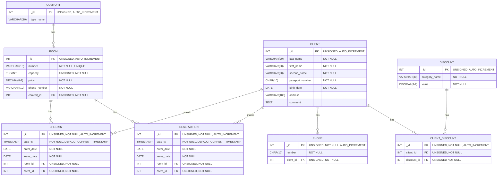

# Практическая работа 3.2. Разработка серверной части базы данных в СУБД MySQL. Создание таблиц

- [1. Цель работы](#1-цель-работы)
- [2. Условия задач](#2-условия-задач)
- [3. Решение задач](#3-решение-задач)
  - [3.1 Задача 1](#31-задача-1)
    - [3.1.1	Анализ задачи](#311анализ-задачи)
      - [Описание предметной области](#описание-предметной-области)
      - [Требуемый результат:](#требуемый-результат)
      - [3.1.2	Формирование инфологической модели](#312формирование-инфологической-модели)
      - [3.1.3	Создание базы данных](#313создание-базы-данных)
      - [3.1.4 Создание таблиц](#314-создание-таблиц)
- [Заключение](#заключение)

## 1. Цель работы
- изучить основные принципы построения концептуальной, логической и физической модели данных;
-	изучить структуры данных СУБД, общий подход к организации представлений, таблиц, индексов и кластеров;
-	сформировать умение создавать объекты баз данных в современных СУБД.

## 2. Условия задач
1) В соответствии с заданной предметной областью (вариант 2 – Гостиница) составить инфологическую модель данных.
2) В соответствии с полученной инфологической моделью создать базу данных и таблицы в СУБД MYSQL, используя язык DDL.

## 3. Решение задач

### 3.1 Задача 1

#### 3.1.1	Анализ задачи

##### Описание предметной области
Гостиница. Гостиница предоставляет номера клиентам. Каждый номер характеризуется вместимостью, комфортностью (люкс, полу люкс, обычный) и ценой. О клиентах собирается определенная информация (фамилия, имя, отчество, паспортные данные, дата рождения, адрес жительства и некоторый комментарий). Сдача номера (комфортность, количество человек, телефон) клиенту производится при наличии свободных мест в номерах, подходящих клиенту по указанным выше параметрам. При заселении фиксируется дата заселения. При выезде из гостиницы для каждого места запоминается дата освобождения. Необходимо также осуществлять бронирование номеров. Для постоянных клиентов, а также для определенных категорий клиентов предусмотрена система скидок. Скидки могут суммироваться.

##### Требуемый результат:
-	составить инфологическую модель предметной области;
-	на основе полученной инфологической модели создать базу данных в СУБД MySQL;
-	в созданной базе сформировать таблицы в СУБД MySQL на основе инфологической модели данных.

##### 3.1.2	Формирование инфологической модели
Инфологическая модель, полученная на основе анализа предметной области, представлена на рисунке 1.


*Рисунок 1 – Инфологическая модель предметной области*



##### 3.1.3	Создание базы данных
Листинг 1 демонстрирует команду создание базы данных в соответствии с предметной областью.

*[Листинг 1 – Команда создания базы данных](./01-create-db-hotel.sql)*
```sql
CREATE DATABASE hotel;
```

Рисунок 2 иллюстрирует ход создания базы данных.

```
mysql> CREATE DATABASE hotel;
Query OK, 1 row affected (0.00 sec)
```

*Рисунок 2 – Создание базы данных*

##### 3.1.4 Создание таблиц
Листинги 2, 3, 4, 5, 6, 7, 8, 9 демонстрируют команды создания таблиц в соответствии с полученной инфологической моделью. Рисунки 3, 4, 5, 6, 7, 8, 9, 10 иллюстрируют ход создания таблиц.

*[Листинг 2 – Команда создания таблицы КОМФОРТАБЕЛЬНОСТЬ](./02-create-tbl-comfort.sql)*
```sql
CREATE TABLE comfort (
    _id INT UNSIGNED NOT NULL AUTO_INCREMENT PRIMARY KEY,
    type_name VARCHAR(10) NOT NULL
);
```


```
mysql> CREATE TABLE comfort (
    _id INT UNSIGNED NOT NULL AUTO_INCREMENT PRIMARY KEY,
    type_name VARCHAR(10) NOT NULL CHECK(type_name != '')
);
Query OK, 0 rows affected (0.01 sec)

mysql> CREATE TABLE comfort (
    -> _id INT UNSIGNED NOT NULL AUTO_INCREMENT PRIMARY KEY,
    -> type_name VARCHAR(10) NOT NULL
    -> );
Query OK, 0 rows affected (0.01 sec)

mysql> DESCRIBE comfort;
+-----------+--------------+------+-----+---------+----------------+
| Field     | Type         | Null | Key | Default | Extra          |
+-----------+--------------+------+-----+---------+----------------+
| _id       | int unsigned | NO   | PRI | NULL    | auto_increment |
| type_name | varchar(10)  | NO   |     | NULL    |                |
+-----------+--------------+------+-----+---------+----------------+
2 rows in set (0.01 sec)
```

*Рисунок 3 – Создание таблицы КОМФОРТАБЕЛЬНОСТЬ*

*[Листинг 3 – Команда создания таблицы НОМЕРА](./03-create-tbl-room.sql)*
```sql
CREATE TABLE room (
    _id INT UNSIGNED NOT NULL AUTO_INCREMENT PRIMARY KEY,
    number VARCHAR(10) NOT NULL UNIQUE,
    capacity TINYINT UNSIGNED NOT NULL,
    price DECIMAL(8, 2) NOT NULL,
    phone_number VARCHAR(10) NOT NULL,
    comfort_id INT UNSIGNED NOT NULL
);
```


```
mysql> CREATE TABLE room (
    _id INT UNSIGNED NOT NULL AUTO_INCREMENT PRIMARY KEY,
    number VARCHAR(10) NOT NULL UNIQUE,
    capacity TINYINT UNSIGNED NOT NULL,
    price DECIMAL(8, 2) NOT NULL,
    phone_number VARCHAR(10) NOT NULL UNIQUE,
    comfort_id INT UNSIGNED NOT NULL,
    CONSTRAINT check_price CHECK(price > 0),
    CONSTRAINT check_phone CHECK(phone_number regexp '^[+][0-9]{8}$')
);
Query OK, 0 rows affected (0.01 sec)

mysql> CREATE TABLE room (
    -> _id INT UNSIGNED NOT NULL AUTO_INCREMENT PRIMARY KEY,
    -> number VARCHAR(10) NOT NULL UNIQUE,
    -> capacity TINYINT UNSIGNED NOT NULL,
    -> price DECIMAL(8, 2) NOT NULL,
    -> phone_number VARCHAR(10) NOT NULL,
    -> comfort_id INT UNSIGNED NOT NULL
    -> );
Query OK, 0 rows affected (0.01 sec)

mysql> DESCRIBE room;
+--------------+------------------+------+-----+---------+----------------+
| Field        | Type             | Null | Key | Default | Extra          |
+--------------+------------------+------+-----+---------+----------------+
| _id          | int unsigned     | NO   | PRI | NULL    | auto_increment |
| number       | varchar(10)      | NO   | UNI | NULL    |                |
| capacity     | tinyint unsigned | NO   |     | NULL    |                |
| price        | decimal(8,2)     | NO   |     | NULL    |                |
| phone_number | varchar(10)      | NO   |     | NULL    |                |
| comfort_id   | int unsigned     | NO   |     | NULL    |                |
+--------------+------------------+------+-----+---------+----------------+
6 rows in set (0.00 sec)
```

*Рисунок 4 – Создание таблицы НОМЕРА*

*Листинг 4 – Команда создания таблицы КЛИЕНТЫ*
```sql
CREATE TABLE client (
    _id INT UNSIGNED NOT NULL AUTO_INCREMENT PRIMARY KEY,
    last_name VARCHAR(20) NOT NULL,
    first_name VARCHAR(20) NOT NULL,
    second_name VARCHAR(20) NOT NULL,
    passport_number CHAR(10) NOT NULL,
    birth_date DATE NOT NULL,
    address VARCHAR(100),
    comment TEXT
);
```

```
mysql> CREATE TABLE client (
    _id INT UNSIGNED NOT NULL AUTO_INCREMENT PRIMARY KEY,
    last_name VARCHAR(20) NOT NULL,
    first_name VARCHAR(20) NOT NULL,
    second_name VARCHAR(20) NOT NULL,
    passport_number CHAR(10) NOT NULL UNIQUE,
    birth_date DATE NOT NULL,
    address VARCHAR(100),
    comment TEXT,
    CONSTRAINT check_passport CHECK(passport_number regexp '^[0-9]{10}$')
);
Query OK, 0 rows affected (0.01 sec)

mysql> CREATE TABLE client (
    -> _id INT UNSIGNED NOT NULL AUTO_INCREMENT PRIMARY KEY,
    -> last_name VARCHAR(20) NOT NULL,
    -> first_name VARCHAR(20) NOT NULL,
    -> second_name VARCHAR(20) NOT NULL,
    -> passport_number CHAR(10) NOT NULL,
    -> birth_date DATE NOT NULL,
    -> address VARCHAR(100),
    -> comment TEXT
    -> );
Query OK, 0 rows affected (0.01 sec)

mysql> DESCRIBE client;
+-----------------+--------------+------+-----+---------+----------------+
| Field           | Type         | Null | Key | Default | Extra          |
+-----------------+--------------+------+-----+---------+----------------+
| _id             | int unsigned | NO   | PRI | NULL    | auto_increment |
| last_name       | varchar(20)  | NO   |     | NULL    |                |
| first_name      | varchar(20)  | NO   |     | NULL    |                |
| second_name     | varchar(20)  | NO   |     | NULL    |                |
| passport_number | char(10)     | NO   |     | NULL    |                |
| birth_date      | date         | NO   |     | NULL    |                |
| address         | varchar(100) | YES  |     | NULL    |                |
| comment         | text         | YES  |     | NULL    |                |
+-----------------+--------------+------+-----+---------+----------------+
8 rows in set (0.00 sec)
```

*Рисунок 5 – Создание таблицы КЛИЕНТЫ*

*[Листинг 5 – Команда создания таблицы СКИДКИ](./05-create-tbl-discount.sql)*
```sql
CREATE TABLE discount (
    _id INT UNSIGNED NOT NULL AUTO_INCREMENT PRIMARY KEY,
    category_name VARCHAR(30) NOT NULL,
    value DECIMAL(3,2) NOT NULL
);
```

```
mysql> CREATE TABLE discount (
    -> _id INT UNSIGNED NOT NULL AUTO_INCREMENT PRIMARY KEY,
    -> category_name VARCHAR(30) NOT NULL,
    -> value DECIMAL(3,2) NOT NULL
    -> );
Query OK, 0 rows affected (0.02 sec)

mysql> SHOW COLUMNS FROM discount;
+---------------+--------------+------+-----+---------+----------------+
| Field         | Type         | Null | Key | Default | Extra          |
+---------------+--------------+------+-----+---------+----------------+
| _id           | int unsigned | NO   | PRI | NULL    | auto_increment |
| category_name | varchar(30)  | NO   |     | NULL    |                |
| value         | decimal(3,2) | NO   |     | NULL    |                |
+---------------+--------------+------+-----+---------+----------------+
3 rows in set (0.00 sec)
```

*Рисунок 6 – Создание таблицы СКИДКИ*

*[Листинг 6 – Команда создания таблицы КЛИЕНТЫ_СКИДКИ](./06-create-tbl-client_discount.sql)*
```sql
CREATE TABLE client_discount (
    _id INT UNSIGNED NOT NULL AUTO_INCREMENT PRIMARY KEY,
    client_id INT UNSIGNED NOT NULL,
    discount_id INT UNSIGNED NOT NULL
);
```

```
mysql> CREATE TABLE client_discount (
    -> _id INT UNSIGNED NOT NULL AUTO_INCREMENT PRIMARY KEY,
    -> client_id INT UNSIGNED NOT NULL,
    -> discount_id INT UNSIGNED NOT NULL
    -> );
Query OK, 0 rows affected (0.01 sec)

mysql> DESCRIBE client_discount;
+-------------+--------------+------+-----+---------+----------------+
| Field       | Type         | Null | Key | Default | Extra          |
+-------------+--------------+------+-----+---------+----------------+
| _id         | int unsigned | NO   | PRI | NULL    | auto_increment |
| client_id   | int unsigned | NO   |     | NULL    |                |
| discount_id | int unsigned | NO   |     | NULL    |                |
+-------------+--------------+------+-----+---------+----------------+
3 rows in set (0.00 sec)

```

*Рисунок 7 – Создание таблицы КЛИЕНТЫ_СКИДКИ*

*[Листинг 7 – Команда создания таблицы ТЕЛЕФОНЫ](./07-create-tbl-phone.sql)*
```sql
CREATE TABLE phone (
    _id INT UNSIGNED NOT NULL AUTO_INCREMENT PRIMARY KEY,
    number CHAR(10) NOT NULL,
    client_id INT UNSIGNED NOT NULL
);
```

```
mysql> CREATE TABLE phone (
    _id INT UNSIGNED NOT NULL AUTO_INCREMENT PRIMARY KEY,
    number CHAR(12) NOT NULL UNIQUE CHECK(number regexp '^[+][0-9]{10}$'),
    client_id INT UNSIGNED NOT NULL
);
Query OK, 0 rows affected (0.01 sec)

mysql> CREATE TABLE phone (
    -> _id INT UNSIGNED NOT NULL AUTO_INCREMENT PRIMARY KEY,
    -> number CHAR(10) NOT NULL,
    -> client_id INT UNSIGNED NOT NULL
    -> );
Query OK, 0 rows affected (0.01 sec)

mysql> SHOW COLUMNS FROM phone;
+-----------+--------------+------+-----+---------+----------------+
| Field     | Type         | Null | Key | Default | Extra          |
+-----------+--------------+------+-----+---------+----------------+
| _id       | int unsigned | NO   | PRI | NULL    | auto_increment |
| number    | char(10)     | NO   |     | NULL    |                |
| client_id | int unsigned | NO   |     | NULL    |                |
+-----------+--------------+------+-----+---------+----------------+
3 rows in set (0.00 sec)

```

*Рисунок 8 – Создание таблицы ТЕЛЕФОНЫ*

*[Листинг 8 – Команда создания таблицы БРОНИ](./08-create-tbl-reservationsql)*
```sql
CREATE TABLE reservation (
    _id INT UNSIGNED NOT NULL AUTO_INCREMENT PRIMARY KEY,
    date_ts TIMESTAMP NOT NULL DEFAULT CURRENT_TIMESTAMP,
    enter_date DATE NOT NULL,
    leave_date DATE NOT NULL,
    room_id INT UNSIGNED NOT NULL,
    client_id INT UNSIGNED NOT NULL
);
```

```
mysql> CREATE TABLE reservation (
    -> _id INT UNSIGNED NOT NULL AUTO_INCREMENT PRIMARY KEY,
    -> date_ts TIMESTAMP NOT NULL DEFAULT CURRENT_TIMESTAMP,
    -> enter_date DATE NOT NULL,
    -> leave_date DATE NOT NULL,
    -> room_id INT UNSIGNED NOT NULL,
    -> client_id INT UNSIGNED NOT NULL
    -> );
Query OK, 0 rows affected (0.02 sec)

mysql> DESCRIBE reservation;
+------------+--------------+------+-----+-------------------+-------------------+
| Field      | Type         | Null | Key | Default           | Extra             |
+------------+--------------+------+-----+-------------------+-------------------+
| _id        | int unsigned | NO   | PRI | NULL              | auto_increment    |
| date_ts    | timestamp    | NO   |     | CURRENT_TIMESTAMP | DEFAULT_GENERATED |
| enter_date | date         | NO   |     | NULL              |                   |
| leave_date | date         | NO   |     | NULL              |                   |
| room_id    | int unsigned | NO   |     | NULL              |                   |
| client_id  | int unsigned | NO   |     | NULL              |                   |
+------------+--------------+------+-----+-------------------+-------------------+
6 rows in set (0.00 sec)

```

*Рисунок 9 – Создание таблицы БРОНИ*

*[Листинг 9 – Команда создания таблицы ПОСЕЛЕНИЯ](./09-create-tbl-checkin.sql)*
```sql
CREATE TABLE checkin (
    _id INT UNSIGNED NOT NULL AUTO_INCREMENT PRIMARY KEY,
    date_ts TIMESTAMP NOT NULL DEFAULT CURRENT_TIMESTAMP,
    enter_date DATE NOT NULL,
    leave_date DATE NOT NULL,
    room_id INT UNSIGNED NOT NULL,
    client_id INT UNSIGNED NOT NULL
);
```

```
mysql> CREATE TABLE checkin (
    -> _id INT UNSIGNED NOT NULL AUTO_INCREMENT PRIMARY KEY,
    -> date_ts TIMESTAMP NOT NULL DEFAULT CURRENT_TIMESTAMP,
    -> enter_date DATE NOT NULL,
    -> leave_date DATE NOT NULL,
    -> room_id INT UNSIGNED NOT NULL,
    -> client_id INT UNSIGNED NOT NULL
    -> );
Query OK, 0 rows affected (0.01 sec)

mysql> SHOW COLUMNS FROM checkin;
+------------+--------------+------+-----+-------------------+-------------------+
| Field      | Type         | Null | Key | Default           | Extra             |
+------------+--------------+------+-----+-------------------+-------------------+
| _id        | int unsigned | NO   | PRI | NULL              | auto_increment    |
| date_ts    | timestamp    | NO   |     | CURRENT_TIMESTAMP | DEFAULT_GENERATED |
| enter_date | date         | NO   |     | NULL              |                   |
| leave_date | date         | NO   |     | NULL              |                   |
| room_id    | int unsigned | NO   |     | NULL              |                   |
| client_id  | int unsigned | NO   |     | NULL              |                   |
+------------+--------------+------+-----+-------------------+-------------------+
6 rows in set (0.00 sec)

```

*Рисунок 10 – Создание таблицы ПОСЕЛЕНИЯ*

## Заключение
По итогам работы были изучены основные принципы построения концептуальной, логической и физической модели данных; изучены структуры данных СУБД, общий подход к организации представлений, таблиц, индексов и кластеров, сформировано умение создавать объекты баз данных в современных СУБД.
